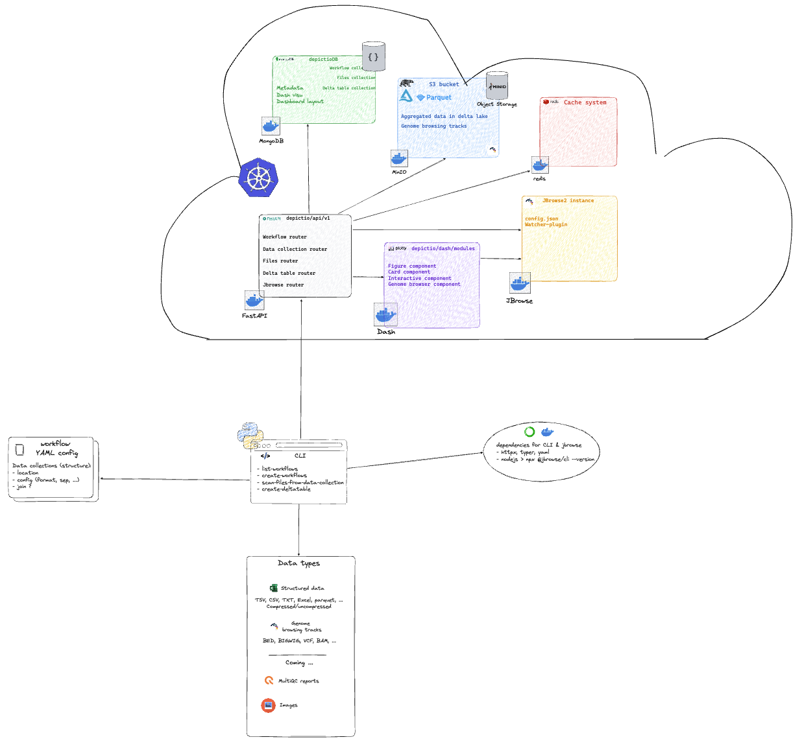

# Depictio

## Project Overview

Depictio is an innovative web-based platform currently under development, aimed at facilitating downstream analysis in bioinformatics. It provides a dynamic and interactive dashboard experience for quality control (QC) metrics monitoring and result exploration in genomic studies. The platform is tailored towards large-scale studies and research facilities, offering support for various data formats and interactive data visualization tools.

## Features

* Dynamic Dashboards: Real-time data interaction, customizable views, and user-driven exploration features.
* Diverse Data Format Support: Handles standard formats like CSV, TSV, XLSX, Parquet, and specialized genomic files like BED, BigBed, BigWig, BAM/CRAM, VCF.
* AI-Assisted Dashboard Generation: Future plans include implementing AI templates for automatic data-driven dashboard creation.
* Robust Backend Technologies: Utilizes FastAPI, MongoDB, and Redis cache for high-performance data management and processing.
* Intuitive Frontend: Built on Plotly Dash, a ReactJS-based framework, complemented by visualization tools like JBrowse and Cytoscape.

## Current Status

Depictio is currently in the development phase and is not yet available for general use. The platform is being built with an emphasis on versatility and adaptability to various biological research needs.

## Architecture



### Kubernetes 

- API (FastAPI)
- NoSQL database (MongoDB)
- Interactive Frontend (plotly Dash)
- Caching mechanism (redis)
- S3 bucket system (MinIO)
- Genome browser (Jbrowse)

### Local

- CLI client

## Installation

Depictio microservices architecture aims to be deployed on a Kubernetes instance. Before transitioning to kubernetes, the current reproduces a similar setup using a docker-compose layer that encapsulates the different services that will be deployed on K8S. A Command Line Interface (CLI) was developed to interact with the API running on K8S in order to register workflows and data collections, scan files, aggregate data over time and so on. 

### Docker


Clone the repo:

```
git clone https://github.com/weber8thomas/depictio.git
```


```
docker-compose up -d
```


### Kubernetes

Ongoing 


## Depictio data YAML config setup

#TODO: YAML schema 

## Get started

- Prepare data
- Prepare YAML
- CLI commands


## Modularity

## General design


### API

### Frontend components

## Jbrowse config 

## Validation and models


## Others


- config_backend.yaml


## Biological Use-Cases

Depictio is currently being developed with two primary workflows employed as use-cases :

* Single-cell Structural Variations from Strand-seq data: Focus on cancer subclonal characterisation and genome phasing.
* Diatom Interactions and Climate Change Studies: Analysis of diatom symbioses in marine biology, in collaboration with the Vincent group and TREC.

## Contributing

While Depictio is not yet operational, we welcome ideas, suggestions, and feedback from the community. If you have insights or want to contribute to the project, please feel free to open an issue or submit a pull request.


