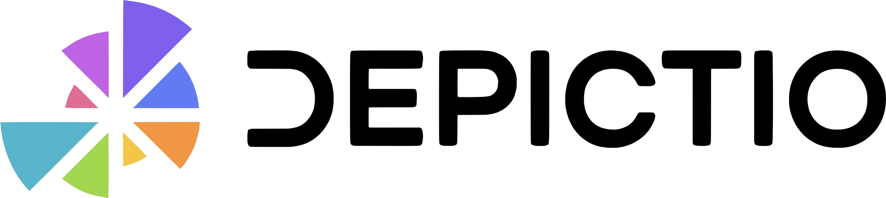

<p align="center">
  
</p>

# Depictio


## Project Overview

Depictio is an innovative web-based platform currently under development, aimed at facilitating downstream analysis in bioinformatics. It provides a dynamic and interactive dashboard experience for quality control (QC) metrics monitoring and result exploration in omics. The platform is tailored towards large-scale studies and research facilities, offering support for various data formats and interactive data visualization tools.

## Features

* Dynamic Dashboards: Real-time data interaction, customizable views, and user-driven exploration features.
* Diverse Data Format Support: Handles standard formats like CSV, TSV, XLSX, Parquet, and omics files like BED, BigBed, BigWig, BAM/CRAM, VCF.
* Robust Backend Technologies: Utilizes FastAPI, MongoDB, and Redis cache for high-performance data management and processing.
* Intuitive Frontend: Built on Plotly Dash, a ReactJS-based framework

## Modularity

Depictio is designed with a modular architecture, allowing for easy integration of new features and functionalities. The frontend and backend components are decoupled, enabling independent development and deployment of each module. The platform is built to be scalable and adaptable to various needs, with a focus on user-friendly interfaces and interactive data visualization tools. 

The code organisation clearly separates each of the frontend components and the API endpoints, making it easy to understand and extend the platform.

### Dashboard components

Each of the components is designed to be modular and can be easily integrated into the dashboard. To add a new component to the dashboard, you simply need to click on the "Add new component" button of your dashboard. This will open a 3-levels modal where you will be able to select:
- 1. The data source: it corresponds to the bioinformatics workflow and the data collection you want to be based on to build your new component.
- 2. The component type: it corresponds to the type of component (listed below) you want to add to your dashboard.
- 3. The component configuration: it corresponds to the configuration of the component you want to add to your dashboard.

#### Generic components (Data collection Table)
There are currently 4 main components supported to build your dashboard:
- Figures: Bar, Line, Scatter, Box and Histogram plots.
- Metrics cards: Cards displaying metrics values.
- Interactive components: (slider, dropdown, input text, etc.)
- Tables: Interactive tables with sorting, filtering and searching functionalities.

#### Specific components
- JBrowse: Genome browser to visualize genomic data.
- Graphs: Network graphs to visualize interactions between entities.
- Geomap: Geographical map.

### API

Depictio API is built on top of FastAPI, a modern, fast (high-performance), web framework for building APIs with Python 3.6+ based on standard Python type hints. It is designed to be easy to use and understand, with a focus on performance and scalability. 

## Architecture


Depictio architecture is currently composed of two main aspects: a microservices architecture (to be executed into a docker-compose and late on in a kubernetes cluster) and a CLI client to be installed locally on-premise where the data to be scanned is located. 
There are currently 6 main microservices running:
- 1. FastAPI instance
- 2. mongoDB **database**
- 3. redis cache system
- 4. JBrowse on-premise genome browser
- 5. MinIO S3 bucket management instance
- 6. Plotly Dash server


## Installation

Depictio microservices architecture aims to be deployed on a Kubernetes instance. Before transitioning to kubernetes, the current reproduces a similar setup using a docker-compose layer that encapsulates the different services that will be deployed on K8S. A Command Line Interface (CLI) was developed to interact with the API running on K8S in order to register workflows and data collections, scan files, aggregate data over time and so on. 

### Docker Compose


Clone the repo:

```
git clone https://github.com/weber8thomas/depictio.git
```

Or if you want to use the jbrowse submodule:

```
git clone --recurse-submodules https://github.com/weber8thomas/depictio.git
```

If needed, example data can be downloaded by cloning the following repo:

```
git clone https://github.com/weber8thomas/depictio-data.git
```


Modify the `.env` file to update the environment variables. The following variables are mandatory to be set:


```
DEPICTIO_BACKEND_DATA_VOLUME_HOST=<path_to_your_data_folder>
```


Start the docker-compose services:

```
docker compose up -d --build
```


### Kubernetes

Ongoing 


## Depictio data YAML config setup

#TODO: YAML schema 

## Get started

- Prepare data
- Prepare YAML
- CLI commands


# General design


## Jbrowse config 

## Validation and models


## Others


- config_backend.yaml


## Biological Use-Cases

Depictio is currently being developed with two primary workflows employed as use-cases :

* Single-cell Structural Variations from Strand-seq data: Focus on cancer subclonal characterisation and genome phasing.
* Diatom Interactions and Climate Change Studies: Analysis of diatom symbioses in marine biology, in collaboration with the Vincent group and TREC.


## Current Status

Depictio is currently in the development phase and is not yet available for general use. The platform is being built with an emphasis on versatility and adaptability to various biological research needs.

## Contributing

While Depictio is not yet operational, we welcome ideas, suggestions, and feedback from the community. If you have insights or want to contribute to the project, please feel free to open an issue or submit a pull request.


