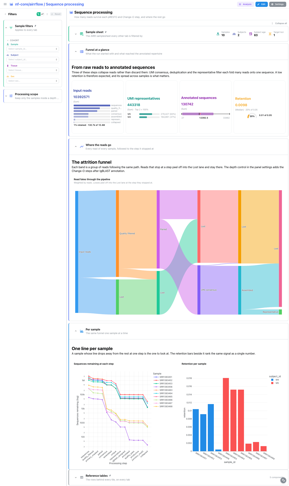
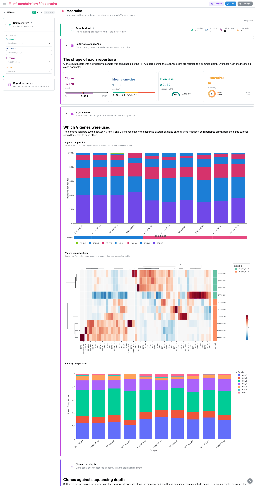
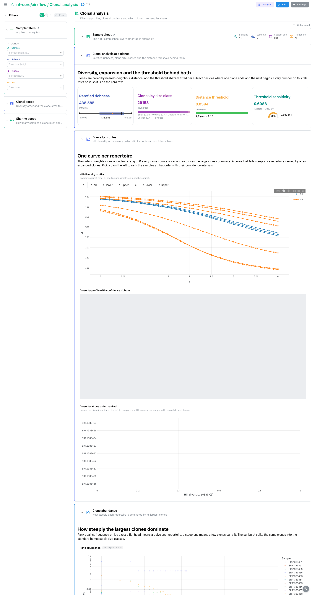

# nf-core/airrflow 5.1.0: Depictio dashboards

This template turns the output of [nf-core/airrflow](https://nf-co.re/airrflow) 5.1.0 into a
single four-tab Depictio dashboard. airrflow processes B and T cell receptor amplicon
libraries into an AIRR rearrangement repertoire: it trims and assembles the reads, collapses
them by UMI, annotates V(D)J genes with IgBLAST, groups the sequences into clones and then runs
the [Immcantation](https://immcantation.readthedocs.io) enchantR report on top. The template
surfaces that report, and the sequence funnel that feeds it, next to the pipeline's own MultiQC.

Data comes from the AWS megatest run
`results-e69d49e3f23f11a3391755b5fb7aa4283c0a2471` (the 5.1.0 release tag), a ten-sample,
two-subject multiple sclerosis B cell study of cervical lymph node and brain lesion tissue.

---

## How the dashboard is built

- **One funnel, four tabs.** Quality control, then Sequence processing, then Repertoire, then
  Clonal analysis. Each tab answers the question the previous one raises: are the reads good,
  how many survive, what repertoire do the survivors make, and how is that repertoire
  structured.
- **Persistent filters.** `Sample filters` (sample, subject, tissue, sex) is pinned to the top
  of every tab's filter panel, sourced on the validated AIRR samplesheet the pipeline writes.
  The template's links fan a selection there out to every other collection, so one pick narrows
  the MultiQC panels, the funnel, the diversity profiles and the overlap matrix at once.
- **Pinned reference tables.** The rows behind every tile sit in a collapsed
  `Reference tables` section pinned to the bottom of every tab, alongside a pinned, collapsed
  `Sample sheet` section at the top.
- **Catalog provenance.** Every repertoire panel is a catalog render (`use: enchantr/...`) and
  every MultiQC tile names its module (`use: multiqc/fastp`, `use: multiqc/fastqc`), so the tile
  chrome shows where the panel comes from.
- **Subject is structural, not cosmetic.** airrflow defines clones within a subject, so
  `subject_id` colours the diversity profiles, annotates both heatmaps and zeroes the
  cross-subject cells of the overlap matrix. It is not a display choice: a clone id under two
  subjects is two different clones.

---

## Quality control

The main tab. `Read QC at a glance` carries the MultiQC general statistics table, the fastp
filtered-read bars and the FastQC sequence counts. `Base quality` pairs fastp's per-base quality
curves with FastQC's quality histograms and per-read score distribution. `Read content`
(collapsed) holds GC, length, duplication, adapter content and the FastQC status grid.

airrflow runs FastQC twice, on the raw reads and again after the mate pairs are assembled, so
MultiQC labels the second run `fastqc-1` and the panels carry both the `<sample>` and
`<sample>_ASSEMBLED` series. Amplicon libraries are expected to look duplicated and to sit at a
narrow GC and length range, so most FastQC warnings here are normal.

A `Read QC scope` filter narrows the panels to selected report samples, independently of the
persistent sample filter, because the MultiQC sample ids carry the `_ASSEMBLED` suffix.

## Sequence processing

`Funnel at a glance` carries four cards: total input reads with an attrition strip across the
six milestone steps, UMI representatives broken down by subject, annotated sequences as a Tukey
box plot, and the median retention on a gauge.

`Where the reads go` is the signature panel: a Sankey of every read of every sample, following
each group to the step it stopped at. Three of the steps collapse reads rather than discard
them, since UMI consensus, deduplication and the representative filter each fold many reads onto
one sequence, so a retention of about one percent is expected and its spread across samples is
what matters. The depth control adds the Change-O steps after IgBLAST annotation.

`Per sample` plots the same funnel as one line per sample on a log axis, next to a retention bar
chart. A sample whose line drops away from the rest at one step is the one to look at.

## Repertoire

`Repertoire at a glance`: clone counts as a box plot, mean clone size against a threshold,
median evenness on a gauge, and the repertoire count broken down by subject. Clone counts scale
with sequencing depth, so the Hill numbers behind the evenness card are rarefied to a common
depth by alakazam.

`V gene usage` pairs a stacked composition of V family and V gene fractions (switchable between
the two resolutions) with a clustered sample by V gene heatmap, column standardised so rare
genes stay visible, annotated by subject. A stacked bar of the family level alone sits below.

`Clones and depth` plots clones against sequencing depth on log axes, point size the mean clone
size: a repertoire that is simply deeper sits along the diagonal, one that is genuinely more
clonal sits below it. Selecting points, or rows in the table beside it, narrows the clonal tab.

## Clonal analysis

`Clonal analysis at a glance` puts the distance threshold on the card row, because clones are
called by nearest-neighbour distance and every number on the tab rests on the threshold shazam
fitted per subject. Beside it: rarefied richness, clones by homeostasis size class, and the
threshold's sensitivity.

`Diversity profiles` shows the Hill diversity profile, one curve per repertoire, against the
order q. At q of 0 every clone counts once; as q rises the large clones dominate, so a curve
that falls steeply is a repertoire carried by a few expanded clones. The panel beside it draws
the same curves with alakazam's bootstrap confidence band shaded per sample, and a ranked
confidence-interval strip below compares one Hill number per sample once a q is picked.

`Clone abundance` pairs a rank-abundance scatter (top 500 clones per sample, log axes, selection
enabled on sample) with a sunburst of subject to sample to clone size class, using the standard
clonal homeostasis bins from rare to hyperexpanded.

`Sharing between samples` pairs the shared-clone heatmap for every sample pair with an UpSet of
the higher-order intersections a pairwise view cannot show. The heatmap's diagonal is zeroed, so
the colour scale spans the real sharing rather than each sample's own repertoire size, and
samples from different subjects always read zero.

---

## Catalog module

The recipes ship as one catalog module, `depictio/catalog/enchantr/`, holding `module.yaml`
plus ten `<output>.py` / `<output>.yaml` / `<output>.tsv` triples. enchantR is airrflow's own R
package rather than an nf-core module, so `module.yaml` declares its identity in full
(homepage, EDAM immunology and immunoproteins topics).

| Output | What it is | Renders as |
|---|---|---|
| `sequence_counts` | Sequences remaining after every pRESTO and Change-O step | 4 cards, table |
| `sequence_fates` | The same funnel as read groups, per milestone | Sankey, table |
| `repertoire_summary` | Clone counts, clone-size spread, rarefied Hill numbers | 4 cards, scatter, table |
| `clonal_diversity` | Hill diversity profile with bootstrap CIs | Rarefaction, CI bars, table |
| `clonal_overlap` | Sample by sample shared clone matrix | Clustered heatmap, table |
| `clone_sizes` | Every clone with rank, frequency and size class | Sunburst, 2 cards, table |
| `clone_sets` | Clone by sample presence matrix | UpSet, card, table |
| `v_gene_usage` | V family and V gene fractions per sample | Stacked composition, card, table |
| `v_gene_matrix` | Sample by V gene fraction matrix | Clustered heatmap, table |
| `threshold_summary` | The shazam distance threshold per subject | 3 cards, table |

The MultiQC modules airrflow emits (`fastp`, `fastqc`) already exist under
`depictio/catalog/multiqc/`, which is what lets a MultiQC tile carry `use: multiqc/<module>`
and the catalog badge.
