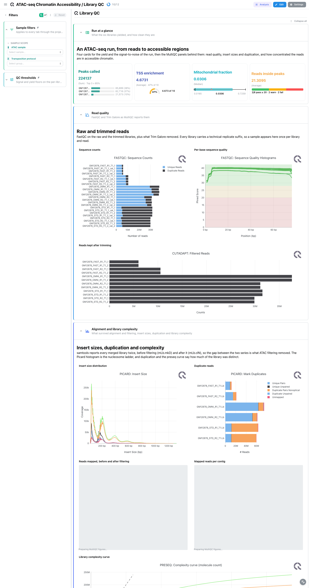
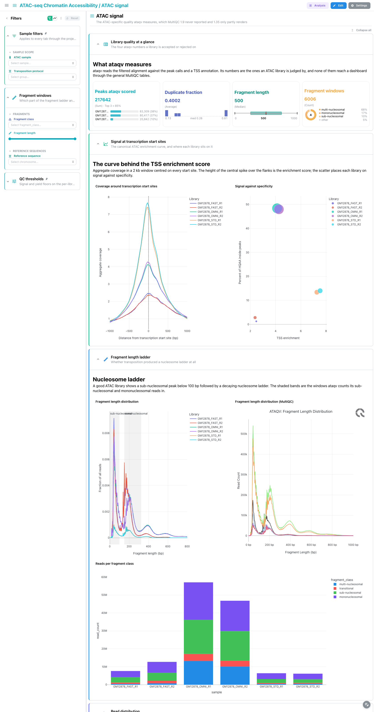
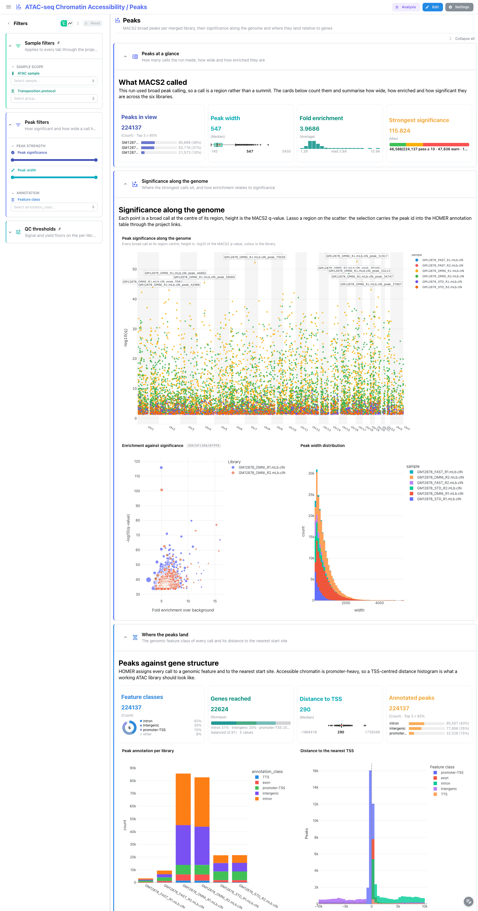
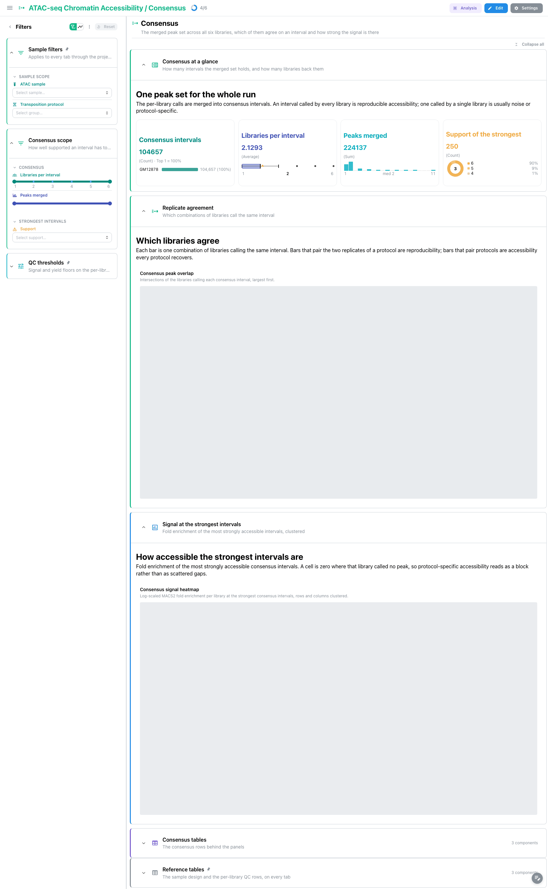
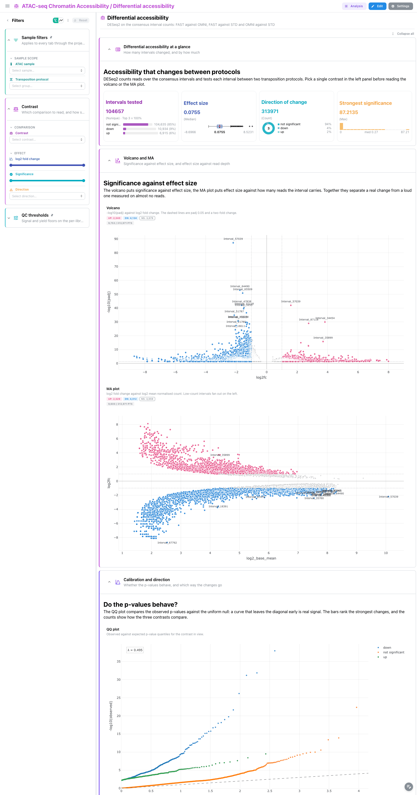

# nf-core/atacseq 1.2.2: Depictio dashboards

This template turns the output of [nf-core/atacseq](https://nf-co.re/atacseq) 1.2.2 into a
single five-tab Depictio dashboard. atacseq trims and aligns ATAC libraries, filters out
duplicates and mitochondrial reads, measures the ATAC-specific quality signals with ataqv,
calls accessible regions per library with MACS2, annotates them with HOMER, merges them into
one consensus peak set and finally tests each consensus interval for differential
accessibility with DESeq2. The dashboard follows that chain from left to right.

Data comes from the AWS megatest run
`results-f327c86324427c64716be09c98634ae0bc8165f6` (the 1.2.2 release tag): six GM12878
libraries across three transposition protocols, FAST, OMNI and STD, two biological replicates
each.

> **This template reads a REPROCESSED MultiQC report.**
> atacseq 1.2.2 is a DSL1 pipeline and this run published MultiQC 1.9, which writes
> `multiqc_data.json` and no parquet, nested at `multiqc/broadPeak/multiqc_data/`. Depictio
> reads only `multiqc.parquet` (MultiQC 1.31 and later), so the QC tab is bound to a report
> this repository generates by re-running the pinned MultiQC 1.35 over the run's own raw tool
> outputs. Here the upgrade is not only a format change: MultiQC 1.35 gained an `ataqv`
> module that 1.9 had no idea about, so the reprocess adds four ATAC-specific QC panels
> outright. Never copy a `selected_plot` out of the published HTML report; read it from
> `multiqc.list_plots()` on the regenerated parquet. See the Reproducing section below and
> `VALIDATION_REPORT.md`.

> **This is the broad-peak route.** The run was called with `--narrow_peak false`, so the
> peak files are `*_peaks.broadPeak` (BED6+3, no summit column) and are read by the
> template's own `recipes/broad_peaks.py` rather than by the catalog's `macs2/peaks`, which
> reads the narrowPeak shape. Release 1.2.1 is the narrowPeak twin of the same run.

---

## How the dashboard is built

- **One funnel, five tabs.** Library QC, then ATAC signal, then Peaks, then Consensus, then
  Differential accessibility. Each tab answers the question the previous one raises: are the
  libraries clean, is the ATAC signal where it should be, what did MACS2 call in each
  library, which of those calls the libraries agree on, and which of the agreed intervals
  change between transposition protocols.
- **The design sheet is the hub.** `pipeline_info/design_reads.csv` becomes `sample_design`,
  one row per library with its protocol group and both spellings of its name. A persistent
  `Sample filters` section (ATAC sample, transposition protocol) is pinned to the top of
  every tab, and the template's links fan a pick there out to the MultiQC panels, the ataqv
  collections, the peak QC summary, the peak calls and the HOMER annotation at once.
- **Two spellings, one filter.** atacseq calls the merged filtered library
  `<sample>.mLb.clN` and MACS2 stamps that into every peak name, while ataqv, the peak QC
  summary and MultiQC use the bare sample id. `sample_design` carries both columns and each
  link starts from whichever one its target uses, so one pick in the sample filter reaches
  every collection.
- **Pinned reference tables and thresholds.** The design sheet and the per-library peak QC
  rows sit in a collapsed `Reference tables` section pinned to the bottom of every tab, next
  to a collapsed `QC thresholds` section holding the TSS enrichment and FRiP floors, so the
  numbers behind the cards and the cut-offs applied to them are one click away everywhere.
- **Selection, both ways.** The signal-against-specificity scatter on the ATAC signal tab
  carries `selection_enabled` on `sample` and the ataqv metrics table carries
  `row_selection_enabled` on the same column; the enrichment scatter on the Peaks tab and
  both peak tables do the same on `peak_id`. Lassoing narrows the tables, ticking rows
  narrows the panels, and the project links carry the selection between the MACS2 and HOMER
  collections.
- **Catalog provenance.** 47 of the 102 tiles carry a `use:` catalog reference, so the tile
  chrome says where the panel comes from: `ataqv/*` for the ATAC quality panels, `macs2/*`
  for the peak and consensus panels, `homer/annotated_peaks` for the annotation panels,
  `deseq2/*` for the differential accessibility panels and `multiqc/<module>` for the
  tool-module QC panels.
- **Everything matches on file name.** No data collection or recipe glob spells out the
  `bwa/mergedLibrary/macs/broadPeak/` prefix, so a run aligned with a different aligner lands
  in the same collections.

---

## Library QC

The main tab, and the one reading the reprocessed report.

`Run at a glance` is a four-card strip, each card with a different secondary layout: peaks
called across the run with a breakdown by library, mean TSS enrichment, the median
mitochondrial fraction, and the share of high-quality autosomal reads that fall inside peaks.
Three of the four read the `ataqv` collections rather than MultiQC, because those are the
numbers an ATAC library is accepted or rejected on.

`Read quality` carries FastQC sequence counts and quality histograms and the cutadapt kept
reads. Every library appears here more than once, under its raw and trimmed read-pair names.

`Alignment and library complexity` pairs Picard insert sizes with Picard duplication, then
samtools percent mapped and per-contig distribution at both filtering levels the run
published, then the preseq complexity curve. The doubled samtools entries are the point of
that section: `mLb.mkD` is duplicate-marked but unfiltered, `mLb.clN` is what the peak caller
sees, and the pair says how much ATAC filtering removed.

`Accessibility signal` is the tab's conclusion: the deepTools fingerprint curve, the FRiP
scores, the peak counts per library and the featureCounts bars saying how many reads fall
inside the consensus peaks.

The MultiQC General Statistics table is **not** bound on this tab, for the reason chipseq
documented: samtools stats and flagstat both contribute a column titled "Reads mapped" and
the API's general-stats payload collapses them. See `VALIDATION_REPORT.md`, AT-D8.

---



## ATAC signal

The tab that exists because MultiQC 1.9 reported none of this and 1.35 only reports part of
it.

`Library quality at a glance` is a four-card strip on the ataqv collections: the peaks ataqv
scored, the duplicate fraction, the median fragment length and the spread of reads over the
fragment classes.

`Signal at transcription start sites` holds the canonical ATAC enrichment curve, coverage
against distance to the TSS with one trace per library, next to a scatter placing each
library on TSS enrichment against the share of reads in peaks. That scatter is the tab's
selection source: lassoing libraries there narrows the ataqv table below.

`Fragment length ladder` puts the template's own fragment-length figure next to MultiQC's
rendering of the same signal, then the reads-per-fragment-class bars. The pair is
deliberate: the figure is filtered by the fragment-window controls in the left rail, the
MultiQC panel is the unfiltered reference.

`Read distribution` carries the per-chromosome read matrix as a complex heatmap and MultiQC's
MAPQ distribution beside it. The mitochondrial contig is the row to read first: a high `chrM`
share is the classic ATAC failure.

`ATAC quality tables`, collapsed, holds the per-library ataqv metrics with row selection on
`sample`.

---



## Peaks

`Peaks at a glance` counts the calls in view, their width distribution as a Tukey box plot,
their fold enrichment and the strongest significance reached.

`Significance along the genome` is the manhattan panel over `-log10(q)`, next to a code-mode
scatter of enrichment against significance carrying `selection_enabled` on `peak_id`, and a
width histogram in UI mode.

`Where the peaks land` reads the HOMER annotation: four cards (feature classes, genes
reached, distance to TSS, annotated peaks), the annotation bar per library, and a code-mode
histogram of the distance to the nearest start site inside a 10 kb window.

`Peak tables`, collapsed, holds the MACS2 broad calls and the HOMER annotation, both with row
selection on `peak_id`, linked to each other in both directions.

The left rail filters on peak significance, peak width and feature class.

---



## Consensus

`Consensus at a glance` counts the intervals in the merged set, how many libraries back each
one, how many per-library peaks were merged into them, and the support of the strongest.

`Replicate agreement` is the UpSet panel over the six library columns of the consensus
boolean matrix: which combinations of libraries call the same interval. With three protocols
in two replicates each, the protocol-specific intersections are what to read.

`Signal at the strongest intervals` is the fold-enrichment heatmap over the 250 most
accessible intervals, clustered. It is a top-N view on purpose: the full set is 104657
intervals, which is not a heatmap. Selecting an interval elsewhere narrows this panel when
the interval is in the top set and clears it otherwise.

`Consensus tables`, collapsed, holds both consensus collections with row selection on
`peak_id`.

---



## Differential accessibility

DESeq2 over the consensus interval counts, three contrasts: FAST against OMNI, FAST against
STD and OMNI against STD.

`Differential accessibility at a glance` counts the intervals tested, the effect size
distribution, the direction split as a donut and the strongest significance.

`Volcano and MA` are the catalog's `deseq2/volcano` and `deseq2/ma` panels. `Calibration and
direction` adds the QQ plot, the strongest differential intervals as a DA barplot, and a
code-mode bar of significant intervals per contrast.

The `Contrast` filter is a single-choice `Select` rather than a MultiSelect. That is
deliberate: DESeq2 scores consensus intervals named `Interval_1 ... Interval_N` and the
numbering restarts per contrast, so a `gene_id` identifies an interval only in combination
with the selected contrast.

`Differential tables`, collapsed, holds the DESeq2 rows with row selection on `gene_id`.

---



## Reproducing

```bash
# 1. Fetch the megatest subset (147 files, 215 MB)
bash depictio/projects/nf-core/atacseq/1.2.2/download_test_data.sh \
  ~/Data/depictio-nfcore/atacseq/1.2.2/megatest

# 2. Regenerate the MultiQC report Depictio reads (the run wrote 1.9)
python -m depictio.dev_scripts.multiqc_reprocess \
  --src  ~/Data/depictio-nfcore/atacseq/1.2.2/megatest \
  --dest ~/Data/depictio-nfcore/atacseq/1.2.2/megatest

# 3. Dry run, then ingest
python -m depictio.cli run --template nf-core/atacseq/1.2.2 \
  --data-root ~/Data/depictio-nfcore/atacseq/1.2.2/megatest --dry-run
python -m depictio.cli run --template nf-core/atacseq/1.2.2 \
  --data-root ~/Data/depictio-nfcore/atacseq/1.2.2/megatest
```

Step 2 is mandatory, not optional: without it `multiqc_data` finds no parquet and the whole
Library QC tab is empty. Step 2 is also not idempotent for its provenance record, so keep the
first `REPROCESSED.json` or delete `multiqc/multiqc_data/` before re-running (AT-D7).
