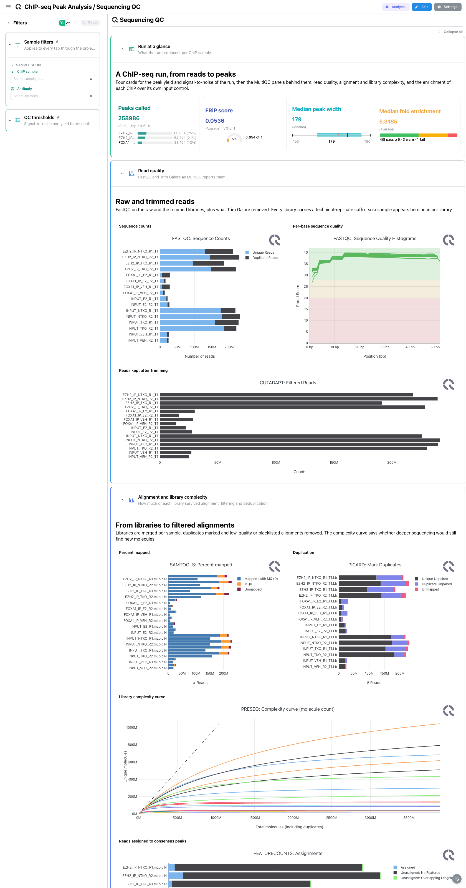
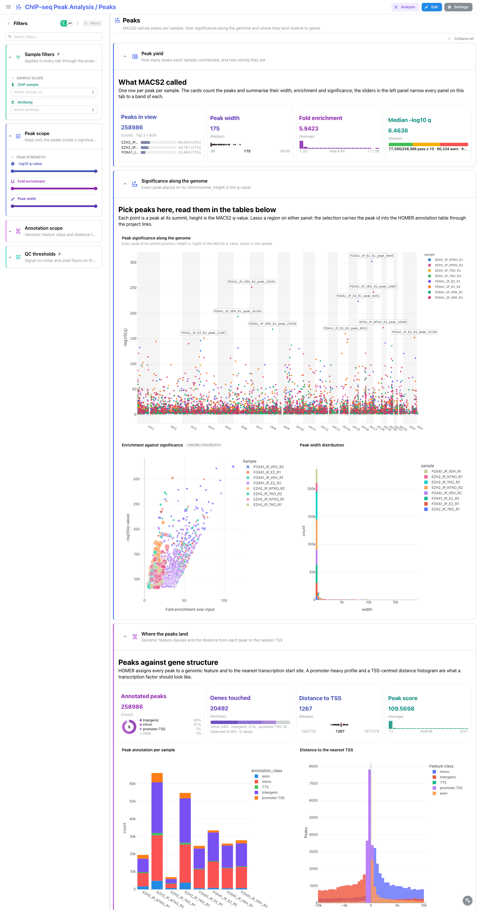
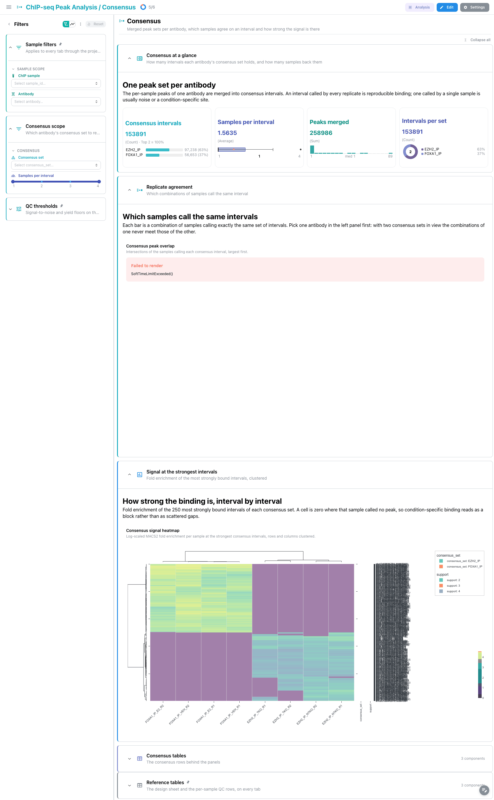
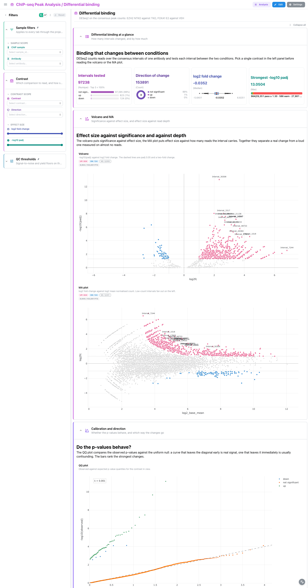

# nf-core/chipseq 1.2.0: Depictio dashboards

This template turns the output of [nf-core/chipseq](https://nf-co.re/chipseq) 1.2.0 into a
single five-tab Depictio dashboard. chipseq aligns ChIP and input libraries, filters and
deduplicates them, calls peaks per sample with MACS2, annotates those peaks with HOMER, merges
them into one consensus peak set per antibody and finally tests each consensus interval for
differential binding with DESeq2. The dashboard follows that chain from left to right.

Data comes from the AWS megatest run
`results-048fd6854fcc85b355c61dfc2e21da0bcc6399ea` (the 1.2.0 release tag): sixteen human
libraries, EZH2 ChIP in NTKO and TKO cells and FOXA1 ChIP in E2 and VEH treated cells, two
replicates each, every ChIP against its own input control.

> **This template reads a REPROCESSED MultiQC report.**
> chipseq 1.2.0 is a DSL1 pipeline and this run published MultiQC 1.9, which writes
> `multiqc_data.json` and no parquet. Depictio reads only `multiqc.parquet` (MultiQC 1.31 and
> later), so the MultiQC tab is bound to a report this repository generates by re-running the
> pinned MultiQC 1.35 over the run's own raw tool outputs. The published 1.9 report is not
> used. Its anchors and plot names differ from the 1.35 ones the template is authored
> against, so never copy a `selected_plot` out of the published HTML report: read it from
> `multiqc.list_plots()` on the regenerated parquet. See the Reproducing section below and
> `VALIDATION_REPORT.md`.

---

## How the dashboard is built

- **One funnel, five tabs.** MultiQC, then Signal, then Peaks, then Consensus, then
  Differential binding. Each tab answers the question the previous one raises: are the
  libraries good, is each ChIP enriched over its own input, what did MACS2 call in each
  sample, which of those calls the replicates agree on, and which of the agreed intervals
  change between conditions.
- **The design sheet is the hub.** `pipeline_info/design_controls.csv` is one row per ChIP
  sample with the input control it was called against and its antibody. A persistent
  `Sample filters` section (ChIP sample, antibody) is pinned to the top of every tab, and the
  template's links fan a pick there out to the MultiQC panels, the peak table, the peak QC
  summary and the HOMER annotation at once.
- **Pinned design and reference tables.** The design sheet sits in a collapsed `ChIP design`
  section pinned to the top, with four cards counting the ChIP samples split by antibody, the
  antibodies themselves, the input controls and the share of ChIPs whose antibody is
  replicated; the per-sample peak QC rows sit in a collapsed `Reference tables` section
  pinned to the bottom. Both follow the viewer from tab to tab, so the cohort and the numbers
  behind the cards are one click away everywhere.
- **Peak-level selection, both ways.** The manhattan panel on the Peaks tab carries
  `selection_enabled` on `peak_id`, and both peak tables carry `row_selection_enabled` on the
  same column. Lassoing peaks there narrows the tables, ticking rows in a table narrows the
  panels, and the project links carry the selection between the MACS2 and HOMER collections.
- **Catalog provenance.** 49 of the 97 tiles carry a `use:` catalog reference, so the tile
  chrome says where the panel comes from: `macs2/*` for the peak and consensus panels,
  `homer/annotated_peaks` for the annotation panels, `deseq2/*` for the differential binding
  panels and `multiqc/<module>` for the tool-module QC panels.
- **Everything matches on file name.** No data collection or recipe glob spells out the
  `bwa/mergedLibrary/macs/narrowPeak/` prefix, so a run aligned with a different aligner lands
  in the same collections.

---

## MultiQC

The main tab, and the one reading the reprocessed report.

`Run summary` is the MultiQC General Statistics table: one row per library, pooling the
FastQC, Trim Galore, samtools, Picard, MACS2 and phantompeakqualtools headline numbers. It is
the one panel in the report that speaks for the run rather than for a single tool, so it is
what the tab opens on, and the sections below take it apart module by module.

`Read quality` carries FastQC sequence counts and quality histograms and the cutadapt filtered
read bars. Every library appears here under its `<sample>_T<n>` technical-replicate name, so a
sample shows up once per library rather than once per sample.

`Alignment and library complexity` pairs samtools percent mapped with Picard duplication, then
the preseq complexity curve full width, then the featureCounts assignment bars that say how
many reads fall inside the consensus peaks.

`ChIP enrichment` is the tab's point: the deepTools fingerprint curve, which separates an
enriched ChIP from a flat input, next to the FRiP scores, then the strand cross-correlation
plot with the NSC and RSC coefficients derived from it.

Every tile on this tab reads the report. The panels that read a tool's own tables instead of
MultiQC's rendering of them are on the Signal tab, next to the collections they come from.



## Signal

preseq, plotFingerprint and plotProfile each write a per-sample table beside the curve MultiQC
renders. This tab reads those tables.

`Signal at a glance` is a four-card strip on them: coverage concentration as a Tukey box plot,
the mean divergence from the input on a gauge, the share of the genome called enriched as a
histogram, and the strongest metagene signal with a top-3 breakdown by sample.

`Library complexity` is `use: preseq/complexity_ribbon`, which adds the 95% confidence band
MultiQC drops, so a library whose extrapolation is guesswork is visible as a ribbon that fans
out rather than as a line that looks as certain as any other.

`Coverage concentration` is `use: deeptools/fingerprint_scatter`, deepTools' own QC scatter:
the share of the genome called enriched against the Jensen-Shannon distance to the input,
point size the differential enrichment and colour how concentrated the coverage is against a
uniform library of the same depth. Both axes need `--JSDsample`, so only the IP libraries
carry a point; the inputs are the reference each IP is compared against.

`Metagene signal` is `use: deeptools/metagene_profile`, the `plotProfile` matrix as one curve
per library with the TSS marked at bin 300 and the scaled gene body shaded.

Clicking a curve or a point on any of those three panels filters the dashboard to that
library.

## Peaks

`Peak yield` is a four-card strip on the peak table: peaks in view with a top-3 breakdown by
sample, peak width as a box plot, fold enrichment as a histogram, and median -log10 q against
a threshold.

`Significance along the genome` puts every peak at its summit position with -log10 of the
MACS2 q-value as height, coloured by sample. It is the tab's selection source: lasso a region
and the peak ids travel to the tables below and, through the project links, to the HOMER
annotation. Beside it, a volcano of the same significance against fold enrichment over input,
with the q 1e-10 and five-fold lines drawn and the peaks past both drawn large; and a
peak-width histogram per sample, which is what separates a sharp transcription-factor profile
from a broad histone mark.

`Where the peaks land` reads the HOMER annotation: cards for annotated peaks by feature class
(donut), genes touched (composition by class), distance to TSS (box plot) and peak score
(histogram); a stacked bar of feature class per sample; and a code-mode histogram of the
signed distance to the nearest TSS, clipped to a 10 kb window and split by feature class, with
the TSS marked. The raw column runs to several hundred kb, so without the window the peak at
zero flattens out. Under it, `use: homer/tss_distance` reads the same distances pre-binned
by the recipe, one curve per sample as a share of that sample's peaks: the histogram pools
samples and splits by class, the profile does the opposite, and being a share rather than a
count is what lets libraries of different depth be compared.

`Peak tables` (collapsed) holds the HOMER annotation table and the MACS2 call table, both with
row selection on `peak_id`.

The left panel adds a `Peak scope` group (q-value, fold enrichment and width range sliders)
and a collapsed `Annotation scope` group (feature class, distance to TSS).



## Consensus

`Consensus at a glance`: intervals per consensus set with a top-3 breakdown, samples per
interval as a box plot, peaks merged as a histogram, and intervals per set as a donut.

`Replicate agreement` is an UpSet of the eight per-sample presence columns: each bar is a
combination of samples calling exactly the same set of intervals. Pick a single antibody in
the left panel first, because the combinations of one consensus set never meet those of the
other and reading both at once is meaningless.

`Signal at the strongest intervals` is a clustered complex heatmap of MACS2 fold enrichment,
log1p scaled, rows annotated by consensus set and support. It plots the 250 most strongly
bound intervals of each consensus set rather than all 153891, because a heatmap draws one row
per interval. A cell is zero where that sample called no peak, so condition-specific binding
reads as a block rather than as scattered gaps.

`Consensus tables` (collapsed) holds the boolean matrix and the fold-enrichment matrix, both
with row selection on `peak_id`, linked to each other in both directions.



## Differential binding

`Differential binding at a glance`: intervals tested with a top-3 breakdown by direction,
direction of change as a donut, log2 fold change as a box plot, and the strongest -log10 padj
against a significance threshold.

`Volcano and MA` pairs the two standard views. The volcano puts -log10(padj) against log2 fold
change with the padj 0.05 and two-fold lines drawn; the MA plot puts effect size against log2
mean normalised count, where the low-count intervals fan out on the left. Together they
separate a real change from a loud one measured on almost no reads.

`Calibration and direction` pairs a QQ plot of observed against expected p-value quantiles
with a ranked bar chart of the 25 intervals with the largest significant effect.

`Differential tables` (collapsed) holds the DESeq2 rows with row selection on `gene_id`.

Pick a single contrast in the left panel before reading any of these panels. DESeq2 names
consensus intervals `Interval_1 ... Interval_N` and the numbering restarts in each consensus
set, so `gene_id` identifies an interval only together with its contrast; the `Contrast`
filter is a single-choice `Select` for that reason.

---



## Catalog modules

| Module | Outputs | Renders as |
|---|---|---|
| `depictio/catalog/macs2/` | `peaks`, `broad_peaks`, `peak_summary`, `consensus_boolean`, `consensus_fc` | manhattan, UpSet, complex heatmap, 2 figures, 4 tables, 14 cards |
| `depictio/catalog/homer/` | `annotate_peaks`, `tss_distance_profile` | profile, 3 figures, 7 cards, table with row selection |
| `depictio/catalog/preseq/` | `complexity_curve` | profile with a confidence ribbon, figure, 4 cards, table |
| `depictio/catalog/deeptools/` | `fingerprint_metrics`, `plot_profile` | scatter (X/Y), profile, 2 figures, 7 cards, 2 tables |
| `depictio/catalog/deseq2/` (reused) | `results` | volcano, MA, QQ, DA barplot, 4 cards, figure, table |

`macs2` and `homer` both map to nf-core modules (`macs2/callpeak`, `homer/annotatepeaks`), so
their `module.yaml` carries `nf_core_url` and leaves the rest of the identity to the nf-core
`meta.yml`. `deseq2` comes from the differentialabundance workstream and is used unchanged.

The MultiQC modules this pipeline emits already have catalog entries: `fastqc`, `cutadapt`,
`samtools`, `picard`, `featurecounts` existed, and `preseq` and `deeptools` were added here.
`preseq` and `deeptools` have a standalone tool as well as a MultiQC entry, and the two do
not overlap: the panels are the curves MultiQC redraws from its parquet, the tools read the
tables nf-core publishes beside them, which carry the preseq confidence bounds and the
per-sample fingerprint metrics the panels leave out. See `TEMPLATE_BOTTLENECKS.md`, "What
MultiQC parses but never publishes as data".

`macs` and `phantompeakqualtools` are parsed by MultiQC but expose no plot, only
general-statistics columns, so they get no catalog entry and no panel of their own; they
reach the dashboard through the General Statistics table alone. chipseq's own
custom-content sections (FRiP, peak counts, NSC/RSC, strand cross-correlation, the DESeq2 PCA
and clustering panels) are pipeline specifics rather than tool modules, so they are bound as
plain MultiQC tiles with no `use:` badge.

---

## Reproducing

```bash
# 1. Fetch the megatest subset (399 files, 213 MB, no credentials needed).
bash depictio/projects/nf-core/chipseq/1.2.0/download_test_data.sh
#    -> ~/Data/depictio-nfcore/chipseq/1.2.0/megatest

# 2. REQUIRED. Regenerate the MultiQC report with the pinned MultiQC 1.35.
#    The run published MultiQC 1.9, which ships no parquet, so without this step
#    the multiqc_data collection finds nothing and the MultiQC tab is empty.
python -m depictio.dev_scripts.multiqc_reprocess \
  --src  ~/Data/depictio-nfcore/chipseq/1.2.0/megatest \
  --dest ~/Data/depictio-nfcore/chipseq/1.2.0/megatest
#    -> multiqc/multiqc_data/multiqc.parquet + REPROCESSED.json
#    Check REPROCESSED.json: source_version 1.9, reprocessed_with 1.35, 20 modules.
#    Do not re-run this over a directory that already holds the regenerated
#    parquet: the source-version probe would then read 1.35 back off it.

# 3. Dry run, then the real ingest.
python -m depictio.cli run --template nf-core/chipseq/1.2.0 \
  --data-root ~/Data/depictio-nfcore/chipseq/1.2.0/megatest --dry-run
python -m depictio.cli run --template nf-core/chipseq/1.2.0 \
  --data-root ~/Data/depictio-nfcore/chipseq/1.2.0/megatest
```

Do not pass `--project-name`: the dashboard's `project_tag` is resolved by project name, so
renaming the project breaks a later standalone `depictio dashboard import`. Re-ingesting
accumulates dashboards, so delete the project before repeating a run rather than renaming it.

To check which module and plot names the regenerated report actually offers:

```python
import multiqc

multiqc.parse_logs(
    "~/Data/depictio-nfcore/chipseq/1.2.0/megatest/multiqc/multiqc_data/multiqc.parquet"
)
multiqc.list_plots()
```

This is the list `template.yaml`'s `dc_specific_properties.plots` and every `selected_plot` in
`dashboards/base.yaml` are authored against. It is a MultiQC 1.35 list, and it is not the same
as the section list in the 1.9 HTML report the pipeline published.
