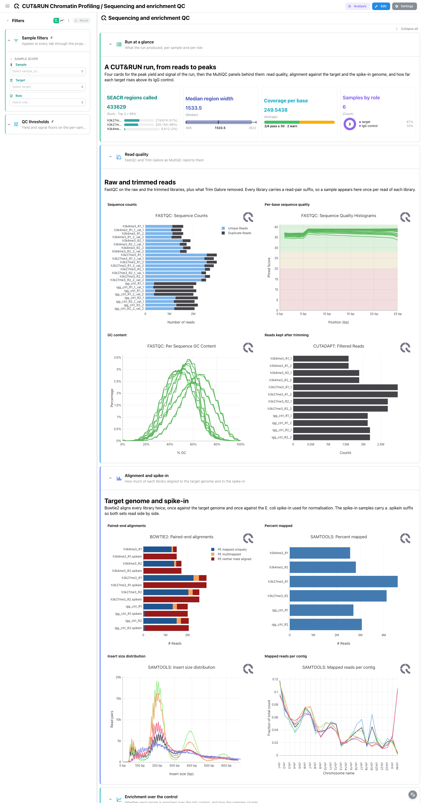
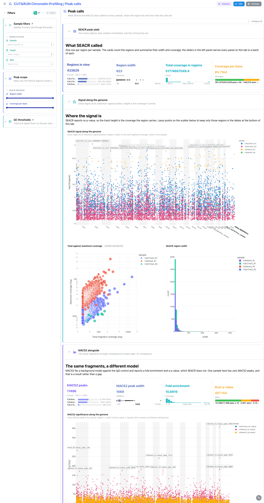
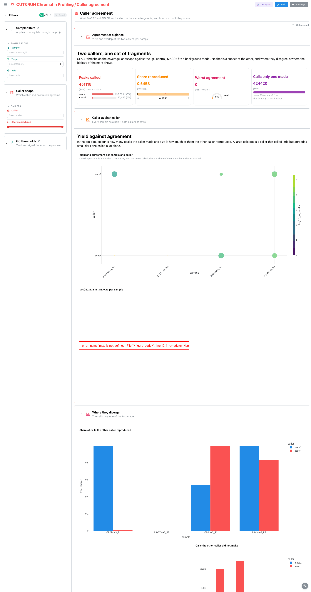
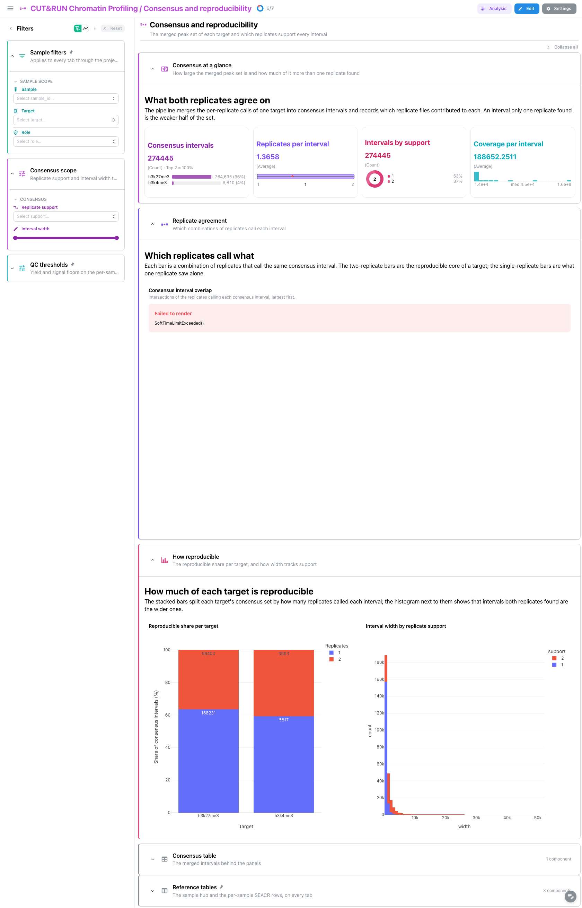

# nf-core/cutandrun 3.1: Depictio dashboards

This template turns the output of [nf-core/cutandrun](https://nf-co.re/cutandrun) 3.1 into a
single four-tab Depictio dashboard. cutandrun trims and aligns CUT&RUN libraries against both
the target genome and a spike-in, converts the alignments to fragment coverage, calls
enriched regions with SEACR against the IgG control (and, optionally, with MACS2 over the
same fragments), and merges the calls of each target into a consensus set. The dashboard
follows that chain from left to right, with one tab in the middle devoted to what the two
callers disagree about.

Data comes from the AWS megatest run
`results-42502fb44975e930eec865353c5481f472bcf766` (the 3.1 release tag): H3K4me3 and
H3K27me3 in two replicates each, plus two IgG controls.

> **This template reads a REPROCESSED MultiQC report.**
> cutandrun 3.1 published MultiQC 1.14, which writes `multiqc_data.json` and no parquet.
> Depictio reads only `multiqc.parquet` (MultiQC 1.31 and later), so the QC tab is bound to a
> report this repository generates by re-running the pinned MultiQC 1.35 over the run's own
> raw tool outputs. Unlike chipseq and atacseq, 1.14 already parsed every module 1.35 does
> for this run, so the reprocess buys the format and not new panels. It is still mandatory:
> without it the QC tab is empty. See the Reproducing section below and
> `VALIDATION_REPORT.md`.

---

## How the dashboard is built

- **One funnel, four tabs.** Sequencing and enrichment QC, then Peak calls, then Caller
  agreement, then Consensus and reproducibility. Each tab answers the question the previous
  one raises: are the libraries clean and is the target enriched over its control, what did
  each caller call, how much of that the two callers share, and how much of it both
  replicates of a target support.
- **The sample hub is the hub.** `samples` is one row per library with its target, its
  replicate number and its role (target or control). A persistent `Sample filters` section
  (sample, target, role) is pinned to the top of every tab, and the template's links fan a
  pick there out to the MultiQC panels, both peak collections, the peak summary, the
  fragment-length tables and the caller comparison at once.
- **Pinned reference tables and thresholds.** The sample hub and the per-sample SEACR summary
  sit in a collapsed `Reference tables` section pinned to the bottom of every tab, next to a
  collapsed `QC thresholds` section holding the yield and coverage floors.
- **Selection, both ways.** The total-against-maximum-coverage scatter on the Peak calls tab
  carries `selection_enabled` on `peak_id` and both peak tables carry
  `row_selection_enabled` on the same column; the caller scatter on the Caller agreement tab
  and the comparison table do the same on `sample`. Lassoing narrows the tables, ticking rows
  narrows the panels.
- **Catalog provenance.** 41 of the 81 tiles carry a `use:` catalog reference, so the tile
  chrome says where the panel comes from: `seacr/*` for the SEACR panels, `macs2/*` for the
  MACS2 comparison panels, and `multiqc/<module>` for the tool-module QC panels.
- **Everything matches on file name.** No data collection or recipe glob spells out the
  numbered `03_peak_calling/` prefixes, so only `megatest.yaml` knows about the stage
  numbering and a reorganised release needs the manifest updated and nothing else.

---

## Sequencing and enrichment QC

The main tab, and the one reading the reprocessed report.

`Run at a glance` is a four-card strip: SEACR regions called across the run with a breakdown
by sample, the median region width as a Tukey box plot, the median coverage per base against
a threshold, and the sample count broken down by role, which is the card that makes the two
IgG controls visible.

`Read quality` carries FastQC sequence counts, quality histograms and GC content, then the
cutadapt kept reads.

`Alignment and spike-in` is CUT&RUN specific: bowtie2 paired-end alignment rates for the
target genome and the spike-in side by side, then samtools percent mapped, insert size and
per-contig distribution. The spike-in rate is what a normalisation factor is derived from, so
a library whose spike-in alignment collapses is not comparable to the others even if its
target alignment looks fine.

`Enrichment over the control` is the tab's point: the deepTools fingerprint curve and its
quality metrics, which separate an enriched target from a flat IgG control, then the sample
PCA and the sample correlation matrix. Those four panels are pictures MultiQC redraws from
its own parquet; nf-core also publishes the three tables behind them, and three tiles below
read those instead. `use: deeptools/fingerprint_scatter` puts every library on one plane,
coverage concentration against divergence from a uniform library, so the targets separate
from the IgG controls; `use: deeptools/pca_embedding` reads the `plotPCA` loadings with the
variance each component explains; and `use: deeptools/correlation_heatmap` reads the
correlation matrix itself, where a block spanning two targets is a swap or a contamination.

`Fragment lengths` closes the tab with the nucleosomal ladder: four cards on the
fragment-length table, a code-mode distribution figure and its cumulative twin. For H3K4me3
the ladder should show a clear mononucleosome peak; a flat distribution means the digestion
did not work.

---



## Peak calls

`SEACR peak yield` counts the regions in view, their width distribution, the total coverage
they carry and the coverage per base.

`Signal along the genome` places every region at its maximum-signal position with height
`log10(total signal)`, next to a code-mode scatter of total against maximum coverage carrying
`selection_enabled` on `peak_id`, and a width histogram.

`MACS2 alongside` is the same fragments through a background-model caller: four cards (peaks,
width, fold enrichment, best q-value) and a manhattan panel over `-log10(q)`. Note that the
two manhattan panels on this tab do not share a y axis: SEACR has no p-value and no fold
enrichment at all, so its panel plots coverage while the MACS2 panel plots significance.

`Peak tables`, collapsed, holds both callers' rows with row selection on `peak_id`.

The left rail filters on region width and coverage per base.

---



## Caller agreement

The tab that exists because this pipeline runs two callers over one set of fragments.

`Agreement at a glance` counts the peaks each caller made, the share each caller's calls the
other reproduced, the worst agreement in view on a gauge, and the calls only one of the two
made.

`Caller against caller` places every sample as a point with the two callers as rows in a dot
plot, next to a code-mode scatter of MACS2 yield against SEACR yield per sample, carrying
`selection_enabled` on `sample`.

`Where they diverge` holds two bars: the calls the other caller did not make, and the share
of calls the other caller reproduced.

`Comparison table` holds the eight rows (four samples times two callers) with row selection
on `sample`.

`macs2_peaks` is the template's only `optional: true` collection, so a SEACR-only run keeps
every other tile. This tab is the part that degrades least gracefully in that case: with one
caller present the comparison reads as complete agreement rather than as missing data. See
`VALIDATION_REPORT.md`, CR-D3.

---



## Consensus and reproducibility

`Consensus at a glance` counts the merged intervals per target, the replicates per interval,
the split by support as a donut and the coverage per interval.

`Replicate agreement` is the UpSet panel over the four replicate columns of the consensus
table: which combinations of replicates call each interval.

`How reproducible` holds a code-mode bar of the reproducible share per target and a histogram
of interval width by replicate support.

Read the donut before the rest: on this megatest 63 % of the consensus intervals are called
by a single replicate, because H3K27me3 is a broad mark whose replicates overlap poorly. The
`Replicate support` filter defaults to showing every value rather than the reproducible
subset, so the cards above average over that mostly single-replicate set unless you narrow
it.

`Consensus table`, collapsed, holds the merged intervals with row selection on `peak_id`.

---



## Reproducing

```bash
# 1. Fetch the megatest subset (103 files, 90 MB)
bash depictio/projects/nf-core/cutandrun/3.1/download_test_data.sh \
  ~/Data/depictio-nfcore/cutandrun/3.1/megatest

# 2. Regenerate the MultiQC report Depictio reads (the run wrote 1.14)
python -m depictio.dev_scripts.multiqc_reprocess \
  --src  ~/Data/depictio-nfcore/cutandrun/3.1/megatest \
  --dest ~/Data/depictio-nfcore/cutandrun/3.1/megatest

# 3. Dry run, then ingest
python -m depictio.cli run --template nf-core/cutandrun/3.1 \
  --data-root ~/Data/depictio-nfcore/cutandrun/3.1/megatest --dry-run
python -m depictio.cli run --template nf-core/cutandrun/3.1 \
  --data-root ~/Data/depictio-nfcore/cutandrun/3.1/megatest
```

Step 2 is mandatory, not optional: without it `multiqc_data` finds no parquet and the whole
QC tab is empty. Keep the first `REPROCESSED.json` or delete `multiqc/multiqc_data/` before
re-running, because the source-version probe reads the parquet it just wrote.
