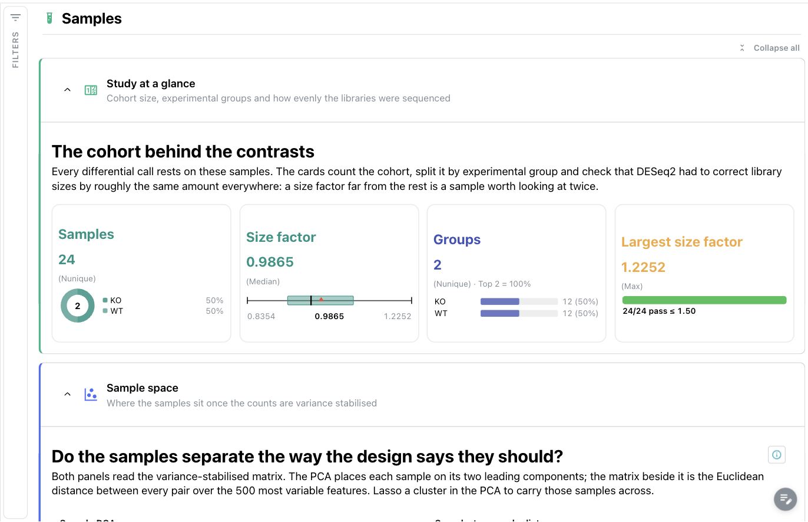
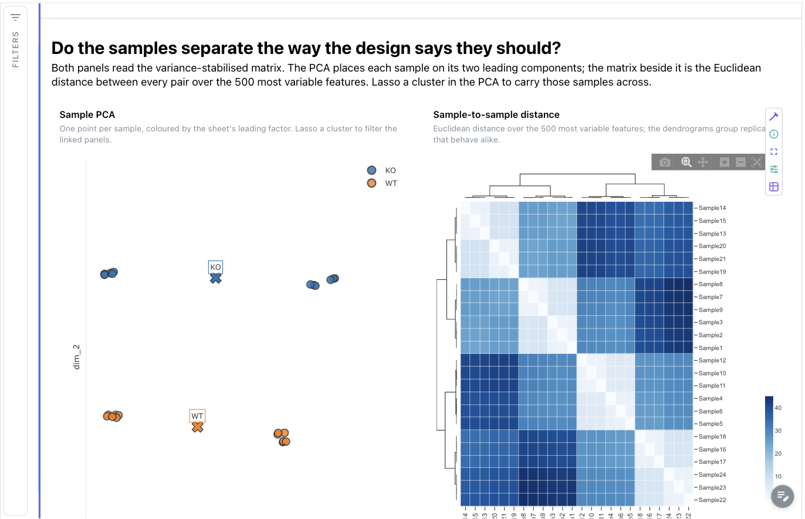
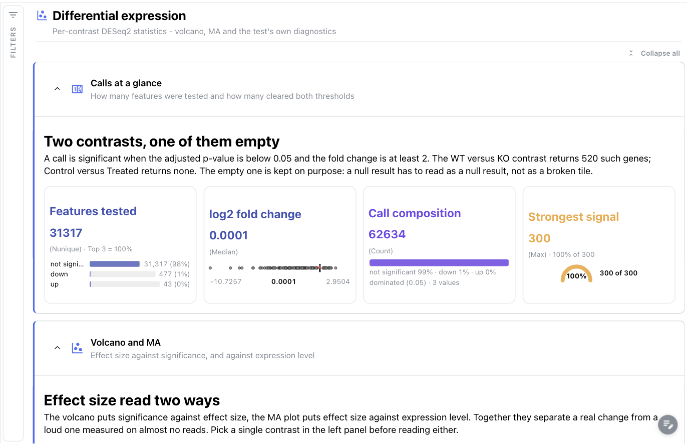
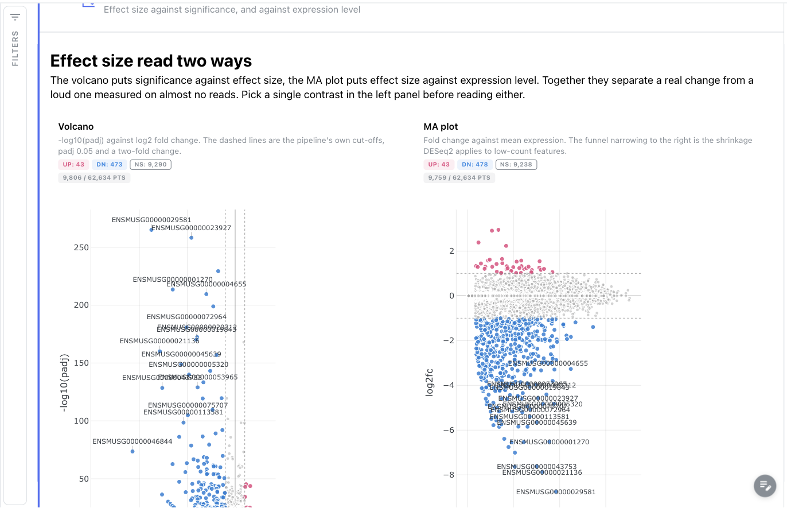
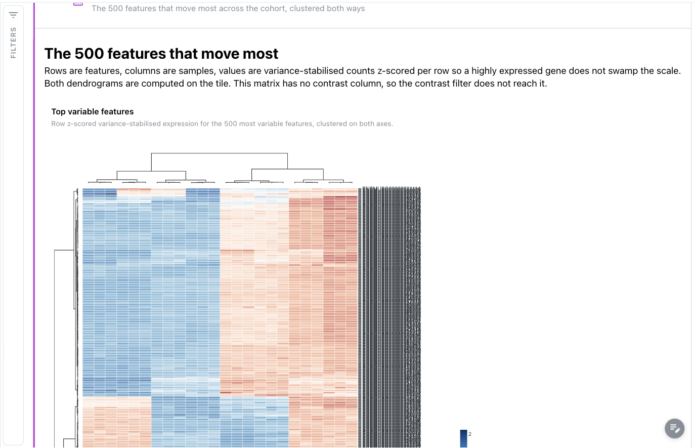
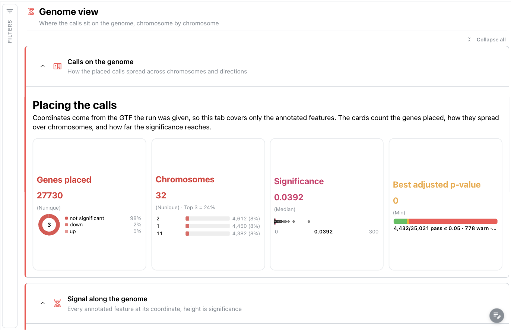
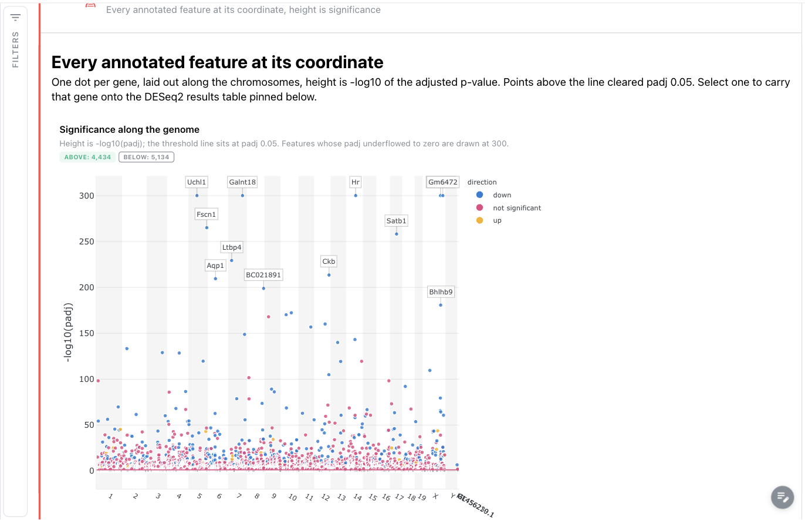

# nf-core/differentialabundance 2.0.0: Depictio dashboards

This template turns the output of
[nf-core/differentialabundance](https://nf-co.re/differentialabundance) 2.0.0 into one
interactive Depictio dashboard with four tabs. The pipeline runs DESeq2 over a count
matrix and a contrast sheet; the template surfaces the per-contrast statistics, the gene
annotation joined onto them, and the variance-stabilised sample space the pipeline uses
for its own exploratory plots.

Scope: the DESeq2 route (`--differential_method deseq2`, the pipeline default). The
limma / propd / dream routes write differently named tables and are not bound.

## No MultiQC tab

differentialabundance runs no MultiQC. Its reporting is an R/shinyngs application, which
is not parquet-backed and therefore has nothing Depictio can read. There is no
`multiqc_data` data collection and no QC tab; the **Samples** tab carries the run-level
quality read instead (cohort size, group balance, library-size normalisation, and the
sample-distance matrix that exposes an outlier).

## Data source (AWS megatest)

```
s3://nf-core-awsmegatests/differentialabundance/results-30ed7741fc392127156c2fb10cfa3d69d216b54b
```

24 mouse RNA-seq samples (featureCounts matrix), two contrasts:

| Contrast | Comparison | Blocking | Significant calls (padj < 0.05, abs log2FC >= 1) |
|---|---|---|---|
| `Condition_genotype_WT_KO_study` | Condition genotype, WT vs KO | `batch` | 520 of 31,317 |
| `Condition_treatment_Control_Treated_study` | Condition treatment, Control vs Treated | none | 0 of 31,317 |

**The second contrast is deliberately kept.** A real analysis often returns nothing, and a
dashboard has to say so rather than look broken. Its volcano is a symmetric cloud with no
labelled points, its DA-barplot panel is empty, and its `_filtered` table on disk is a
header with no rows. The dashboard text says this in as many words on the Differential
expression tab.

This run was launched with two parameter sets at once, so every table sits one directory
deeper than a normal run
(`tables/differential/deseq2_rnaseq_gsea,deseq2_rnaseq_gprofiler2/…`, comma included). The
template absorbs the difference: its scans match on file name and its recipe globs use
`**`, so a plain run and this one bind identically.

## Tabs

### 1. Samples

Is the experiment sound before any contrast is read?

* **Study at a glance**: cohort size split by group (donut), the DESeq2 size-factor
  distribution (Tukey box plot), the group census (top 3) and the largest size factor
  against a 1.5 ceiling (threshold strip).
* **Sample space**: the sample PCA on the 500 most variable features, coloured by the
  sheet's leading factor with group centroids, next to the Euclidean sample-to-sample
  distance matrix with dendrograms on both axes. Lassoing the PCA carries those samples to
  the distance matrix through the `samples` hub links.





### 2. Differential expression

* **Calls at a glance**: features tested with the up/down/not-significant split (top 3),
  the log2 fold-change spread, the call composition, and the strongest signal on a gauge
  scaled to 300 (`-log10(padj)`; see the cap note below).
* **Volcano and MA**: `deseq2/volcano` and `deseq2/ma`, both cut at the pipeline's own
  thresholds (padj 0.05, two-fold change).
* **Test diagnostics**: `deseq2/qq` against the uniform null, beside a code-mode scatter
  that pairs the two contrasts gene by gene. That tile needs a per-contrast reshape, which
  is why it is the one figure written in code rather than UI mode. Selecting a point
  carries its `gene_id` to the annotated table and to the pinned results table.
* **Gene table**: the annotated calls with row selection on `gene_id`, the other half of
  the selection pair.





### 3. Expression

* **Annotation at a glance**: biotype census (concentration strip), annotated genes by
  direction, and mean significance on a coverage bar gauged against the significance
  cut-off itself, `-log10(0.05)` = 1.301. The cut-off is the reference that makes the
  bar readable: gauged against the largest value in the table instead, a mean of about
  1 draws an empty bar.
* **Top variable features**: the 500 most variable features, row z-scored, clustered on
  both axes. The matrix has no contrast column, so the contrast filter does not reach it.
* **Effect by biotype**: `deseq2/annotated_da_barplot` (the 15 largest effect sizes per
  contrast, one panel per contrast, so the null contrast reads as an empty panel) beside a
  UI-mode box plot of effect size within each biotype.



### 4. Genome view

* **Calls on the genome**: genes placed by direction, the chromosome census, the
  significance spread and the best adjusted p-value against a 0.05 cut-off.
* **Signal along the genome**: the Manhattan plot, height `-log10(padj)`, threshold line
  at padj 0.05, selectable by `gene_id`.
* **Per-chromosome detail**: the lollipop panel splits the calls one chromosome at a
  time (pick a few chromosomes in the left panel to keep it readable), beside the volcano
  redrawn with gene symbols and coloured by biotype.





### Reference tables (pinned, every tab)

The observation sheet and the full DESeq2 result set, collapsed by default and pinned to
the bottom of every tab. The results table carries row selection on `gene_id`.

## Reading notes

* **`-log10(padj)` is capped at 300.** Five genes in the WT/KO contrast have a padj that
  underflowed to exactly 0 in the DESeq2 output; `-log10(0)` is infinite and no axis can
  place it. Those rows are drawn at 300, just short of the double-underflow limit, so they
  stay visible above every finite value (the largest of which is about 265). Points sitting
  exactly on 300 are "beyond measurement", not "measured at 300".
* **`padj` is null for about a third of the features.** That is DESeq2's independent
  filtering, not a defect: those features never reached the multiple-testing correction.
  They count as not significant and have no Manhattan or volcano height.
* **The annotated collections are shorter than the raw ones** (27,743 against 31,317 rows
  per contrast). Features the GTF did not place on the genome are dropped, since there is
  no coordinate to draw them at. Eleven of the 520 significant WT/KO calls are lost this
  way.
* **The sample filter stops at the sample-space collections.** A contrast pools its
  samples, so the differential tables have no sample column and nothing to filter on.

## Reproducing

```bash
bash depictio/projects/nf-core/differentialabundance/2.0.0/download_test_data.sh
# then follow post_fetch_help in megatest.yaml for the samplesheet and contrasts curls
depictio-cli run --template nf-core/differentialabundance/2.0.0 \
  --data-root ~/Data/depictio-nfcore/differentialabundance/2.0.0/megatest
```

`--project-name` is safe for `run` itself, but leave it off anyway. The dashboard carries
`project_tag: Differential Abundance Analysis`, and the standalone `depictio dashboard
import` resolves that tag by name, so a renamed project cannot take a re-imported
dashboard later.
