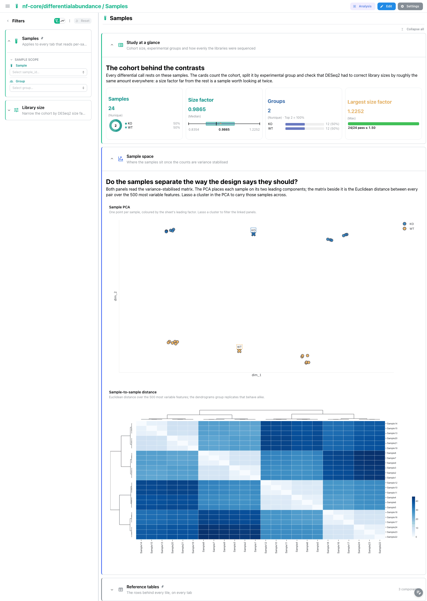
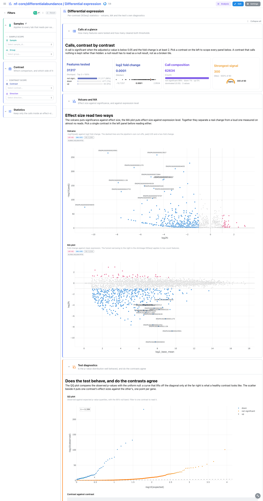
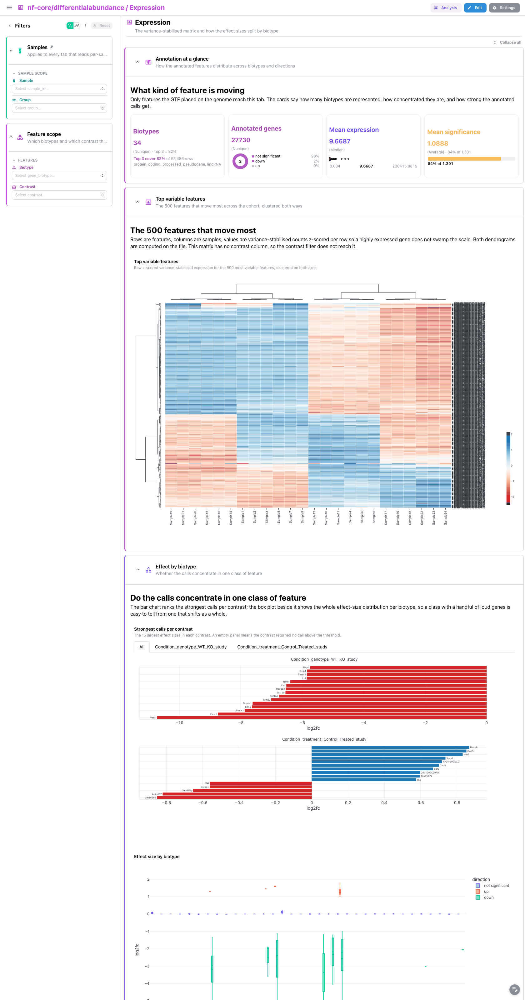
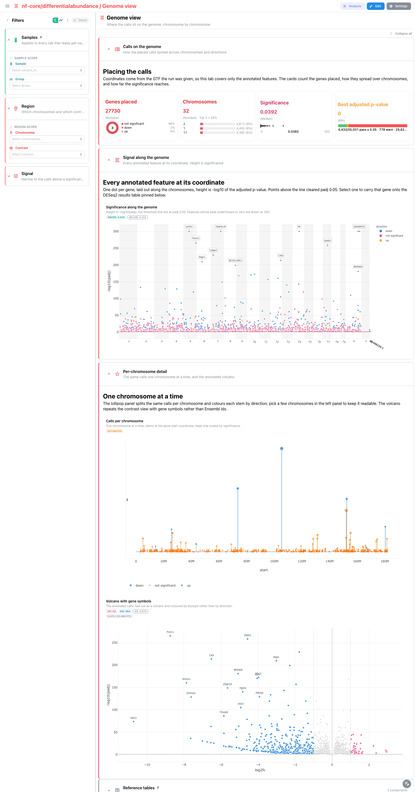

# nf-core/differentialabundance 2.0.0: Depictio dashboards

This template turns the output of
[nf-core/differentialabundance](https://nf-co.re/differentialabundance) 2.0.0 into one
interactive Depictio dashboard with four tabs. The pipeline runs DESeq2 over a count
matrix and a contrast sheet; the template surfaces the per-contrast statistics, the gene
annotation joined onto them, and the variance-stabilised sample space the pipeline uses
for its own exploratory plots.

Scope: the DESeq2 route (`--differential_method deseq2`, the pipeline default). The
limma / propd / dream routes write differently named tables and are not bound.

## No MultiQC tab

differentialabundance runs no MultiQC. Its reporting is an R/shinyngs application, which
is not parquet-backed and therefore has nothing Depictio can read. There is no
`multiqc_data` data collection and no QC tab; the **Samples** tab carries the run-level
quality read instead (cohort size, group balance, library-size normalisation, and the
sample-distance matrix that exposes an outlier).

## Data source (AWS megatest)

```
s3://nf-core-awsmegatests/differentialabundance/results-30ed7741fc392127156c2fb10cfa3d69d216b54b
```

24 mouse RNA-seq samples (featureCounts matrix), two contrasts:

| Contrast | Comparison | Blocking | Significant calls (padj < 0.05, abs log2FC >= 1) |
|---|---|---|---|
| `Condition_genotype_WT_KO_study` | Condition genotype, WT vs KO | `batch` | 520 of 31,317 |
| `Condition_treatment_Control_Treated_study` | Condition treatment, Control vs Treated | none | 0 of 31,317 |

**The second contrast is deliberately kept.** A real analysis often returns nothing, and a
dashboard has to say so rather than look broken. Its volcano is a symmetric cloud with no
labelled points, its DA-barplot panel is empty, and its `_filtered` table on disk is a
header with no rows. The dashboard text says this in as many words on the Differential
expression tab.

This run was launched with two parameter sets at once, so every table sits one directory
deeper than a normal run
(`tables/differential/deseq2_rnaseq_gsea,deseq2_rnaseq_gprofiler2/…`, comma included). The
template absorbs the difference: its scans match on file name and its recipe globs use
`**`, so a plain run and this one bind identically.

## Tabs

### 1. Samples

Is the experiment sound before any contrast is read?

* **Study at a glance**: cohort size split by group (donut), the DESeq2 size-factor
  distribution (Tukey box plot), the group census (top 3) and the largest size factor
  against a 1.5 ceiling (threshold strip).
* **Sample space**: the sample PCA on the 500 most variable features, coloured by the
  sheet's leading factor with group centroids, then the Euclidean sample-to-sample
  distance matrix with dendrograms on both axes, then the per-sample expression
  distributions. Lassoing the PCA carries those samples to the distance matrix, to the
  variance-stabilised heatmap on the Expression tab and to the distributions, through the
  PCA's own outgoing links.

  The distribution panel is the one a PCA cannot replace. A PCA says which libraries
  differ; a density curve says whether a library is *shaped* like the others at all, which
  is the question behind a normalisation problem. Every sample is binned on one shared
  grid, so the curves stack and a shifted or short-tailed library shows up as a curve out
  of the bundle rather than as a point off the cloud. Features at the matrix floor are
  excluded from the grid, because the spike they form is tall enough to flatten everything
  else, and published as a share on its own card instead.

#### Filtering by more than one factor

A study is rarely one factor, and until this pass only the leading one had a control: the
rest were visible in the observation sheet and unfilterable. The ingest recipe now
publishes the next three factor-like columns of the sheet under stable names (`factor_2`,
`factor_3`, `factor_4`), so the persistent left rail can carry a control for each without
the template having to know what any given run's sheet calls them. A column with more
levels than a reader can pick from is skipped rather than turned into a dead control, and
each alias carries its source column name alongside it (`factor_2_name` and friends), so a
panel can say which sheet column it is actually filtering. Every column also keeps its own
sanitised name in the sheet, so nothing is hidden by the aliasing.




### 2. Differential expression

* **Calls at a glance**: features tested with the up/down/not-significant split (top 3),
  the log2 fold-change spread, the call composition, and the strongest signal on a gauge
  scaled to 300 (`-log10(padj)`; see the cap note below).
* **Volcano and MA**: one `deseq2/volcano` tile with a view switch in its header
  (`views: [volcano, ma]`), cut at the pipeline's own thresholds (padj 0.05, two-fold
  change). The MA view reads `log2_base_mean` on x.
* **Test diagnostics**: the raw p-value histogram, one panel per contrast (flat with a
  spike at zero is a well-specified test), beside the same volcano tile opened on its QQ
  view against the uniform null, and below them a code-mode scatter
  that pairs the first two contrasts (by id) gene by gene. That tile needs a per-contrast reshape, which
  is why it is the one figure written in code rather than UI mode. Selecting a point
  carries its `gene_id` to the annotated table and to the pinned results table.
* **Gene table**: the annotated calls with row selection on `gene_id`, the other half of
  the selection pair, above a gene record (`record_card`) that follows the selection, one
  card per contrast, and opens on Uchl1. The Ensembl identifier links out through
  `https://www.ensembl.org/id/`.




### 3. Expression

* **Annotation at a glance**: biotype census (concentration strip), annotated genes by
  direction, and mean significance on a coverage bar gauged against the significance
  cut-off itself, `-log10(0.05)` = 1.301. The cut-off is the reference that makes the
  bar readable: gauged against the largest value in the table instead, a mean of about
  1 draws an empty bar.
* **Top variable features**: the 500 most variable features, row z-scored, clustered on
  both axes. The matrix has no contrast column, so the pinned `Contrast scope` does not reach it.
* **Effect by biotype**: `deseq2/annotated_da_barplot` (the 15 largest effect sizes per
  contrast, one panel per contrast, so the null contrast reads as an empty panel) beside a
  UI-mode box plot of effect size within each biotype.




### 4. Genome view

* **Calls on the genome**: genes placed by direction, the chromosome census, the
  significance spread and the best adjusted p-value against a 0.05 cut-off.
* **Signal along the genome**: the Manhattan plot, height `-log10(padj)`, threshold line
  at padj 0.05, selectable by `gene_id`.
* **Per-chromosome detail**: the lollipop panel gives each contrast a lane and each gene a
  head at its start coordinate, coloured by direction, sized by significance and labelled
  for the strongest calls in each lane (pick a chromosome in the left panel first, since
  coordinates from different contigs otherwise share one axis), above the volcano redrawn
  with gene symbols and coloured by biotype.




### 5. Enrichment

Which gene sets moved, and how much of each set carries the movement.

GSEA runs pre-ranked over the DESeq2 statistics and publishes one report per **pole** of
each contrast, so a two-contrast run produces four report tables. Neither the contrast nor
the pole is a column of any of them: both live only in the file name, so the recipe
recovers them from the path and stacks every report into one frame. That is why each panel
here splits on `phenotype` as well as on `contrast`; a set enriched at one pole and a set
enriched at the other are the two ends of one comparison, not two findings.

* **Enrichment at a glance**: sets reported with their split by pole, the strongest
  normalised enrichment score as a Tukey box plot, the median FDR against a 0.05 cut-off,
  and the mean leading-edge share on a gauge.
* **Enriched sets**: one dot per set on its normalised enrichment score, sized by how many
  of its genes were found in the ranked list and coloured by significance. This is the
  `dot_plot` kind on its `enrichment` view, with colour and sort in the tile header.
* **Scores side by side**: the same scores as bars grouped by contrast, which is the view
  that answers whether a set moved in both comparisons or only one.
* **Set table**: one row per set and pole, selectable.

Two details the panel makes explicit rather than leaving to be rediscovered. Read the
**normalised** enrichment score, not the raw one: normalising for set size is what makes a
set of twenty comparable with a set of two hundred. And an FDR q-value of zero is what GSEA
writes for anything below its own resolution, so the significance axis is clipped at the
smallest q-value the run actually resolved rather than sent to infinity.

The contrast picked on the Differential expression tab reaches this tab through a link on
`contrast`, so the enrichment panels follow the comparison being read rather than showing
every contrast at once.


### Observation sheet (pinned, every tab)

Every column of the pipeline's `--input` sheet with the DESeq2 size factor joined on,
collapsed by default and pinned to the top of every tab. The template binds `sample_id`,
`group` and `size_factor` by name and keeps whatever else the sheet carried, so the
covariates a contrast was blocked on are readable here even though no tile is bound to
them.

### Reference tables (pinned, every tab)

The full DESeq2 result set, collapsed by default and pinned to the bottom of every tab. The
results table carries row selection on `gene_id`.

## Reading notes

* **`-log10(padj)` is capped at 300.** Five genes in the WT/KO contrast have a padj that
  underflowed to exactly 0 in the DESeq2 output; `-log10(0)` is infinite and no axis can
  place it. Those rows are drawn at 300, just short of the double-underflow limit, so they
  stay visible above every finite value (the largest of which is about 265). Points sitting
  exactly on 300 are "beyond measurement", not "measured at 300".
* **`padj` is null for about a third of the features.** That is DESeq2's independent
  filtering, not a defect: those features never reached the multiple-testing correction.
  They count as not significant and have no Manhattan or volcano height.
* **The annotated collections are shorter than the raw ones** (27,743 against 31,317 rows
  per contrast). Features the GTF did not place on the genome are dropped, since there is
  no coordinate to draw them at. Eleven of the 520 significant WT/KO calls are lost this
  way.
* **The sample filter stops at the sample-space collections.** A contrast pools its
  samples, so the differential tables have no sample column and nothing to filter on.
* **The contrast is a second pinned scope.** `Contrast scope` is sourced on
  `deseq2_results.contrast` and persistent, so one pick narrows the Differential expression,
  Expression, Genome view and Enrichment tabs at once: the template carries it onto the
  annotated table (`deseq2_results -> deseq2_results_annotated` on `contrast`) and onto the
  GSEA report. The tabs keep only their own local controls (direction, biotype, chromosome,
  pole, thresholds).

## Reproducing

```bash
bash depictio/projects/nf-core/differentialabundance/2.0.0/download_test_data.sh
# then follow post_fetch_help in megatest.yaml for the samplesheet and contrasts curls
depictio-cli run --template nf-core/differentialabundance/2.0.0 \
  --data-root ~/Data/depictio-nfcore/differentialabundance/2.0.0/megatest
```

`--project-name` is safe for `run` itself, but leave it off anyway. The dashboard carries
`project_tag: Differential Abundance Analysis`, and the standalone `depictio dashboard
import` resolves that tag by name, so a renamed project cannot take a re-imported
dashboard later.
