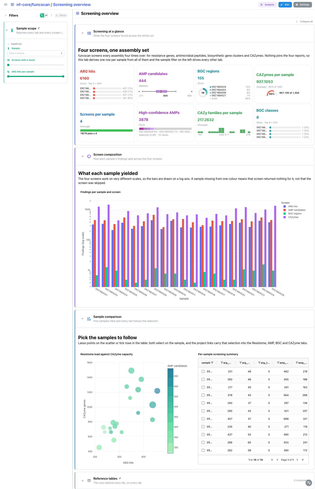
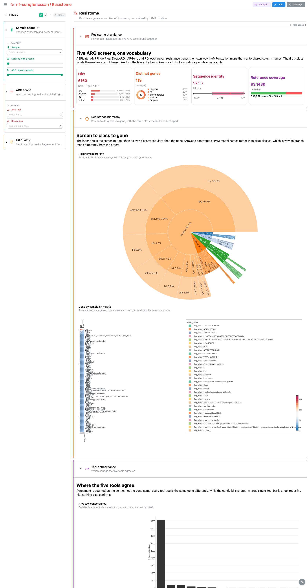
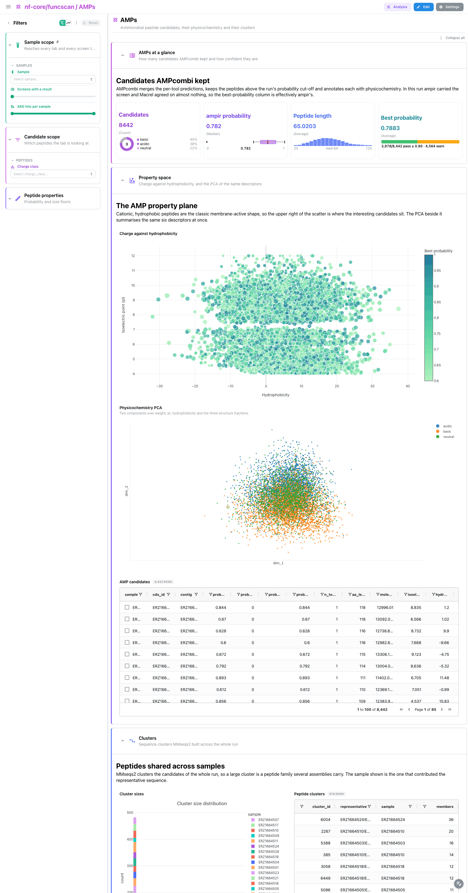
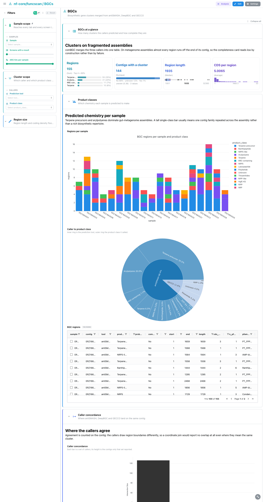
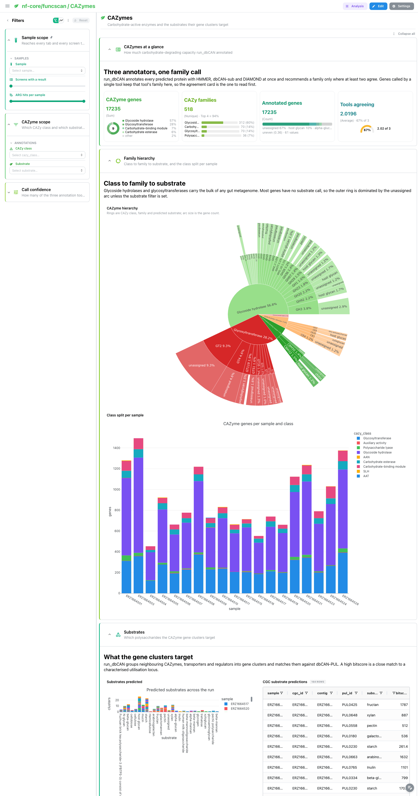

# nf-core/funcscan 4.0.0: Depictio dashboards

This template turns the output of [nf-core/funcscan](https://nf-co.re/funcscan) 4.0.0 into a
single five-tab Depictio dashboard. The pipeline screens (meta)genome assemblies with four
independent arms and aggregates each one into a single report:

| Screen | Tools | Aggregator | Headline file |
|---|---|---|---|
| ARG (resistome) | abricate, AMRFinderPlus, DeepARG, fARGene, RGI | hAMRonization | `reports/hamronization_summarize/hamronization_combined_report.tsv` |
| AMP (peptides) | ampir, Macrel, hmmsearch | AMPcombi2 | `reports/ampcombi2/Ampcombi_summary*.tsv` |
| BGC (clusters) | antiSMASH, DeepBGC, GECCO, hmmsearch | comBGC | `reports/combgc/combgc_complete_summary.tsv` |
| CAZyme | HMMER, dbCAN-sub, DIAMOND | run_dbCAN | `cazyme/dbcan/cazyme_annotation/*/*_overview.tsv` |

Data comes from the AWS megatest run
`results-aee3dc965eb0c77267435544dda30da858763913` (the 4.0.0 release tag), a 19-sample
metagenome-assembly screen of MGnify assemblies with all four arms enabled.

Every screening arm is optional in the template. A run that switched an arm off simply
prunes that arm's data collections, either automatically (the files are absent and the
collections are `optional: true`) or explicitly with `--var SKIP_ARG=true`,
`SKIP_AMP`, `SKIP_BGC`, `SKIP_CAZYME`.

---

## How the dashboard is built

- **Hub data collection.** `screening_summary` is one row per sample with the counts each
  arm produced (`arg_hits`, `amp_candidates`, `amp_high_confidence`, `bgc_regions`,
  `bgc_classes`, `cazymes`, `cazyme_families`, `screens`). It is built by a pipeline-keyed
  recipe that reads the four screening collections through `dc_ref`, so it is declared
  **last** in `data_collections`: the CLI resolves a `dc_ref` source by reading the
  referenced collection back from its Delta table, which only exists once that collection
  has been processed.
- **Links.** Every screening collection is joined to the hub on `sample`, so the
  `Sample scope` filter panel reaches all five tabs. Two further links carry a row
  selection: picking a gene in the hAMRonization table drives the per-sample dot plot, and
  picking a peptide in the AMPcombi table highlights it in the embedding.
- **Sections.** Each tab is a stack of named grid sections opened by a short text tile.
  The funnel is the same everywhere: four cards, then the signature view, then the tool
  concordance, then the rows.
- **Multi-metric cards.** All 20 cards carry a secondary strip: `top_n` breakdowns,
  Tukey `box_plot`s, `donut` and `composition` splits, `gauge`s, `threshold` pass counts
  and `histogram`s.
- **Catalog provenance.** Every advanced visualisation is bound through `use:`
  (`hamronization/arg_hierarchy`, `combgc/bgc_upset`, `dbcan/cazyme_hierarchy`, ...) so the
  tile chrome names the catalog render behind it, and every reference table names its
  catalog output.
- **Pinned reference tables.** The five raw tables sit in a collapsed `Reference tables`
  section that is persistent and pinned to the bottom, so it trails every tab.
- **No QC tab.** The run wrote a MultiQC 1.34 report, but funcscan feeds MultiQC nothing
  but software versions: the parquet holds a single `run_metadata` row with no
  general-statistics table and no module sections. The `multiqc_data` collection stays in
  the template as `optional: true` for future pipeline versions, and the tool versions
  reach the UI through the template's `provenance` block instead.

---

## Screening overview (main tab)

The cross-screen tab. **Screening at a glance** carries eight cards over two rows: ARG hits
with a top-sample breakdown, AMP candidates as a box plot, BGC regions as a donut, CAZymes
as a gauge, then screens completed against a threshold, high-confidence AMPs as a
composition, CAZyme families as a histogram and BGC product classes as a top-N strip.

**Screen composition** is a grouped, log-scaled bar of the four per-sample counts, so a
sample whose resistome is empty but whose CAZyme repertoire is large is visible at a
glance. **Sample comparison** puts an ARG-versus-CAZyme scatter next to the hub table; the
scatter has point selection on `sample`, and the table row-selects on `sample`, so either
one narrows every other tab.

Filters: sample multi-select, a screens-completed range and an ARG-hit range.

---

## Resistome

Six sections. **Resistome at a glance**: hits, distinct gene symbols, sequence identity and
coverage. **Resistance hierarchy** pairs the ARG sunburst
(`tool` to `drug_class` to `gene_symbol`) with the gene-by-sample heatmap, row-annotated by
drug class. The hierarchy deliberately starts at the tool: `antimicrobial_agent` is null for
about 90% of the rows and the five tools do not share a drug-class vocabulary, so a
class-first hierarchy would collapse into a single "unclassified" wedge.

**Tool concordance** stacks the five-set UpSet of which tools called each gene over the
gene-by-sample dot plot (dot size = fraction of tools agreeing, colour = mean identity).
**Gene detail** is the identity-versus-coverage scatter next to the full hit table, which
row-selects on `gene_symbol` and drives the dot plot through the template link. Under both,
the contig track (`use: hamronization/arg_island_track`) draws one lane per contig and one
arrow per hit, pointing the way the gene is read: genes packed head to tail on a single
contig are a resistance island, which no aggregate over drug classes can show.

Filters: `ARG scope` (tool, drug class) and a collapsed `Hit quality`
(identity slider, tools-agreeing slider).

---

## AMPs

**AMPs at a glance**: candidate count, ampir probability, peptide length and a
high-confidence threshold count. **Property space** pairs a hydrophobicity-versus-isoelectric
point scatter with the AMPcombi embedding coloured by charge class, above the full candidate
table. The scatter uses physicochemistry rather than tool probability because
`prob_macrel` is 0 for 8421 of the 8442 candidates in this run, which would give a
degenerate axis. **Clusters** holds the cluster-size histogram and the cluster table.

Filters: `Candidate scope` (charge class) and a collapsed `Peptide properties`
(maximum tool probability, amino-acid length).

---

## BGCs

**BGCs at a glance**: regions, contigs carrying a cluster, region length and CDS count.
**Product classes** pairs a product-class bar with the BGC sunburst (`tool` to
`product_class`) above the region table. **Caller concordance** is a contig-level UpSet of
antiSMASH versus GECCO agreement (126 antiSMASH-only contigs, 11 shared, 7 GECCO-only in
this run). Agreement is scored on the contig, not on region coordinates: the callers
disagree on boundaries by design, so a coordinate join would report no overlap at all where
the biology is the same cluster.

The recipes read comBGC's run-level `combgc_complete_summary.tsv` rather than the per-sample
`reports/combgc/<sample>/combgc_summary.tsv` files, because only the run-level file carries
every caller (the per-sample files hold the antiSMASH branch alone, 137 of the 155 regions).

Filters: `Cluster scope` (tool, product class) and a collapsed `Region size`
(length, CDS count).

---

## CAZymes

**CAZymes at a glance**: annotated genes, families, substrate coverage and tools agreeing.
**Family hierarchy** pairs the CAZyme sunburst (`cazy_class` to `family` to `substrate`) with
a class bar. **Substrates** holds the CGC substrate-prediction bar and table.
**Tool concordance** is the three-set UpSet over HMMER, dbCAN-sub and DIAMOND, above the
full gene table.

run_dbCAN writes one overview file per sample with no sample column, and the recipe harness
concatenates globbed files without their paths, so `dbcan/overview` and `dbcan/tool_overlap`
derive the sample from the gene identifier prefix
(`ERZ1664501.10-NODE-...` gives `ERZ1664501`), falling back to a single `run` pseudo-sample
when the identifiers carry no prefix.

Filters: `CAZyme scope` (class, substrate) and a collapsed `Call confidence`
(tools agreeing).

