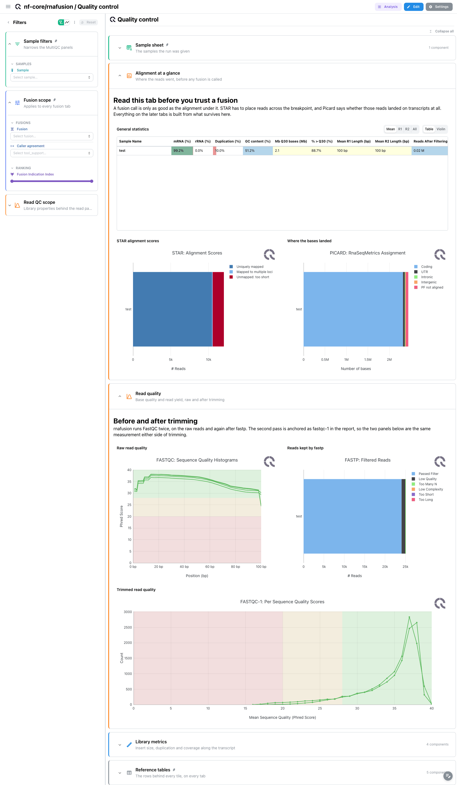
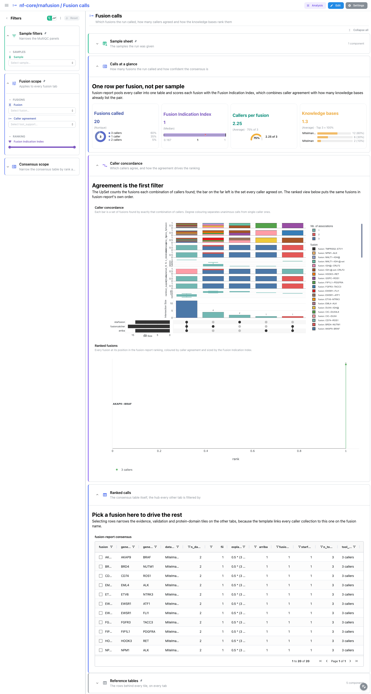
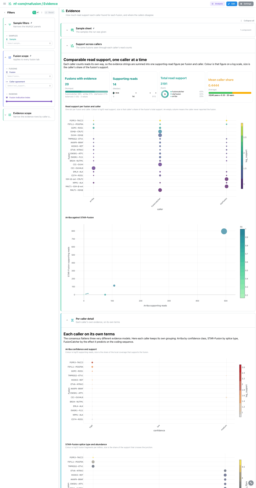
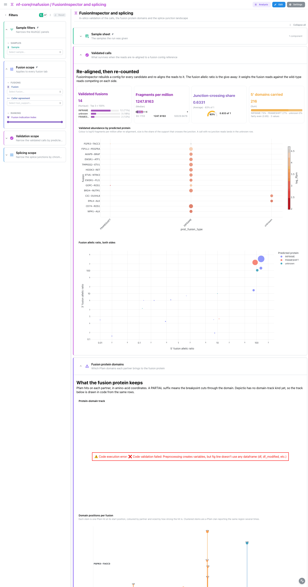

# nf-core/rnafusion 4.1.3: Depictio dashboards

This template turns the output of [nf-core/rnafusion](https://nf-co.re/rnafusion) 4.1.3
into a single four-tab Depictio dashboard. rnafusion looks for gene fusions in RNA-seq
reads: it trims and aligns them, runs Arriba, STAR-Fusion and FusionCatcher over the same
alignment, folds the call sets into one consensus with
[fusion-report](https://github.com/Clinical-Genomics/fusion-report), re-quantifies the
survivors against a fusion contig reference with FusionInspector, and scores the splice
junctions around them with CTAT-splicing. The template surfaces that funnel, from read
quality through to the protein a fusion would produce.

Data comes from the AWS megatest run
`results-76ad76e7c39b2ba9edc35aa3602e3dc454d842ec` (the 4.1.3 release tag). The megatest is
the pipeline's own test profile, a single library spiked with known cancer fusions, so every
panel that compares samples has one value on it; the template itself is built for cohorts.

---

## How the dashboard is built

- **Every fusion row carries its sample.** rnafusion writes one file per tool per sample and
  none of those files carries a sample column, so each fusion recipe derives `sample` from
  the file name (through `RecipeSource.source_path`, stripping the tool's own suffix). The
  samplesheet links to every fusion collection on `sample`, so one sample pick narrows the
  MultiQC panels and every caller table at once, and the fusion-report rank is computed per
  sample rather than across the cohort.
- **Callers are read from the report, not hardcoded.** `fusionreport/fusions` and
  `fusionreport/caller_evidence` treat every column of the fusion-report table that is not a
  known report field as a caller, so a run with an extra caller (for example one enabled by
  a pipeline parameter) gets its flag column and evidence rows without a recipe change. The
  UpSet picks those flag columns with `set_columns_pattern` rather than a fixed list.
- **One funnel, four tabs.** Quality control first, then the calls, then the evidence behind
  them, then the drill-down into what survives validation.
- **Two hubs.** `fusion_consensus` is the main one: a fusion picked anywhere narrows the
  per-caller evidence, all three caller tables, the FusionInspector validation and the Pfam
  domains at once. `fusioninspector_fusions` is the second, local to the last tab.
- **Catalog provenance.** Most tiles carry a `use:` handle, so the tile chrome shows which
  catalog tool and output the panel comes from.
- **Pinned sections on every tab.** `Run at a glance` (persistent, open) holds four run-level
  cards: samples, fusions called, distinct 5' partners and callers reporting. `Sample sheet`
  (persistent, collapsed) holds the samplesheet. `Reference tables` (persistent, collapsed)
  holds the fusion-report consensus table, the rows behind every tile.

### How the filters compose

Three filter sections on the main tab are `persistent`, so they appear on every tab:

| Section | Control | Collection | Reaches |
|---|---|---|---|
| `Sample scope` | `sample`, `strandedness` | `samplesheet` | the MultiQC panels and every fusion collection, through the `sample` links |
| `Fusion scope` | `fusion`, `tool_support`, `fii` | `fusion_consensus` | every fusion collection, through the `fusion` links |
| `Reference scope` | `gene_5p`, `databases` | `fusion_consensus` | the pinned consensus table |

Each tab then adds its own scope, open by default:

| Tab | Section | Controls |
|---|---|---|
| Fusion calls | `Consensus scope` | `rank`, `n_databases`, `chrom_pair` |
| Evidence | `Evidence scope` | `caller`, `supporting_reads`, `evidence_fraction`, `confidence` |
| FusionInspector and splicing | `Validation scope` | `prot_fusion_type`, `ffpm` |
| FusionInspector and splicing | `Splicing scope` | `chrom`, `uniq_mapped` |

Splice junctions are keyed on the junction, not the fusion: CTAT-splicing scores introns of a
single gene, so a fusion name has nothing to match there. The sample link reaches them;
`Splicing scope` narrows them further.

MultiQC sees the post-trim FastQC samples with a `_trimmed` suffix, which the samplesheet
does not know. The template's MultiQC collection lists both FastQC anchors so a run with a
single invocation still binds, but a sample pick may still drop the post-trim series.

### Selection wiring

- `Arriba against STAR-Fusion` (Evidence) and `Fusion allelic ratio, both sides`
  (FusionInspector) both select on `fusion`;
- the caller tables, the evidence table, the FusionInspector table, the Pfam domain table
  and the pinned consensus table all row-select on `fusion`;
- the pinned `Sample sheet` table row-selects on `sample`;
- the junction Manhattan and the junction table select on `gene`, which stays inside the
  splicing section;
- the `Validated call record` card sits beside the allelic-ratio scatter that drives it
  (`linked_component`) and stays a thin rail until a call is picked.

The partner chords, the Sankey, the UpSet, the lollipops and the dot plots do not select:
the chord collection links to nothing else on its tab, and the others are summaries.

---

## Quality control (main tab)

MultiQC panels, read before any fusion is trusted. A fusion call rests on reads that
crossed a breakpoint, so a library that never aligned well cannot support one.

`General statistics` carries the MultiQC general statistics table. `Read quality` pairs the
raw FastQC quality histograms with fastp's filtered-read bars (`use: multiqc/fastp`) and the
post-trim FastQC per-sequence quality scores. `Alignment` holds STAR's alignment scores
(`use: multiqc/star`) and Picard's transcript region assignment (`use: multiqc/picard`).
`Library metrics`, collapsed, holds Picard's insert size distribution and gene body coverage
plus STAR's gene count assignment.



## Fusion calls

What the run called, and how much agreement is behind each call.

`Calls at a glance` is a card row on `fusion_consensus` (`use: fusionreport/fusions`): the
Fusion Indication Index as a median with a Tukey box plot, caller agreement as a count with
its composition by `tool_support`, knowledge base hits, and known fusions (calls with at
least one database hit). The consensus table itself lives in the pinned `Reference tables`,
so it is not repeated here.

`Caller concordance` holds the two signature panels. The UpSet
(`use: fusionreport/caller_upset`) reads the caller flag columns as sets, so each bar is the
fusions found by exactly that combination of callers. The lollipop
(`use: fusionreport/fii_lollipop`) plots each fusion at its rank with the index as the stem
height, coloured by agreement.

`Partner chromosomes` reads the same calls as loci. The flow
(`use: arriba/partner_chrom_sankey`) runs from the contig carrying the 5' partner to the
contig carrying the 3' partner, weighted by supporting reads, so a local rearrangement and a
translocation separate. The chord (`use: arriba/partner_chords`) puts the same links on a
chromosome ring, coloured by structural class. `chrom_pair` in `Consensus scope` narrows both.



## Evidence

The same fusions seen through each caller's own read counts.

`Support across callers` opens with four cards on `caller_evidence`
(`use: fusionreport/caller_evidence`), then the dot plot
(`use: fusionreport/evidence_dot_plot`): one dot per fusion and caller, colour being log10
read support and size that caller's share of the fusion's total support. The code-mode
scatter beside it pivots the long evidence table on sample and fusion so the two split-read
callers face each other on one plane: a fusion far off the diagonal is one the two callers
disagree about.

`Per caller detail` (collapsed) gives each caller its own view: Arriba's event-type and
breakpoint-site bars and its confidence dot plot, STAR-Fusion by splice type, FusionCatcher
by predicted effect. `Caller tables` (collapsed) holds the per-caller evidence table and the
three raw caller tables, each row-selectable by fusion.



## FusionInspector and splicing

What survives when the reads are re-aligned to a fusion contig reference, and what the
junction landscape around the calls looks like.

`Validated calls` carries four cards on `fusioninspector_fusions`
(`use: fusioninspector/fusions`), the dot plot by predicted protein type
(`use: fusioninspector/evidence_dot_plot`) and a code-mode scatter of the fusion allelic
ratio of the 5' side against the 3' side on log axes: a call supported on one side only falls
off the diagonal, the classic signature of a mapping artefact. A record card beside the
scatter shows the picked call's breakpoints, read support and predicted protein.
`Validated rows` (collapsed)
holds the FusionInspector table.

`Fusion protein domains` answers what the fusion protein would keep. The structure view
(`use: fusioninspector/fusion_domains`) draws the busiest fusions as their two partners end
to end, with a bar per Pfam domain; the lollipop (`use: fusioninspector/domain_lollipop`)
places each domain at its start position. A domain name ending in `PARTIAL` is one the
breakpoint cuts through.

`Splice junctions` (collapsed, folded to the foot of the tab) holds four cards on
`splice_junctions` (`use: ctatsplicing/introns`), a Manhattan of junction support along the
genome (`use: ctatsplicing/intron_manhattan`, selectable by gene), the junction arcs
(`use: ctatsplicing/junction_arcs`) and the junction table.

`cancer_introns` is empty on the megatest: CTAT-splicing's cancer intron filter matched
nothing, so the file is a bare header. The collection is declared optional, the ingest skips
it with a message, and no tile depends on it.



---

## Catalog modules

The recipes ship as six catalog tools, each a folder with `module.yaml` plus
`<output>.py` / `<output>.yaml` / `<output>.tsv` triples:

| Tool | Output | What it is | Renders as |
|---|---|---|---|
| `fusionreport` | `fusions` | One row per fusion and sample with its knowledge base hits, index, per caller flags (derived from the report's columns) and per-sample rank | UpSet, lollipop, bar, 4 cards, table |
| `fusionreport` | `caller_evidence` | One row per sample, fusion and caller with the read support that caller reported | Dot plot, 4 cards, table |
| `arriba` | `fusions` | Arriba calls with split reads, discordant mates, coverage, confidence, reading frame and both partner contigs | Dot plot, partner-contig sankey, 3 bars, cards, table |
| `arriba` | `fusion_links` | The same calls as breakpoint pairs, both loci split into contig and integer position | Chord diagram, bar, cards, table |
| `starfusion` | `fusions` | STAR-Fusion calls with junction and spanning counts, splice type, normalised abundance | Dot plot, cards, table |
| `fusioncatcher` | `fusion_genes` | FusionCatcher genes with spanning pairs, unique reads, anchor length, predicted effect | Dot plot, cards, table |
| `fusioninspector` | `fusions` | The calls re-quantified against a fusion contig reference, with allelic ratios | Dot plot, 4 cards, table |
| `fusioninspector` | `protein_domains` | Pfam domains of both partners in amino acid coordinates, one row per domain | Lollipop, cards, table |
| `ctatsplicing` | `introns` | Every junction CTAT-splicing scored, with unique and multi-mapped support | Manhattan, 4 cards, table |
| `ctatsplicing` | `cancer_introns` | Junctions matching the CTAT cancer intron catalog, with TCGA and GTEx prevalence | Manhattan, cards, table |

Every fusion output starts with a `sample` column derived from its file name through
`RecipeSource.source_path`, so the same recipes stack a cohort without a samplesheet join.

The MultiQC modules rnafusion emits are covered by shared entries under
`depictio/catalog/multiqc/`: `fastqc` and `fastp` already existed, `star` and `picard` were
added with this template. That is what lets a MultiQC tile carry `use: multiqc/<module>`
and the catalog badge.

---

## Reproducing

```bash
# 1. Fetch the megatest subset (20 files, about 3.9 MB)
bash depictio/projects/nf-core/rnafusion/4.1.3/download_test_data.sh
# equivalently:
python scripts/nfcore_megatest.py fetch --pipeline rnafusion --version 4.1.3 \
  --dest ~/Data/depictio-nfcore/rnafusion/4.1.3/megatest

# 2. The run does not publish its samplesheet, so fetch the one params.json points at
DEST=~/Data/depictio-nfcore/rnafusion/4.1.3/megatest
mkdir -p "$DEST/input" && curl -fsSL -o "$DEST/input/samplesheet.csv" \
  https://raw.githubusercontent.com/nf-core/test-datasets/rnafusion/testdata/human/samplesheet_valid.csv

# 3. Validate the template against the data without ingesting
depictio-cli run --template nf-core/rnafusion/4.1.3 --data-root "$DEST" --dry-run

# 4. Ingest for real (needs a reachable server and ~/.depictio/CLI.yaml)
depictio-cli run --template nf-core/rnafusion/4.1.3 --data-root "$DEST"
```

Do not pass `--project-name`: the dashboard's `project_tag` is resolved by name, so
renaming the project makes the dashboard import fail. Re-running accumulates dashboards, so
delete the project first if you need to redo a run.

A run that skipped a step needs the matching variable, because rnafusion's route flags are
not auto-detected from `params.json`:

```bash
depictio-cli run --template nf-core/rnafusion/4.1.3 --data-root "$DEST" \
  --var SKIP_FUSIONCATCHER=true --var SKIP_CTATSPLICING=true
```

`SKIP_ARRIBA`, `SKIP_STARFUSION`, `SKIP_FUSIONCATCHER`, `SKIP_FUSIONINSPECTOR`,
`SKIP_CTATSPLICING` and `SKIP_QC` each prune the matching data collections and the tiles
that read them. `SAMPLESHEET_FILE` overrides where the samplesheet is looked for.

`VALIDATION_REPORT.md` next to this file records the ingestion numbers, the tile-by-tile
verification and the discrepancies found while validating.
