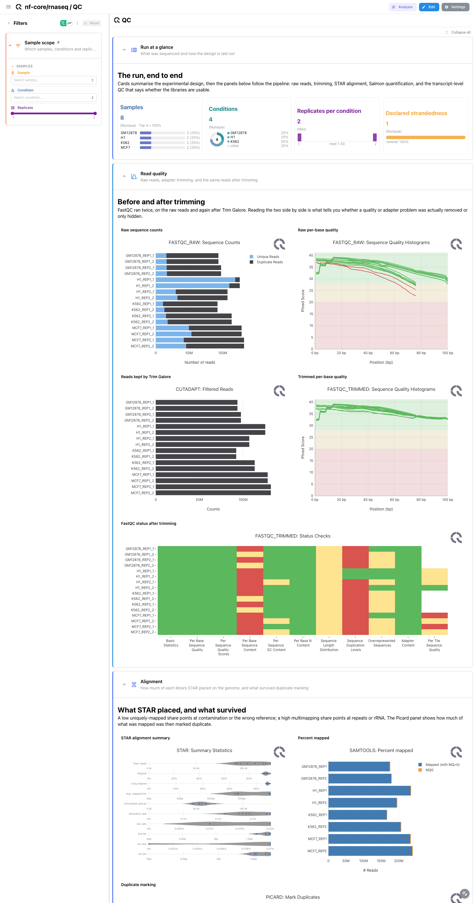
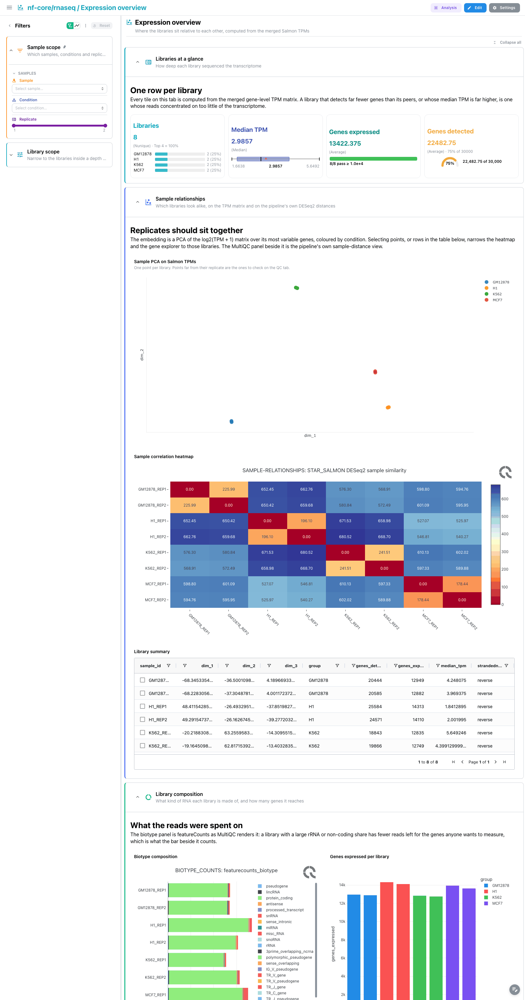
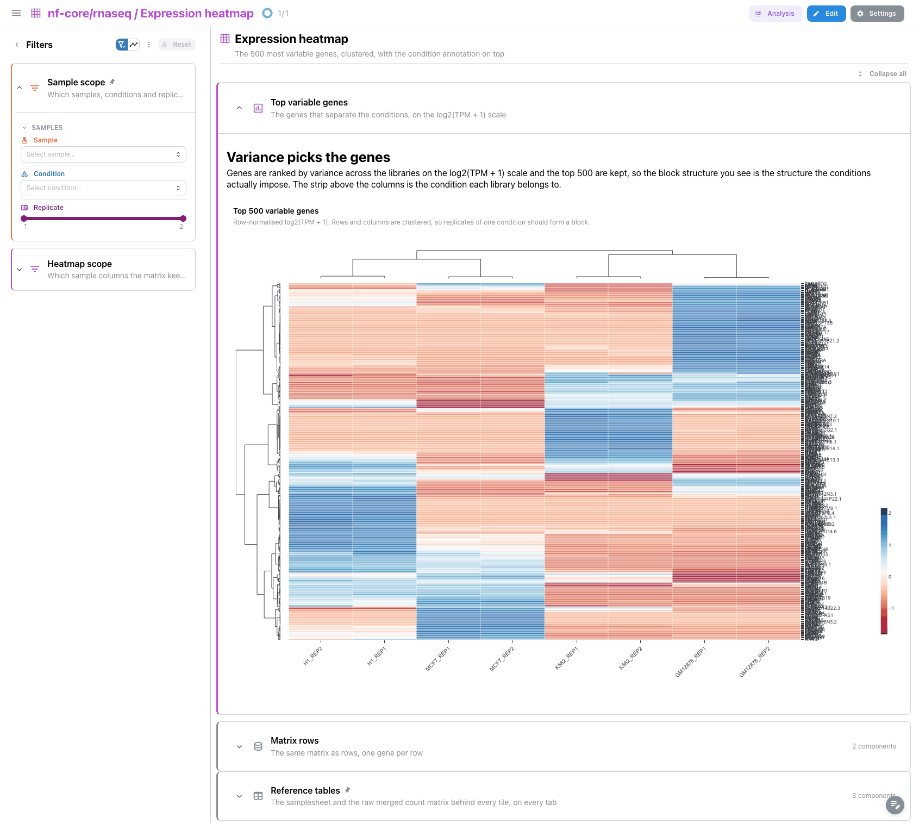
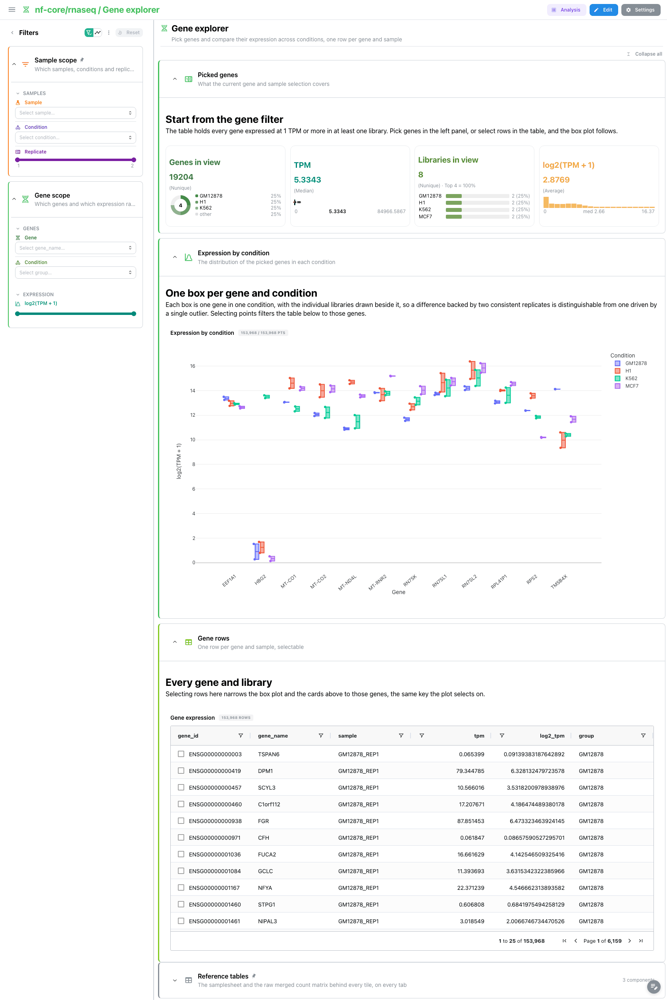

# nf-core/rnaseq 3.26.0: Depictio dashboards

This template turns the output of [nf-core/rnaseq](https://nf-co.re/rnaseq) 3.26.0 into a
single four-tab Depictio dashboard. rnaseq takes bulk RNA sequencing libraries, trims them,
aligns them with STAR, quantifies transcripts with Salmon and merges the per-sample estimates
into gene-level TPM and count matrices. The template surfaces the pipeline's own MultiQC
funnel next to three views computed from that merged TPM matrix: where the libraries sit
relative to each other, which genes separate them, and what any one gene does across
conditions.

Data comes from the AWS megatest run
`results-e7ca46272c8f9d5ceee3f71759f4ba551d3217a4` (the 3.26.0 release tag): eight libraries
from four ENCODE cell lines (GM12878, H1, K562, MCF7), two replicates each, human GRCh37,
Trim Galore then STAR + Salmon.

---

## How the dashboard is built

- **One funnel, four tabs.** MultiQC, then Expression overview, then Expression heatmap, then
  Gene explorer. Each tab answers the question the previous one raises: are the libraries
  usable, how do they relate to each other, which genes drive that, and what does one gene do.
- **Persistent sample filter.** `Sample scope` (sample, condition, replicate) is pinned to the
  top of every tab's filter panel and reads the samplesheet, which links to every other
  collection. One pick there narrows the MultiQC panels, the PCA, the heatmap columns and the
  gene explorer at once. Each tab adds its own filter group on top: a depth and expression
  band on Expression overview, the sample columns on Expression heatmap, gene and expression
  range on Gene explorer.
- **Pinned sample sheet and reference tables.** The samplesheet, with the four design cards
  computed from it above the sheet itself, sits in a collapsed `Sample sheet` section pinned
  to the top of every tab; the raw merged count matrix sits in a collapsed `Reference tables`
  section pinned to the bottom.
- **Catalog provenance.** Every expression panel is a catalog render (`use: salmon/...`) and
  every tool-level MultiQC tile names its module (`use: multiqc/star`,
  `use: multiqc/qualimap`, …), so the tile chrome shows where the panel comes from. The five
  tiles that read nf-core/rnaseq's own custom-content MultiQC sections carry no `use:`,
  because those module ids belong to the pipeline rather than to a tool.
- **The condition comes from the sample name.** The nf-core/rnaseq samplesheet schema is
  `sample,fastq_1,fastq_2,strandedness` and has no condition column, so the samplesheet recipe
  reads `condition` and `replicate` out of the `<condition>_REP<n>` names the pipeline's own
  test data and docs use. Everything the dashboard groups or colours by comes from that.

---

## MultiQC

The main tab, and the pipeline in the order it ran. `Sample sheet`, collapsed at the top of
every tab, is the design: four cards over the samplesheet, one per strip style, giving the
library count with its per-condition breakdown, the condition count as a donut, the replicate
depth as a histogram and the declared strandedness as a composition bar, above the sheet
itself.

`Read quality` opens on the general statistics table, one row per library pooling every
module's headline numbers, then pairs FastQC on the raw reads with Trim Galore's
filtered-read counts and FastQC again after trimming, so the same two measurements sit side
by side before and after.
`Alignment` carries STAR's summary statistics, samtools' percent mapped and Picard's duplicate
marking.

`Quantification and strandedness` is where the run's two most common failure modes show up:
Salmon's fragment length distribution, then the pipeline's own strandedness inference against
what the samplesheet declared, then its read strand composition. A library whose inferred
strandedness disagrees with the sheet was quantified against the wrong library type and every
number downstream of it is suspect. The pipeline's own DESeq2 PCA closes the section; the
Expression overview tab recomputes the same idea from the TPM matrix, filterable.

`Transcript QC` (collapsed) holds RSeQC's read distribution and inner distance, Qualimap's
genomic origin and gene body coverage, and dupRadar's duplication against expression. Coverage
that falls away at the 5' end is degraded RNA; duplication that rises with expression is
normal, duplication that is flat and high is a library problem.



## Expression overview

`Libraries at a glance` puts four different strips on one row: the library count with its
condition breakdown, median TPM as a Tukey box plot, genes expressed against a 10000 threshold
(the usual floor for a bulk human library, warning at 8000) and genes detected on a gauge.

`Sample relationships` is the signature panel, and it now shows the same eight libraries twice.
On the left, a PCA of the log2(TPM + 1) matrix over its most variable genes, one point per
library, coloured by condition, with lasso selection enabled on `sample_id`. On the right, the
pipeline's **own** DESeq2 QC PCA: nf-core/rnaseq runs `deseq2_qc.r` over the count matrix and
publishes the component coordinates as `star_salmon/deseq2_qc/deseq2.pca.vals.txt`, which the
`deseq2/qc_pca` recipe reads instead of recomputing, so the tile carries exactly the points
MultiQC draws as a picture. The variance each component explains is parsed out of the file's
own header (`"PC1: 43% variance"`) and kept as a column, because two libraries far apart on a
component that explains three percent are not far apart.

Below them, the sample distance matrix: the square Euclidean distance matrix the same
`deseq2_qc.r` clusters its dendrogram on, read through `deseq2/qc_sample_dists` and clustered
in the browser. It replaces the static MultiQC similarity image. Because `sample` is a real
column of that matrix and not only a column name, the sample filter narrows it on **both**
axes and it stays square under a selection.

Replicates of one condition should sit together in both PCAs and away from the others; a
library that lands with the wrong group in one but not the other is the one to take back to
the MultiQC tab. The library summary table at the foot selects rows on the same `sample_id`,
so picking points and picking rows are the same act.

`Library composition` puts three views of the same spend on one page. The featureCounts biotype
composition and a bar of genes expressed per library sit on the first row; below them, the
RSeQC read distribution, read straight out of the per-sample
`*.read_distribution.txt` reports rather than out of MultiQC. A library dominated by rRNA or by
a single biotype explains a low gene count above it; a library whose exonic bar is short and
whose intronic or intergenic bar is long explains it a different way.

RSeQC publishes its upstream and downstream bands **nested** inside each other (`TSS_up_5kb`
counts the tags in `TSS_up_1kb` again, `TSS_up_10kb` counts both), so stacking the rows as
written triples the promoter signal. The recipe differences them into disjoint rings and adds
the tags that fall in no feature at all as an explicit `Other_intergenic` row, which is what
makes the composition sum to one. The rank switch moves between the five region classes and
the individual RSeQC features.



## Expression heatmap

One panel, doing one thing, under a glance strip about the libraries behind its columns
(`salmon/sample_pca` cards on the per-sample overview: libraries by condition, median TPM,
genes expressed and genes detected). `Top variable genes` draws the 500 genes with the highest variance
across the run as a clustered heatmap, row z-normalised on the log2(TPM + 1) scale, with the
condition annotation strip above the columns. Row normalisation is what makes the panel about
pattern rather than magnitude: without it the plot is a ranking of highly expressed genes, with
it the replicates of one condition form a visible block.

The `Heatmap scope` filter is a gene multi-select on the matrix itself, so it narrows by
**rows**; the sample columns follow the pinned `Sample scope`, whose link reaches the matrix
by column name. `Matrix rows` (collapsed) holds the same matrix as an ordinary table, one gene
per row.



## Gene explorer

`Picked genes` reports what the current selection covers: genes in view, median TPM as a box
plot, libraries in view, and the mean log2(TPM + 1) as a histogram.

`Expression by condition` is the only code-mode figure in the template. It takes the twelve
highest-expressed genes left after filtering and draws one box per gene and condition, which is
the comparison a UI figure cannot express: the grouping is computed from the filtered frame
rather than declared up front. Selecting boxes filters on `gene_name`, and the `Gene rows`
table below selects rows on the same column, so the figure and the table drive each other.

Start from the `Gene` filter. With no gene picked the panels describe all 153968 gene-sample
rows, which is a distribution of the whole transcriptome rather than a comparison.

---



## Catalog module

The recipes ship as three catalog modules. `depictio/catalog/salmon/` holds `module.yaml` plus
four output definitions; Salmon is an nf-core module, so `module.yaml` points at its nf-core
`meta.yml` rather than restating the identity. `depictio/catalog/deseq2/` and
`depictio/catalog/rseqc/` carry the two QC outputs the pipeline was already writing and
nothing was reading.

| Output | What it is | Renders as |
|---|---|---|
| `salmon_sample_pca` | One row per sample: PCA coordinates of the log2(TPM + 1) matrix, genes detected and expressed, median TPM | Embedding (`use: salmon/pca`), 4 cards, table |
| `salmon_expression_heatmap` | The 500 most variable genes, wide, with a condition annotation strip | Clustered heatmap (`use: salmon/top_variable_heatmap`), table |
| `salmon_gene_expression` | The merged TPMs as one row per gene and sample, expressed genes only | Box figure, 2 cards, gene filter, table |
| `salmon_merged_gene_counts` | The raw merged count matrix tximport writes next to the TPM matrix | Table |
| `deseq2_qc_pca` | The pipeline's own DESeq2 QC principal components, with the variance each explains | Embedding (`use: deseq2/qc_pca_embedding`), gauge card, table |
| `deseq2_qc_sample_dists` | The square sample-to-sample Euclidean distance matrix the QC dendrogram is clustered on | Clustered heatmap (`use: deseq2/qc_distance_heatmap`), table |
| `rseqc_read_distribution` | Share of each library's tags per annotation feature, at two resolutions | Stacked composition (`use: rseqc/distribution_composition`), card, table |

The two `deseq2` outputs are deliberately **not** pipeline-specific: their globs key on the file
suffix (`**/*pca.vals.txt`, `**/*sample.dists.txt`) rather than on a `star_salmon/` directory,
because nf-core/chipseq and nf-core/atacseq run the same `deseq2_qc.r` and publish the same two
files under their consensus directories. Those two write the MultiQC custom-content flavour
(`*.pca.vals_mqc.tsv`, under a `#` comment header), which the recipes also parse; a template
whose run has only that flavour repoints the source with
`source_overrides: {pca: {glob_pattern: "**/*pca.vals_mqc.tsv"}}`. The recipe's own glob
matches only the plain `.txt` so that a run publishing both is not read twice.

`rseqc_read_distribution` is a two-step: the report is fixed-width text, not a table, and the
sample name lives only in the file name, so a recursive scan collection
(`rseqc_read_distribution_raw`) reads every report as raw lines with `include_file_paths`, and
the recipe consumes that collection by tag. `quote_char: null` is required on the scan, because
`5'UTR_Exons` would otherwise open a quoted field that never closes.

All three recipes read the same file, `salmon.merged.gene_tpm.tsv`, and are pipeline-agnostic:
their default source path is `salmon/`, which is where a bare salmon/tximport run and
nf-core's `--skip_alignment` route both write it. nf-core/rnaseq's default route writes it
under `star_salmon/`, so each data collection repoints the source with
`transform.source_overrides`. The samplesheet recipe is project-local
(`depictio/projects/nf-core/rnaseq/recipes/samplesheet.py`) because deriving a condition from
a sample name is an nf-core/rnaseq convention, not a Salmon one.

The MultiQC modules this pipeline emits (`fastqc`, `cutadapt`, `star`, `samtools`, `picard`,
`salmon`, `rseqc`, `qualimap`, `dupradar`) all exist under `depictio/catalog/multiqc/`, which
is what lets a MultiQC tile carry `use: multiqc/<module>` and the catalog badge.

---

## Reproducing

```bash
bash depictio/projects/nf-core/rnaseq/3.26.0/download_test_data.sh
# then follow post_fetch_help in megatest.yaml for the samplesheet curl into input/
depictio-cli run --template nf-core/rnaseq/3.26.0 \
  --data-root ~/Data/depictio-nfcore/rnaseq/3.26.0/megatest
```

**DATA_ROOT is the `aligner_star_salmon/` sub-directory of the megatest prefix, not the prefix
root.** The run publishes `aligner_star_salmon/` and `aligner_star_rsem/` side by side, each a
complete output tree with its own `multiqc/`, `star_salmon/` and `salmon/`. The manifest sets
`run_root: aligner_star_salmon/` and mirrors the fetched keys below the destination, so the
directory `download_test_data.sh` writes is already the right DATA_ROOT; point the CLI at the
prefix root instead and every scan becomes ambiguous between the two routes.

This run's MultiQC (1.33) also wrote its data directory as
`multiqc/star_salmon/multiqc_report_data/` rather than `multiqc/multiqc_data/`, and the
template's MultiQC scan regex pins that literal path for the same reason.

`--project-name` is safe for `run` itself, but leave it off anyway. The dashboard carries
`project_tag: RNA-seq Expression Analysis`, and the standalone `depictio dashboard import`
resolves that tag by name, so a renamed project cannot take a re-imported dashboard later.

Re-running over a project that already exists needs `--update-config --overwrite`; with both,
the four dashboards are updated in place rather than accumulating duplicates.

Non-default routes need their flag passed by hand, since the CLI does not yet read rnaseq's
own `params.json` for them: `--var PSEUDOALIGNER_ONLY=true` for `--skip_alignment`,
`--var SKIP_MULTIQC=true` for `--skip_multiqc` or `--skip_qc`, and
`--var SKIP_QUANTIFICATION_MERGE=true` for `--skip_quantification_merge`.
