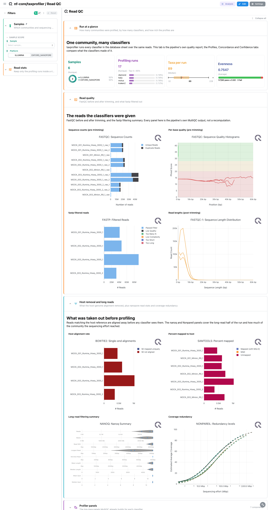
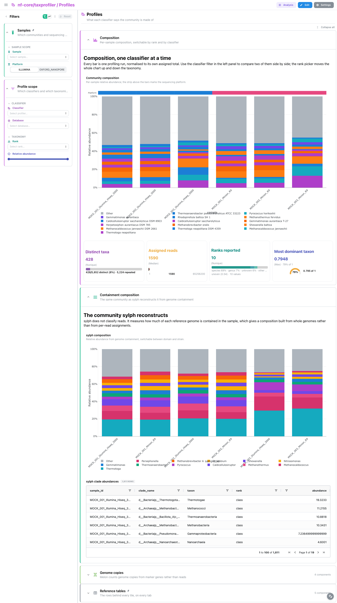
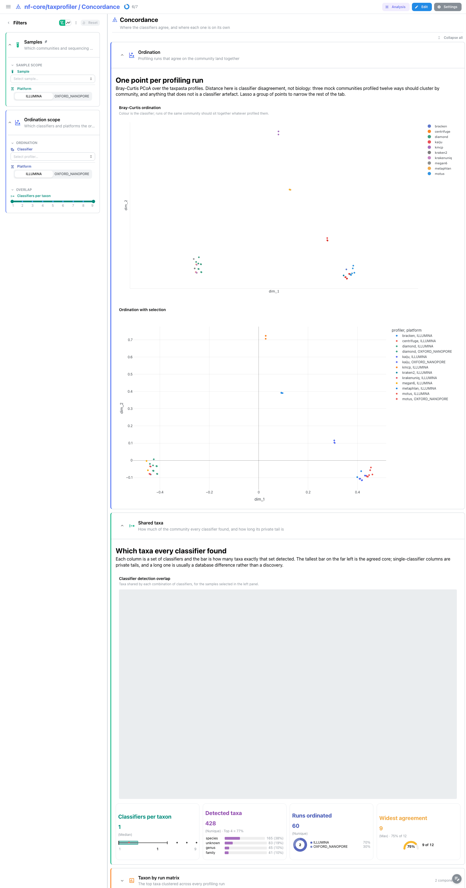
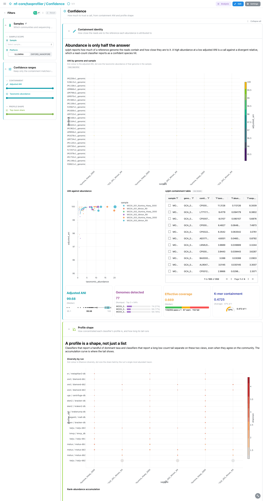

# nf-core/taxprofiler 2.0.1: Depictio dashboards

This template turns the output of [nf-core/taxprofiler](https://nf-co.re/taxprofiler) 2.0.1
into a single five-tab Depictio dashboard. taxprofiler is a benchmarking pipeline as much as a
profiling one: it takes one set of reads, runs it through as many taxonomic classifiers and
reference databases as you ask for, and standardises every result with
[taxpasta](https://taxpasta.readthedocs.io) so the answers can be put side by side. The
dashboard is built around that comparison, so its centre of gravity is not "what is in this
sample" but "how much do the classifiers agree about what is in this sample".

Data comes from the AWS megatest run
`results-70ecc15e49b4f1fcf79d876643b5d14b65c66178` (the 2.0.1 release tag): three synthetic
mock communities, `MOCK_001` to `MOCK_003`, each sequenced on an Illumina HiSeq 3000 and on an
Oxford Nanopore MinION R9.

---

## How the dashboard is built

- **One funnel, five tabs.** MultiQC, then Depth and diversity, then Profiles, then
  Concordance, then Confidence. Each tab answers the question the previous one raises: are the
  reads worth classifying, did the sequencing go deep enough to see the community at all, what
  does each classifier say that community is, where do the classifiers disagree, and how much
  should a given call be trusted.
- **One hub collection.** taxprofiler can run fifteen profilers, so shipping one data
  collection per profiler would make the template's shape depend on the run's flags. Instead
  every `taxpasta/*.tsv` is melted into one long profiler x database x sample x taxon frame,
  and the ordination, the overlap matrix, the taxon-by-run heatmap and the per-run statistics
  are all derived from that hub. Adding or removing a profiler changes rows, never collections.
- **Every tab carries filters, on two levels.** `Samples` (sample, sequencing platform,
  sequencing run) is `persistent` *and* `pin: top`, so it rides every tab's filter panel;
  it is sourced on the taxprofiler samplesheet, and the template's links fan a selection out
  to every taxpasta collection, the widened lineages, both sylph tables, the Nonpareil
  collections and the MultiQC panels. On top of that each tab declares its own non-persistent
  filter section on its own columns: `Read stats` on the landing tab, `Depth scope`
  (coverage, Nonpareil diversity, richness, evenness), `Profile scope` (classifier, database,
  rank, abundance, domain, melon phylum), `Ordination scope` (classifier, platform, overlap,
  domain) and `Confidence ranges` (ANI, abundance, top-taxon share).
- **Every tab opens with a glance strip.** `Run at a glance` is a persistent pinned section of
  four cards on run-level numbers (samples by platform, profiling runs by classifier, distinct
  taxa, reads assigned per run), so the same four readings head every tab. Each tab then adds
  its own four-card strip on its own data at the top of its first section.
- **Pinned sheet and reference tables.** The cohort every tab is filtered on sits in a
  collapsed `Sample sheet` section pinned to the top of every tab, holding the samplesheet
  itself. The rows behind every tile sit in a collapsed
  `Reference tables` section pinned to the bottom: the long profiles frame, the per-run
  statistics and the database sheet.
- **Catalog provenance.** Every analysis panel is a catalog render (`use: taxpasta/...`,
  `use: sylph/...`, `use: melon/...`) and every MultiQC tile names its module
  (`use: multiqc/fastqc`, `use: multiqc/bracken`, and so on), so the tile chrome shows where
  the panel comes from.
- **Profiler and database are one label.** A run is a sample plus a profiler plus a database,
  not a sample plus a profiler: kraken2 against two databases is two answers. The
  `profiler_db` column carries that pairing and it is the key the ordination and the per-run
  table cross-select on.

---

## What ran in this megatest, and what a smaller run would show

Every `run_*` flag in this megatest is true, so it is the maximal case: bracken, centrifuge,
diamond, ganon, kaiju, kmcp, kraken2, krakenuniq, MALT, melon, metacache, metaphlan, mOTUs,
sylph and Krona all ran, on top of fastp / FastQC short-read QC, porechop_abi / nanoq
long-read QC, bowtie2 host removal and nonpareil redundancy estimation.

What reaches the dashboard is narrower than what ran:

- **Ten profilers, seventeen profiler / database combinations** carry the cross-profiler
  tiles: bracken, centrifuge, diamond, kaiju, kmcp, kraken2, krakenuniq, MALT (which taxpasta
  labels `megan6`), metaphlan and mOTUs.
- **ganon ran and assigned nothing.** taxpasta standardised its output into a table whose
  every count is zero, so it has no rows anywhere and is not one of the ten.
- **sylph and melon are beside the hub, not in it.** taxpasta has no parser for either, and
  each answers a question read-count profilers cannot, so each has its own collection:
  containment ANI for sylph, genome copies from marker genes for melon.
- **metacache has no tile.** taxpasta cannot read it, MultiQC has no module for it, and its
  flat taxon / abundance list adds nothing the hub does not already carry.

A run configured differently leaves collections empty rather than failing. The five taxpasta
collections need only `--run_profile_standardisation`, whatever profilers were used.
`taxon_names` needs at least one of kraken2, krakenuniq or centrifuge, because those are the
report formats that carry a scientific name next to the NCBI id; without it the taxa keep a
`taxid <id>` label. `sylph_ani` and `sylph_profile` need `--run_sylph` (and, for the profile,
a sylph-tax taxonomy). `melon_ranks` needs `--run_melon` and at least one long-read sample,
since taxprofiler only routes nanopore data to melon. Every one of those is declared
`optional: true`, so the tiles that have no data simply do not appear.

---

## MultiQC

The main tab. Its three own sections are the pipeline's own MultiQC report, from the raw
reads through host removal to each classifier's top taxa; the pinned `Run at a glance`,
`Sample sheet` and `Reference tables` sections frame them here as they do on every tab. A tab
named MultiQC holds MultiQC panels only, which is why the run-level cards live in the pinned
glance strip rather than in a section of their own here.

`Read quality` opens on MultiQC's general-statistics table, one row per sample pooling every
module's headline numbers, and then holds the read panels themselves: FastQC sequence counts
and quality histograms, fastp's filtered-read bars, and the post-trimming FastQC length
distribution. taxprofiler runs FastQC twice, before and after preprocessing, so MultiQC
labels the second run `fastqc-1`.

`Host removal and long reads` pairs the bowtie2 and samtools views of what the host-genome
alignment took out with nanoq's nanopore read summary and Nonpareil's redundancy levels.
Nonpareil answers a question none of the profilers can: how much of the community the
sequencing depth actually covered, which is the ceiling on everything downstream. The next
tab rebuilds the full curve those redundancy levels are a slice of.

`Profiler panels` (collapsed) carries each classifier's own top-taxa panel as MultiQC renders
it: kraken2, bracken, centrifuge, kaiju, metaphlan, plus MALT's mappability. These are the
per-classifier view; the cross-classifier view starts on the next tab.



## Depth and diversity

The tab that sets the ceiling. Everything after it is a statement about a community, and a
statement about a community is only as good as the fraction of it the reads reached.

`Coverage redundancy` carries the Nonpareil curve. taxprofiler publishes only
`nonpareil/nonpareil_all_samples.tsv`, six fitted numbers per sequencing library, because the
per-effort samples stay inside the `.npo` files the pipeline does not copy out. Those six
numbers are enough: Nonpareil models coverage against the log of sequencing effort as a gamma
CDF whose mean is the published diversity index and whose 95th percentile is the log of the
projected effort, so the two are solved for the model's parameters and the curve is evaluated
over a log-spaced effort axis, 200 points per library. The reconstruction is checked against a
number the fit never sees: feeding each library's own effort back through the model reproduces
the published coverage to within 0.05, always slightly above, which is the expected sign
because the published value is the last coverage observed and the model is the curve fitted
through it. Four cards head the section (mean coverage on a gauge, the diversity index and the
depth multiple still missing as box plots, libraries measured broken down by sample), and the
scatter underneath puts coverage against diversity with the missing depth as the point size.
Only the Illumina libraries are measured: taxprofiler routes Nonpareil at short reads only, so
the four rows here are `MOCK_001` to `MOCK_003` with `MOCK_003` counted twice for its two
sequencing runs.

`Alpha diversity` is the same question asked of the classifiers rather than of the reads.
Shannon diversity and Pielou evenness are computed per profiling run, so one mock community has
as many diversity values as classifiers that profiled it, and the vertical spread of the
richness-against-diversity scatter is classifier disagreement rather than biology. The
rank-abundance accumulation curve underneath ranks the taxa inside each run and accumulates
their shares: a curve that reaches one after a handful of taxa is a profile carried by a few
organisms, one that keeps climbing has a long low-count tail.

## Profiles

`Composition` is the tab's centre: one stacked taxonomy panel over the whole hub, switchable
by taxonomic rank and narrowed by the `Profile scope` filter, so the same tile shows one
classifier at a time or all of them. Its glance strip is four cards: the profiling runs the
bars stand for broken down by profiler, median assigned count as a box plot, ranks reported as
a composition strip, and the share held by the single most dominant taxon on a gauge. A
profile whose top taxon holds more than half the reads is either a very simple community or a
classifier that has collapsed onto one reference.

`Lineage rings` is the same rows drawn as a hierarchy. taxprofiler runs taxpasta without
`--add-lineage`, so the ancestry is read back out of the kraken-style reports the run writes
anyway: those reports indent each taxon's name by two spaces per level, so walking a report
with a stack recovers every taxon's parents, and the result is joined onto the hub by NCBI
taxonomy id. In this megatest that places 94 percent of the rows; reads no classifier could
assign keep an explicit `unclassified` arc rather than leaving the ring silently, and taxa
whose database uses identifiers no report named sit under `unresolved` (all of kmcp's, whose
database is keyed differently). Pick one classifier in the left panel and the rings are that
classifier's view of the community; pick several and they pool, which is a fast way to see
whose tree is deeper.

`Containment composition` shows the same communities as sylph reconstructs them. sylph does
not count reads into a taxonomy; it estimates how much of each reference genome is contained
in the sample, and sylph-tax then maps that onto a lineage. Reading it next to the read-count
composition is the point: the two disagree in a way that says something about the reference
database rather than about the sample.

`Genome copies` (collapsed) carries melon, which counts genome copies from prokaryotic marker
genes instead of reads. A copy-number community and a read-count community differ by genome
size, so a large-genome organism that looks dominant by reads can be a minority by copies.
Melon's sample identifier lives only in its output path, so these rows are pooled across the
long-read samples rather than shown per sample.



## Concordance

`Ordination` is the tab's signature panel: a Bray-Curtis PCoA over every profiling run, one
point per sample, profiler and database. Runs that agree about the community land together, so
the spread reads as classifier disagreement rather than as biological distance, and the
clusters usually form by profiler family rather than by sample. The scatter beside it has
selection enabled on `profiler_db`, wired through the template's links to the pinned per-run
table, so picking a point in the ordination selects that run's row and picking a row highlights
its point.

`Shared taxa` asks how much of the community the classifiers agree on. The UpSet plot shows
the intersections a pairwise view cannot: not just "kraken2 and bracken share n taxa" but "this
many taxa were found by exactly these five classifiers and no others". A long tail of taxa
found by exactly one classifier is the normal shape, and its length is the interesting number.
The tab's glance strip, at the top of `Ordination`, carries the readings that go with it: runs
ordinated broken down by platform, the median and maximum number of classifiers per taxon, and
the taxa detected broken down by rank.

`Taxonomic flow` is the Pavian view of the same profiles. Every read leaves the root and
follows the taxonomy down, so a band's width is the share of the community that took that
path, and the reads a classifier could not place leave the root as a band of their own: for
kraken2 in this run that is 3.3 to 3.7 percent, which its top-taxa panel never shows. The
depth control in the tile settings adds or removes ranks between the root and the species, and
picking one classifier in the left panel reads a single profile rather than the pooled flow.

`Taxon by run matrix` (collapsed) clusters the top taxa across every profiling run as a heatmap
with the rank as a row annotation and the profiler and platform as column strips. It is the
same disagreement the ordination summarises, read taxon by taxon.



## Confidence

`Containment identity` is where a call gets qualified. sylph reports, for every reference genome
it detects, the adjusted ANI of the containment match alongside the abundance, so abundance and
identity can be read together: a high-abundance, low-ANI genome is a confident-looking call that
is really a divergent relative of the reference. The dot plot and the scatter show the same two
axes at different resolutions, the pinned table has row selection on the sample, and four cards
report median ANI, genomes detected by sample, median effective coverage and mean k-mer
containment.

`Profile shape` treats a profile as a distribution rather than a list. The dot plot puts
Shannon diversity against the top-taxon share for every run, and the bar chart beside it is the
blunt version of the same reading: the share held by each run's single most abundant taxon,
which is also the threshold the top-taxon slider in the left panel moves. The accumulation
curve that used to sit here now lives on the Depth and diversity tab, next to the other
distribution views.

---



## Catalog modules

The recipes ship as four catalog modules.

| Module | Output | What it is | Renders as |
|---|---|---|---|
| `taxpasta` | `taxpasta_profiles` | Every standardised table melted into one long profiler x database x sample x taxon frame | Stacked taxonomy, 6 cards, 2 interactives, table |
| `taxpasta` | `taxpasta_lineage` | The same rows with the seven NCBI ranks widened into their own columns, ancestry recovered from the indented reports | Sunburst, sankey, 4 cards, 2 interactives, table |
| `taxpasta` | `taxpasta_matrix` | The top taxa as a wide taxon by run matrix, with profiler and platform column strips | Clustered heatmap, table |
| `taxpasta` | `taxpasta_embedding` | Bray-Curtis PCoA over every profiling run | Embedding, table |
| `taxpasta` | `taxpasta_presence` | Per sample and taxon, a 0/1 detection column for every profiler | UpSet, card, table |
| `taxpasta` | `taxpasta_sample_summary` | Taxa reported, reads assigned, top-hit share, Shannon and evenness per run | Dot plot, 5 cards, scatter, bar, table |
| `sylph` | `sylph_ani` | Per-genome containment: adjusted ANI against abundance and coverage | Dot plot, scatter, 3 cards, table |
| `sylph` | `sylph_profile` | The sylph-tax merged report as long sample x rank x taxon composition | Stacked taxonomy, card, table |
| `melon` | `melon_ranks` | Genome-copy composition, seven ranks wide, pooled over the long-read samples | Sunburst, 3 cards, table |
| `nonpareil` | `nonpareil_summary` | Coverage, projected effort and diversity index, one row per sequencing library | 4 cards, scatter, interactive, table |
| `nonpareil` | `nonpareil_curves` | The coverage curve each library's fitted model describes, 200 points per curve | Profile, line figure, interactive, table |

The MultiQC side gained one entry too: `multiqc/malt` binds the MALT mappability and
taxonomic-assignment panels, which had no catalog output and therefore no `use:` handle.

`nonpareil` is a new module, and its arithmetic lives in
`depictio/recipes/lib/nonpareil.py`: a regularised incomplete gamma written out in full
rather than pulled from scipy, which is not a declared dependency, plus the two-equation
solve that recovers the model parameters and the log-spaced effort axis the curve is sampled
on. `depictio/tests/recipes/test_nonpareil_curves.py` pins the reconstruction against the real
megatest summary.

One recipe is project-local rather than catalog: taxprofiler runs taxpasta with
`--add-name false`, so the standardised tables identify taxa by NCBI id only.
`depictio/projects/nf-core/taxprofiler/recipes/taxon_names.py` reads the names and ranks back
out of the kraken2, krakenuniq and centrifuge report files the pipeline also writes and
publishes one lookup the taxpasta collections join against. Repairing one pipeline's taxpasta
invocation is not a reusable rendering of any tool's output, so it stays out of the catalog.

Six `multiqc/<module>.yaml` entries were added for this template: `bracken`, `centrifuge`,
`kaiju`, `metaphlan`, `nanoq` and `nonpareil`. `kraken`, `fastqc`, `fastp`, `bowtie2` and
`samtools` already existed. Bracken and Centrifuge are worth a note: MultiQC 1.35 has no
module for either, so nf-core/taxprofiler runs the `kraken` module three times with different
`path_filters` and gives the extra two their own anchors. Their catalog entries therefore find
kraken-style report files rather than the tools' native tables, which MultiQC does not read.

---

## Reproducing

```bash
bash depictio/projects/nf-core/taxprofiler/2.0.1/download_test_data.sh
# fetches the megatest subset from S3 and curls the samplesheet and database sheet
# into <TARGET_DIR>/input/, which the template's two input collections read

depictio-cli run --template nf-core/taxprofiler/2.0.1 \
  --data-root ~/Data/depictio-nfcore/taxprofiler/2.0.1/megatest
```

Leave `--project-name` off. The dashboard carries
`project_tag: Taxprofiler Metagenomic Profiling`, and the standalone
`depictio dashboard import` resolves that tag by name, so a renamed project cannot take a
re-imported dashboard later.

No `--var` is needed: the `run_*` and `perform_*` flags come from
`pipeline_info/params.json`, and every profiler-specific collection is `optional: true`, so a
run with a different profiler set ingests unchanged and simply shows fewer tiles.
