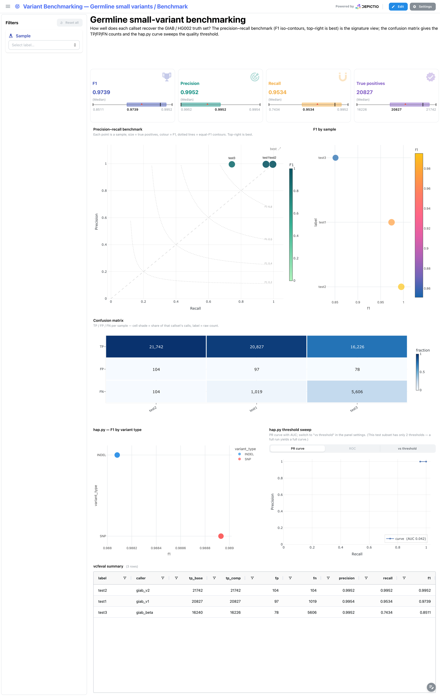
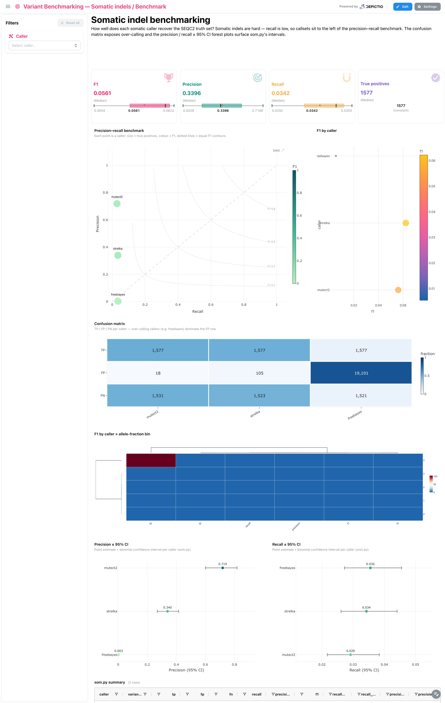
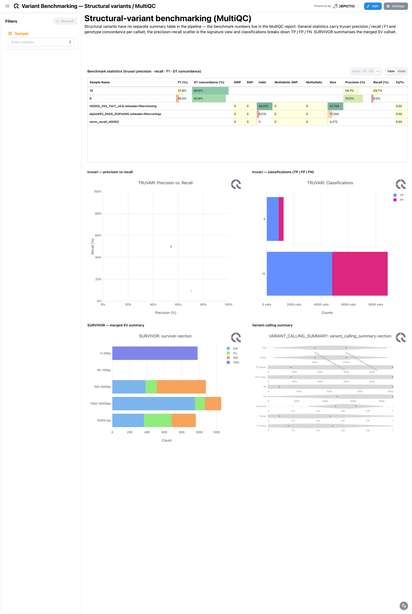
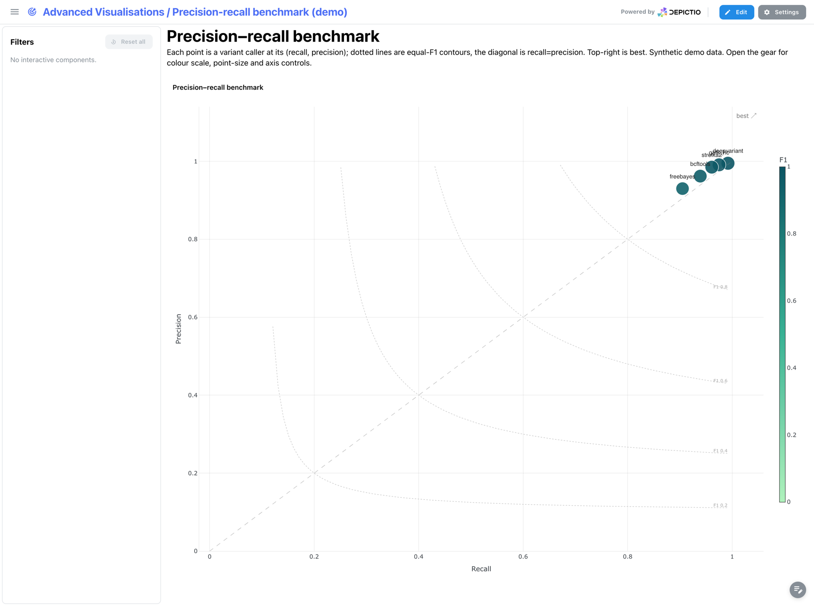
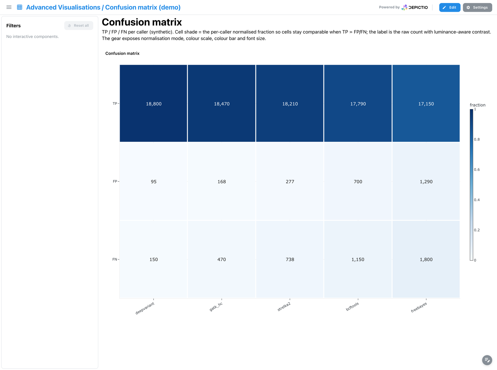

# nf-core/variantbenchmarking 1.4.0 — Depictio dashboards

This template turns the output of [nf-core/variantbenchmarking](https://nf-co.re/variantbenchmarking)
1.4.0 into interactive Depictio dashboards. The pipeline benchmarks variant callers
against a truth set (precision / recall / F1); the template surfaces those numbers as the
same panels the pipeline's own `bin/plots.R` produces, plus the integrated MultiQC report.

The template is split into **three per-variant-type projects**, named after the pipeline's own
`analysis × variant_type` axis. Each has a **Benchmark** tab (the analytical funnel) and a
**MultiQC** tab (the pipeline's report), except structural — which has no separate summary table
in the pipeline, so it is MultiQC-only.

| Project | analysis / variant_type | Truth set | Benchmark tools |
|---|---|---|---|
| Germline small variants | `germline` / `small` | GIAB / HG002 | hap.py, rtg-tools vcfeval |
| Somatic indels | `somatic` / `indel` | SEQC2 | som.py, rtg-tools vcfeval |
| Structural variants | `somatic` / `sv` | HG002 Tier1 | truvari, SURVIVOR (MultiQC only) |

Data is sourced from the most recent AWS megatest run
(`results-8b21c01749c4447b285d242a198127736f3ffe51`, 2026-04-22) — the only run covering both
germline (`small/`) and somatic (`indel/`) benchmarks.

---

## Germline small variants

### Benchmark

The signature funnel. KPI cards (median F1 / precision / recall / true positives) sit above the
**precision–recall benchmark** scatter (each point a callset, size = true positives, colour = F1,
dotted lines = equal-F1 contours — top-right is best). Below, the **confusion matrix** gives
TP / FP / FN per callset, the **hap.py** panels break the score down by variant type and sweep the
quality threshold (PR curve with AUC), and the **vcfeval summary** table carries the raw numbers.

### MultiQC

The pipeline's MultiQC report for the germline run: bcftools general statistics per callset,
hap.py SNP / INDEL violin panels, and variant-substitution / indel-length distributions.

---

## Somatic indels

### Benchmark

Same funnel, tuned for somatic indels — which are hard, so recall is low and the callsets sit to
the left of the PR benchmark. The confusion matrix exposes over-calling (e.g. freebayes dominating
the FP row), an **F1 × allele-fraction bin** heatmap stratifies performance, and the
**precision / recall ± 95 % CI** forest plots surface som.py's binomial confidence intervals.

### MultiQC

bcftools general statistics per callset, som.py combined / indel / SNV panels, and variant
substitution distributions for the somatic indel run.

---

## Structural variants (MultiQC only)

Structural variants have no separate summary table in the pipeline — the benchmark numbers live in
the MultiQC report. General statistics carry truvari precision / recall / F1 and genotype
concordance per callset; the truvari **precision-vs-recall** scatter is the signature view,
**classifications** break down TP / FP / FN, and **SURVIVOR** summarises the merged SV callset.

---

## Benchmarking visualisation kinds

The template's benchmark tabs are built from a set of reusable, benchmarking-specific advanced-viz
kinds. Each is demonstrated as a one-viz tab of the **Advanced Visualisations** showcase dashboard
(synthetic demo data), where the gear exposes a full set of controls (colour scale, normalisation,
point size, labels, axis range).

### Precision–recall benchmark (`pr_benchmark`)

Each point is a variant caller at its (recall, precision); dotted lines are equal-F1 contours, the
diagonal is recall = precision. Top-right is best.

### ROC / PR curve (`roc_pr_curve`)

Threshold-sweep curves, one per caller, with per-curve AUC. The in-panel tab bar switches between
**PR curve** (precision vs recall), **ROC** (TPR vs FPR, with the random-classifier diagonal) and
**vs threshold** (precision & recall vs quality).

### Confusion matrix (`confusion_matrix`)

TP / FP / FN per caller. Cell shade is the per-caller normalised fraction (so cells stay comparable
when TP ≫ FP/FN); the label is the raw count, rendered with luminance-aware contrast so it stays
readable on both dark and light cells.

### Metric ± CI forest (`metric_ci_bars`)

Point estimate + 95 % confidence interval per caller. The dot is the value, the horizontal line the
CI; the x-axis auto-zooms so tight intervals stay readable.

---

## Catalog modules

The recipes ship as catalog modules under `depictio/catalog/<tool>/`, each a full card
(`module.yaml` + `<recipe>.py` + `<recipe>.yaml` + a `.tsv` fixture). `renders_as` declares the
module → plot bindings the dashboards reference via `use:`.

`rtgtools` (vcfeval_summary) · `happy` (summary, roc) · `sompy` (summary, regions) ·
`truvari` (summary) · `svanalyzer` (svbenchmark) · `wittyer` (summary).
