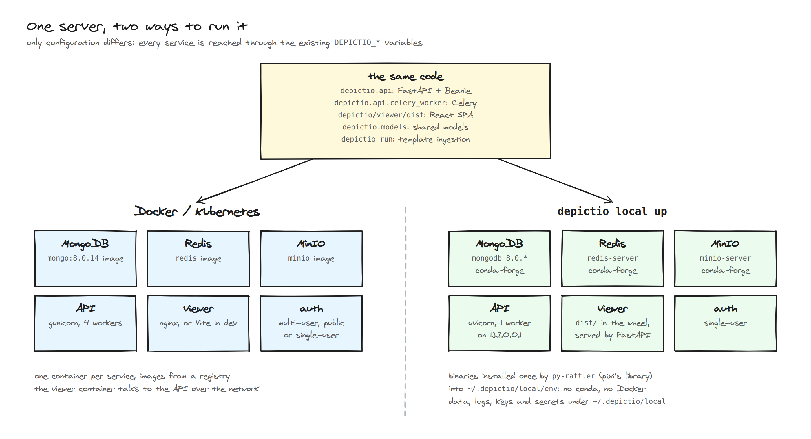
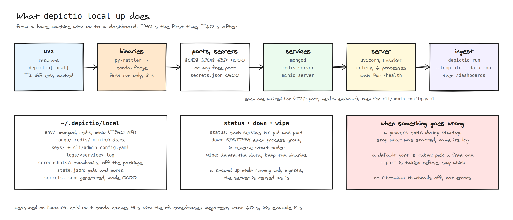
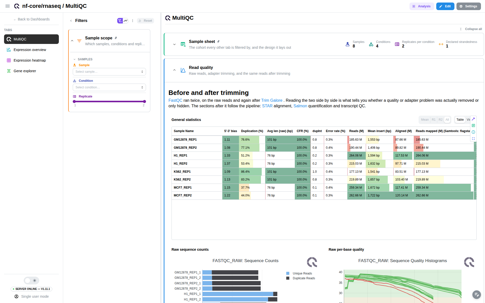
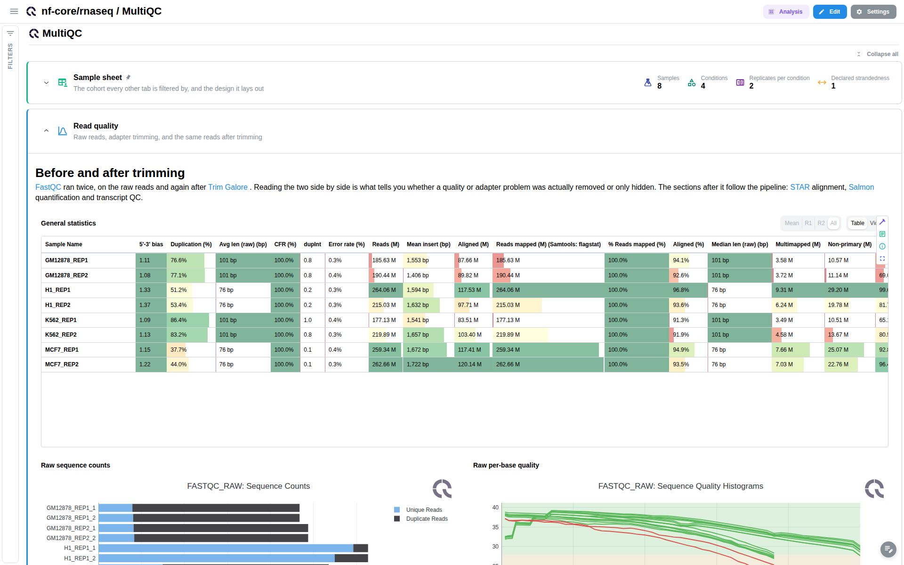
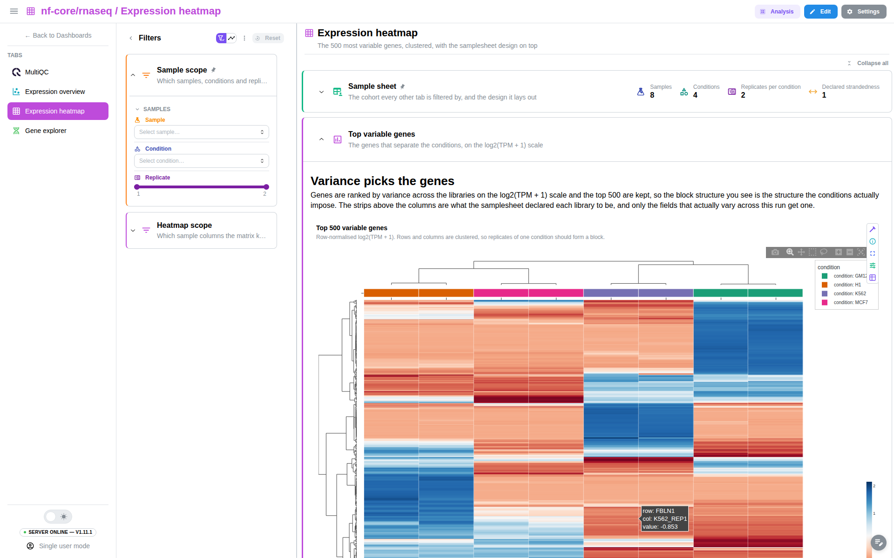
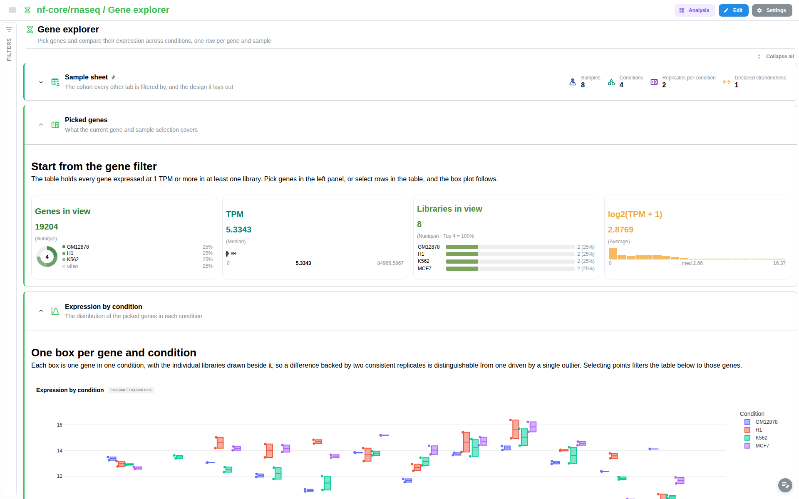
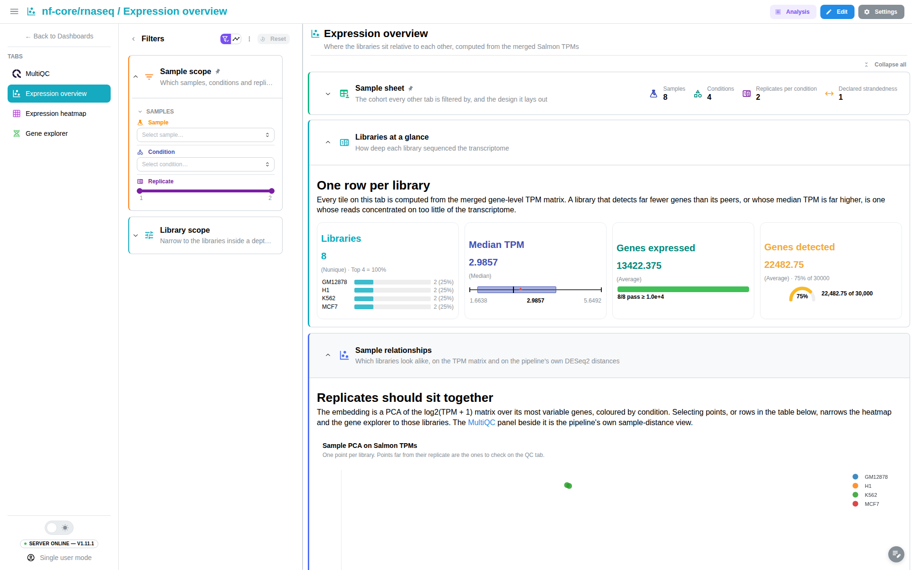
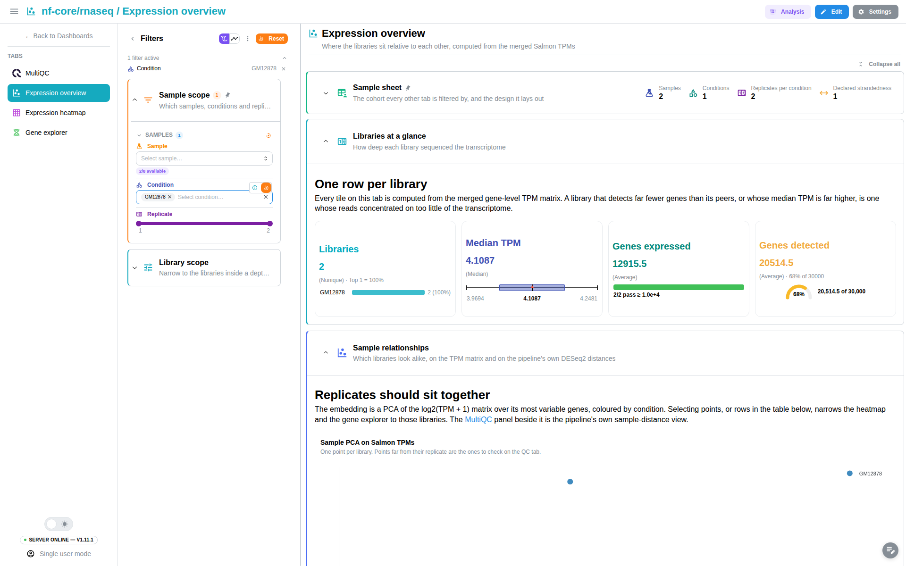
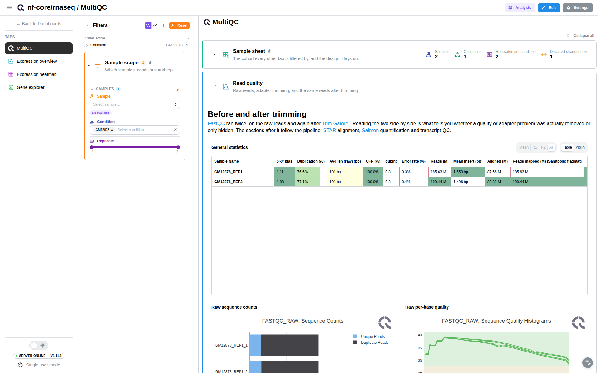

# Serveur Depictio local, sans container

Issue #1085. Cas d'usage : un reviewer nf-core teste un template sur ses propres
résultats, sans Docker et sans rien installer à la main.

## Ce que fait l'utilisateur

```bash
# prérequis unique : uv  (curl -LsSf https://astral.sh/uv/install.sh | sh)
uvx --python 3.12 --from "depictio[local]" depictio local up \
    --template nf-core/rnaseq/latest --data-root results/ \
    --var SAMPLESHEET_FILE=samplesheet.csv

depictio local status | down | wipe
```

`up` démarre la pile, ingère le dossier, puis ouvre `http://127.0.0.1:8058/dashboards`.
Sans `--template`, la commande charge les exemples `iris,penguins` (`--examples all|none|…`).

## Choix retenu : les mêmes services, en processus natifs

C'est le **même code serveur** que Docker/K8s (API FastAPI, worker Celery, viewer,
modèles). Seule la configuration change, et uniquement via les variables
`DEPICTIO_*` existantes.

| Composant | Docker | Local (`depictio local up`) |
|---|---|---|
| MongoDB | image `mongo:8.0.14` | `mongodb 8.0.*` de conda-forge (8.0.23) |
| Redis | image `redis` | `redis-server` de conda-forge |
| MinIO / S3 | image MinIO | `minio-server` de conda-forge |
| Binaires | images | installés une fois par **py-rattler** (la bibliothèque sur laquelle pixi est construit, wheel PyPI) dans `~/.depictio/local/env` |
| API | gunicorn, 4 workers | uvicorn, 1 worker, sur 127.0.0.1 |
| Worker | conteneur Celery | `celery worker --concurrency=2` |
| Viewer | nginx ou Vite | `dist/` inclus dans le wheel, servi par FastAPI |
| Auth | au choix | mono-utilisateur (`DEPICTIO_AUTH_SINGLE_USER_MODE`) |
| Miniatures | Playwright dans le worker | désactivées, sauf si Chromium est présent ou avec `--screenshots` |





Les deux schémas sont générés par `dev/diagrams/local_server.py`, avec la boîte
à outils Excalidraw du repo (`sketch.py`).

## Serveur vs CLI

| | Serveur Docker / K8s | Serveur local : `depictio[local]` (cette PR) | CLI : `depictio-cli` |
|---|---|---|---|
| Rôle | instance partagée | serveur complet et client sur le poste | client : ingère vers un serveur existant |
| Installation | `docker compose up` / Helm | `uvx --python 3.12 --from "depictio[local]" depictio local up` | `uvx depictio-cli` |
| Publié | images ghcr.io | **non** (PyPI à faire) | oui, PyPI 1.11.2 |
| Prérequis | Docker ou un cluster | `uv` seulement | `uv` seulement |
| Serveur nécessaire | c'est lui | non, il le démarre | oui (URL + token dans `CLI.yaml`) |
| Environnement Python | dans les images | ~2 Go, ~30 s à froid | ~0,9 Go, 11 s à froid |
| Autres téléchargements | images | MongoDB, Redis, MinIO de conda-forge : ~360 Mo, 8 s, une seule fois | aucun |
| Viewer | nginx | `dist/` du wheel, servi par FastAPI | aucun |
| Auth | multi-utilisateur, public ou mono-utilisateur | mono-utilisateur | token de l'instance cible |
| Commandes | — | celles de la CLI + `local up/down/status/wipe` | `run`, `dashboard`, `data`, `config`, `backup`… |
| `depictio local up` | — | fonctionne | message clair qui renvoie vers `depictio[local]` |
| Usage type | équipe, démo, production | reviewer qui teste un template sur ses résultats | déclencheur Nextflow, CI, envoi vers une instance partagée |

## Captures (1920×1200, Playwright, pile lancée par `uvx` depuis le wheel)

nf-core/rnaseq 3.26.0, sous-ensemble du megatest, avec les panneaux ouverts puis repliés :

| sidebar et filtres ouverts | sidebar et filtres repliés |
|---|---|
|  |  |
|  |  |

Filtre `Condition = GM12878` : les cartes sont recalculées (8 → 2 librairies),
puis le filtre suit sur l'onglet MultiQC.

| sans filtre | avec filtre | onglet MultiQC filtré |
|---|---|---|
|  |  |  |

## Approches écartées

Les approches suivantes ont été écartées pendant l'implémentation :

- **Stockage sur disque local (`file://`)** : S3 apparaît à 257 endroits dans
  41 fichiers (boto3, `PolarsStorageOptions` obligatoire, `s3://` construit en
  dur, uploads MultiQC et GeoJSON). delta-rs fonctionne bien en local (essai
  concluant), mais le chantier est de taille L. MinIO natif coûte 33 Mo et
  aucune ligne de code métier.
- **Celery sans Redis (threads / `task_always_eager`)** : il faudrait router
  14 sites `.delay` / `apply_async`, et `always_eager` bloquerait
  `GET /dashboards/get` pendant le prerender MultiQC. `redis-server` fait 1 à 12 Mo.
- **Tarballs officiels MongoDB** : un binaire par distribution Linux, lié à
  l'OpenSSL du système. Le paquet conda-forge dépend seulement de glibc ≥ 2.17
  (y compris les vieux clusters HPC) et de macOS ≥ 11.
- **pixi** : il faut cloner le repo et installer pixi. py-rattler résout les
  mêmes paquets conda-forge depuis Python, donc `uvx` suffit. `pixi.toml` reste
  l'outil des développeurs.

## Changements faits dans cette PR

| Fichier | Changement |
|---|---|
| `depictio/cli/cli/local_stack.py`, `commands/local.py` | `depictio local up/down/status/wipe` : binaires via py-rattler, ports libres, secrets générés (0600), PID et logs dans `~/.depictio/local/`, ingestion via `depictio run`, `--var` transmis tel quel |
| `pyproject.toml` | extra `local = ["py-rattler"]` ; `package-data` (viewer `dist/` sans sourcemaps, templates, données de démo, assets). **Le wheel racine ne contenait que le `.py`** : même bug que le wheel CLI 1.9.2 |
| `depictio/version.py` | repli sur `importlib.metadata` : `VERSION` est hors du package, **l'API plantait à l'import depuis un wheel** |
| `db_init_reference_datasets.py` | les `project.yaml` de référence codent `/app/depictio/...` en dur ; ce préfixe est réécrit vers la racine réelle du package (aucun effet dans l'image) |
| `settings_models.py` + 4 sites | `DEPICTIO_PERFORMANCE_SCREENSHOTS_ENABLED` et `_SCREENSHOTS_DIR`. Au démarrage, `clean_screenshots()` supprime les PNG sans dashboard en base, et **il effaçait les miniatures versionnées du repo** quand le serveur tournait depuis un checkout avec une partie des exemples. En local, les miniatures vont dans `~/.depictio/local/screenshots` |
| `dev/diagrams/local_server.py`, `docs/images/v1.4/local/` | les deux schémas (SVG + PNG) et les captures ci-dessus |
| `.github/workflows/local-server-smoke.yaml` | construit le wheel (viewer compris), lance `uvx … depictio local up --examples iris` hors du checkout, puis vérifie `/health`, `/dashboards` et la table Delta iris |

## Mesures (Linux x86_64, réseau datacenter)

| | Valeur |
|---|---|
| Wheel `depictio` | 43,6 Mo (104,6 Mo décompressé) ; viewer 11 Mo sans sourcemaps (46 Mo avec) |
| Environnement Python `uvx` | ~2 Go. Principaux postes : kaleido 221 Mo, deux runtimes polars de 206 Mo chacun, llvmlite 172 Mo, pyarrow 152 Mo, playwright 137 Mo |
| Binaires conda (mongodb, redis, minio + deps) | 8 s ; environ 360 Mo installés |
| Démarrage de mongod | 0,6 s |
| **Premier lancement** à froid, rnaseq inclus | **41 s** (tout téléchargé) |
| Lancement suivant avec données vierges (rnaseq) | 20 s |
| `up` avec exemple iris, caches chauds | 8 s ; table Delta iris prête environ 5 s plus tard |
| Build du viewer | 71 s (à faire dans le job de release) |

Validé avec Playwright (1920×1200) : iris, penguins et le megatest nf-core/rnaseq
3.26.0 (22 Mo). Les 4 onglets et les 12 figures MultiQC s'affichent. Les filtres
recalculent les cartes (8 → 2 librairies) et se propagent d'un onglet à l'autre.

## Risques et questions ouvertes

1. **Publication PyPI (bloquant pour la commande en une ligne)** : ni `depictio`,
   ni `plotly-complexheatmap`, ni `plotly-upset` ne sont publiés. Il faut publier
   les trois, avec le build du viewer avant `uv build`, et vérifier que le nom
   `depictio` est libre.
2. **Taille** : 2 Go d'environnement Python, c'est lourd pour un reviewer. On
   pourrait déplacer `kaleido`, `umap-learn` et `playwright` dans des extras
   serveur optionnels, et ne garder qu'un seul runtime polars
   (`polars[rtcompat]` ajoute le second).
3. **Licences** : MongoDB est sous SSPL et Redis sous SSPL/RSAL, MinIO sous AGPL.
   Les binaires sont téléchargés par l'utilisateur depuis conda-forge, pas
   redistribués par nous. Est-ce acceptable ?
4. **Plateformes** : seul linux-64 a été testé ici. `minio-server` n'a pas de
   build linux-aarch64 dans sa dernière version, et Windows n'est pas pris en
   charge (`os.killpg`). Seul Python 3.12 a été testé, d'où le `--python 3.12`
   dans la commande (`uvx` prendrait sinon le Python le plus récent, avec lequel
   les versions épinglées ne sont pas garanties).
5. **Samplesheet** : les résultats nf-core ne contiennent pas le samplesheet.
   Il faut le passer avec `--var SAMPLESHEET_FILE=…`, sinon la collection
   `samplesheet` échoue et `up` sort en erreur.
6. **Template rnaseq** (indépendant du mode local) : un filtre interroge
   `condition` et `sample` sur `gene_counts`, qui n'a pas ces colonnes, d'où
   des 404 dans la console.
7. **Données** : elles sont conservées d'un `up` à l'autre, et `wipe` les efface.
   Faut-il plutôt un mode éphémère par défaut ?
