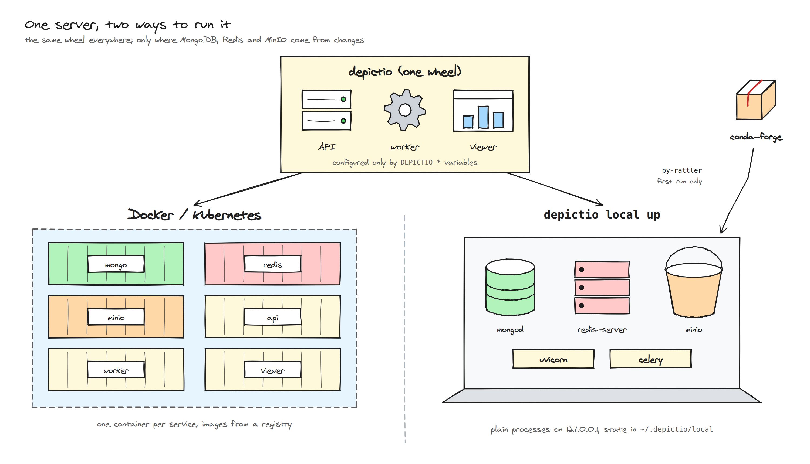
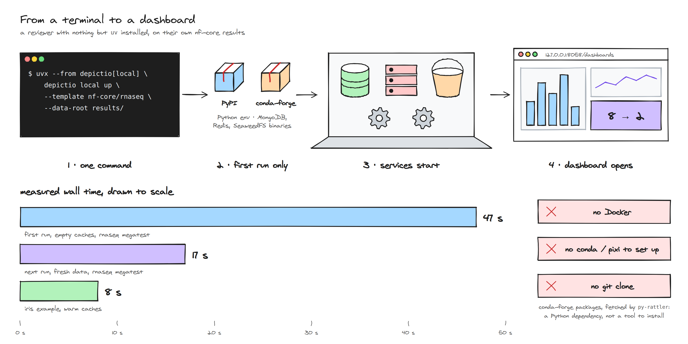
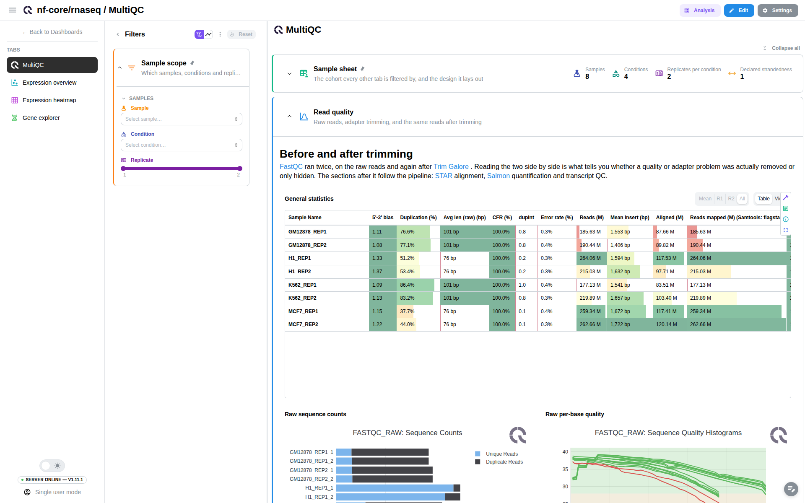
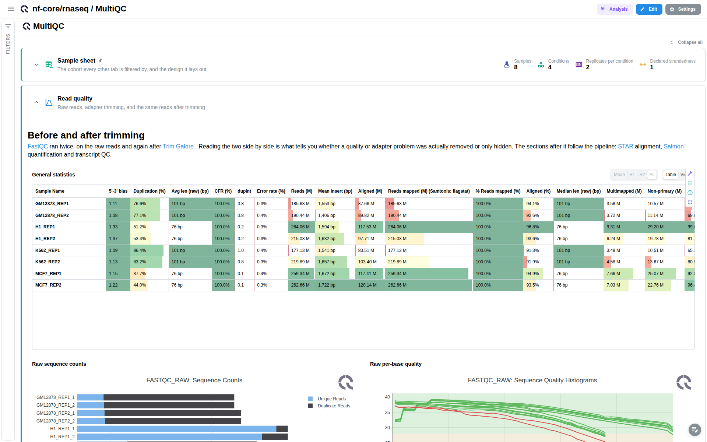
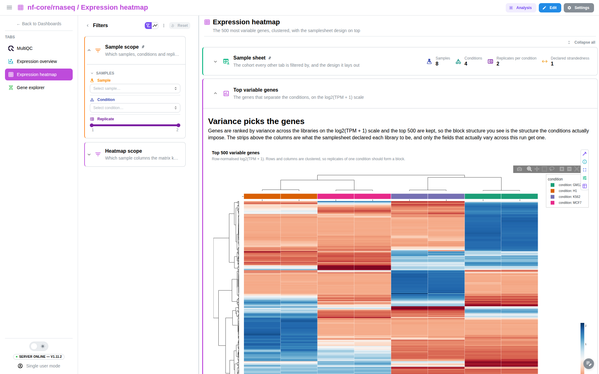
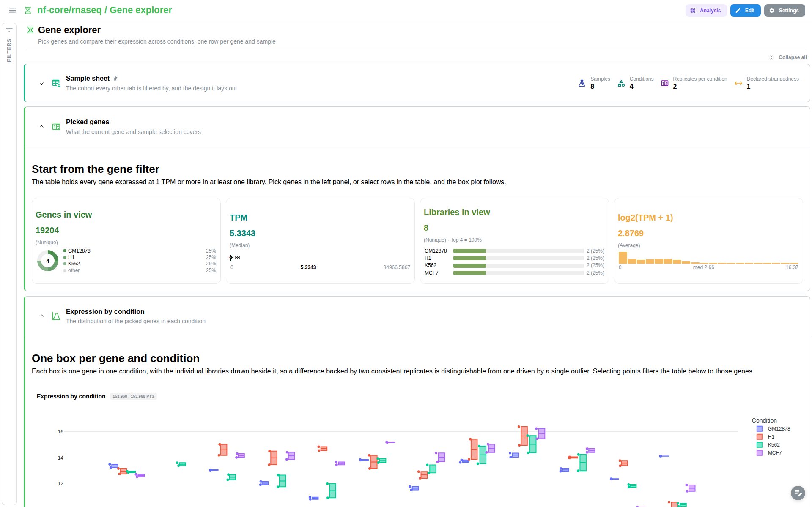
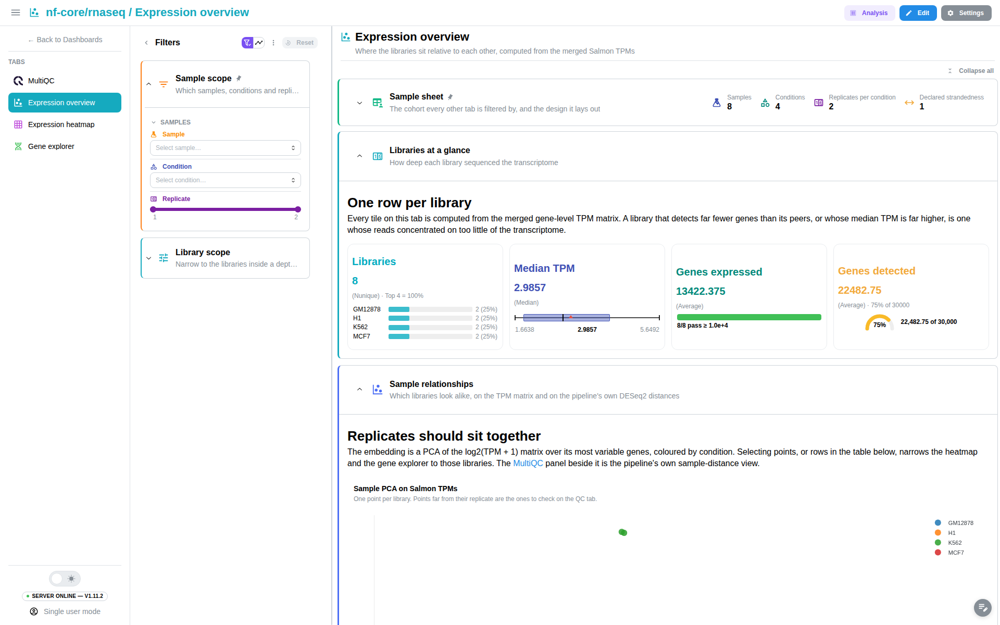
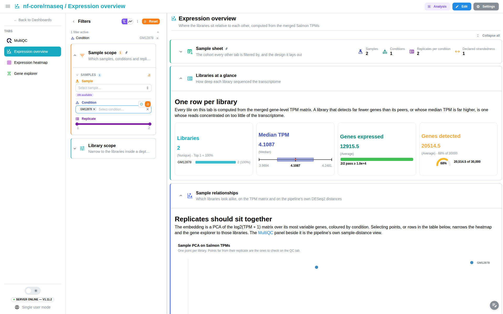
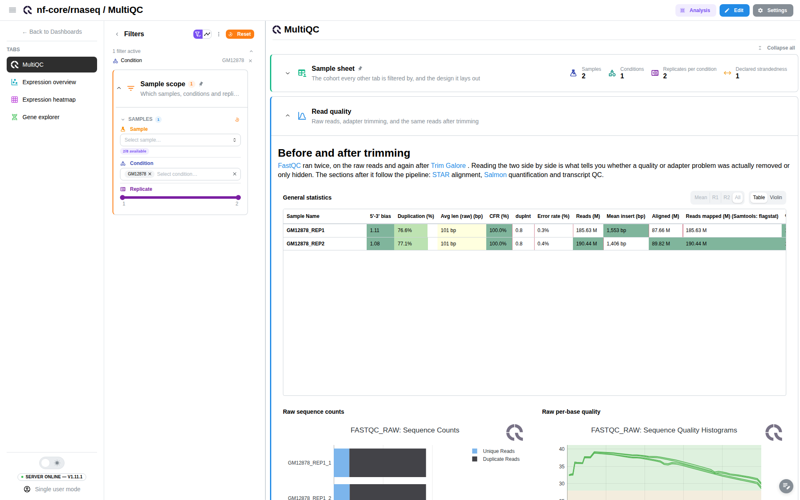

# Local Depictio server, without containers

Issue #1085, PR #1110. Use case: an nf-core reviewer tries a template on their own
results, without Docker and without installing anything by hand. When the trial
becomes a real deployment, the same data moves to Docker Compose.

## What the user does

```bash
# the only prerequisite: uv  (curl -LsSf https://astral.sh/uv/install.sh | sh)
uv tool install "depictio[local]"     # puts `depictio` on PATH
depictio local up                      # iris and penguins examples
depictio ingest --server local --template nf-core/rnaseq/latest --data-root results/ \
    --var SAMPLESHEET_FILE=samplesheet.csv

depictio local open | status | down | wipe
depictio local export --out depictio-docker   # hand over to Docker Compose
```

`up` starts the stack, seeds the iris and penguins examples on a first run
(`--examples iris|penguins|iris,penguins|none`), then opens
`http://127.0.0.1:8058/dashboards`. It ends with a short summary: the dashboards
URL, where the data and logs are, how to add data, how to point the CLI at this
server, and how to stop it. Over SSH, or on Linux without a display, it prints the
`ssh -L` tunnel to open instead of a browser. `up` only runs the server: data goes
in with `depictio ingest --server local`, like into any other server. (In the
first release, 1.12.0b1, `up` took `--template` and `--data-root` itself.)

## Chosen approach: the same services, as native processes

It is the **same server code** as Docker/K8s (FastAPI API, Celery worker, viewer,
models). Only the configuration differs, and only through the existing
`DEPICTIO_*` variables.

| Component | Docker | Local (`depictio local up`) |
|---|---|---|
| MongoDB | image `mongo:8.0.14` | `mongodb 8.0.*` from conda-forge (8.0.23, the only 8.0 build there) |
| Redis | image `redis:8.2.1` | `redis-server 8.*` from conda-forge (no 8.0, 8.2 or 8.4 build there) |
| S3 | SeaweedFS (`weed mini`), image `chrislusf/seaweedfs:4.46` | `seaweedfs 4.*` from conda-forge, same `weed mini` |
| Binaries | images | installed once by **py-rattler** (the library pixi is built on, a PyPI wheel) into `~/.depictio/local/env` |
| API | gunicorn, 4 workers | uvicorn, 1 worker, on 127.0.0.1 |
| Worker | Celery container | `celery worker --concurrency=2`: `prefork` on Linux, `threads` on macOS |
| Viewer | nginx or Vite | `dist/` shipped in the wheel, served by FastAPI on the API port |
| Auth | any mode | single-user (`DEPICTIO_AUTH_SINGLE_USER_MODE`) |
| Thumbnails | Playwright in the worker | off, unless `--screenshots` |
| Ports | fixed in Compose | 8058, 27018, 6379, 9000 or free ones, then kept in `ports.json` |

The conda specs follow the image tags of `docker-compose.yaml` and must move with
them (a comment next to `CONDA_SPECS` says so). The specs and the conda platform
are recorded next to the binaries, so changing either reinstalls them on the next
`up`.





Both schemas are generated by `dev/diagrams/local_server.py`, with the repository's
Excalidraw toolkit (`sketch.py`).

## Server vs CLI

| | Docker / K8s server | Local server: `depictio[local]` (this PR) | CLI: `depictio-cli` |
|---|---|---|---|
| Role | shared instance | full server and client on one machine | client: ingests into an existing server |
| Install | `docker compose up` / Helm | `uv tool install "depictio[local]"` | `uv tool install depictio-cli` |
| Published | ghcr.io images | **not yet** (PyPI pending) | yes, PyPI 1.11.2 |
| Prerequisites | Docker or a cluster | `uv` only | `uv` only |
| Needs a server | it is the server | no, it starts one | yes (URL and token in `CLI.yaml`) |
| Python environment | inside the images | ~2 GB, ~30 s cold | ~0.9 GB, 11 s cold |
| Other downloads | images | MongoDB, Redis, SeaweedFS from conda-forge: ~710 MB installed, 10 s, once | none |
| Viewer | nginx | the wheel's `dist/`, served by FastAPI | none |
| Auth | multi-user, public or single-user | single-user | token of the target instance |
| Commands | n/a | the CLI's, plus `local up/open/down/status/wipe/export` | `ingest`, `dashboard`, `data`, `config`, `backup`... |
| `depictio local up` | n/a | works | a clear message pointing to `depictio[local]` |
| Typical use | team, demo, production | a reviewer trying a template on their results | Nextflow trigger, CI, upload to a shared instance |

The environment sizes and times in this table were measured on 2026-09-24.

## Running a local server

Everything lives under `~/.depictio/local` (or `DEPICTIO_LOCAL_HOME`): `env/` for
the binaries, one directory per service, `logs/`, and three small files. The home,
`keys/` (token signing keys) and `cli/` (admin token) are owner-only; `secrets.json`
(S3 and admin passwords) is created `0600`.

- **Sticky ports.** The first `up` takes 8058, 27018, 6379 and 9000, or free ports
  when those are taken, and saves them in `ports.json`, which `down` keeps. Later
  runs reuse them, so the dashboards URL stays the same. A saved port that another
  program has taken since moves to a free one with a warning; an explicit `--port`
  that is busy fails. After each start the CLI configuration is rewritten to the
  ports in use, so ingestion never targets a stale port.
- **Safe stops.** `state.json` records each PID with its start time. A PID whose
  start time differs (reused after a reboot) is never signalled. A stop signals the
  whole process group, so Celery pool processes and Chromium go too.
- **Startup.** Ready means the API answers `/health` on its port, then the worker is
  checked alive, then the requested examples have their Delta tables. The API
  loads them in a background thread after `/health` answers, and a server stopped
  in those seconds would keep them half loaded, since later boots skip the
  reference projects. `up` waits up to 2 minutes and names an example still
  loading. On a first run (`first_run` in `state.json`: started on an empty
  database) a missing data collection is still to come, since the example projects
  are created one after the other; later it is one the home was created without
  (examples are seeded on its first run only), which is not waited for. A service that dies names its log. Ctrl-C during startup stops
  what that run started and exits 130. A failed check (platform, missing server
  packages) never touches a server that is already running. A conda-forge download
  failure is a one-line error.
- **Isolation.** Inherited `DEPICTIO_*` variables, set for another instance, are
  dropped, except the telemetry opt-out. `DEPICTIO_CLI_*` overrides do not reach
  the ingestion subprocess. The API, the worker and the ingestion get `127.0.0.1`
  added to `no_proxy`, since boto3 and httpx otherwise send loopback traffic
  through a proxy set in the environment; `weed mini` runs without the proxy
  variables and with its telemetry off.
- **Data.** Kept from one `up` to the next; `wipe` deletes it and keeps the binaries.

## Hand-over to Docker Compose

`depictio local export --out DIR` turns a local server into a Compose stack
on the same data:

1. Stops the local server if it is running, so the copy is consistent, and says so.
   Everything that can fail beforehand (no data, non-empty `DIR`, no compose file)
   is checked first, so a refused export leaves the server running.
2. Makes `DIR` owner-only (`0700`), like the local home: the copies keep their
   modes, and `data/keys` holds the token-signing key. Containers reach their bind
   mounts without going through it. Then copies the MongoDB and SeaweedFS data and
   the three key files into `DIR/data`.
   The data is copied, not shared: MongoDB must never run twice on one data
   directory, and the local server stays usable. Redis holds only cache and queue,
   and thumbnails are re-rendered, so neither is carried over.
3. Writes the `docker-compose.yaml` that matches the running code: the checkout's
   own file when run from a source checkout (it matches the code even where the
   version number still names the last release), else the file of the `v<version>`
   tag, downloaded through any configured proxy. A dev build outside a
   checkout is refused with a message, since no published file matches it.
4. Writes `docker-compose.override.yaml`: the `mongo` and `chrislusf/seaweedfs`
   images at the exact versions the local server wrote the data with (read from the
   conda metadata), bind mounts of the copied data, and the key files mounted one
   by one, read-only. On Linux MongoDB and SeaweedFS run as the host user, who owns
   the copied files.
5. Writes `.env` (`0600`): single-user mode, the S3 and admin credentials, and
   `DEPICTIO_VERSION` for a release.
6. Rewrites the copied SeaweedFS `mini.options` to listen on `0.0.0.0:9000`, or the
   container would keep listening on its own loopback. `ip` stays: the master's raft
   state is keyed on it.

It ends with the one command to run next: `cd DIR && docker compose up -d`, then
`http://localhost:5080`. The CLI token minted by the local server stays valid,
because the keys come along.

The `local-to-compose` job in `depictio-ci.yaml` brings up the iris example locally,
exports it, runs Compose on the images built for the commit, and checks that the
table is served, that the worker reads it back from the exported SeaweedFS, and
that the local CLI token is accepted.

## The wheel

The `depictio` wheel is 8.6 MB (43.8 MB before; measured on 2026-10-05). It ships
the viewer bundle without sourcemaps, the nf-core template definitions (enough for
`--template` on one's own results), and the iris and penguins examples with their
seeds (`.db_seeds/*.json`) and two thumbnails. The other reference projects, the
nf-core documentation screenshots and reports, and the ampliseq and viralrecon
reference data stay out. Docker images copy the source tree and are unaffected.

- `package-data` uses explicit include globs: `projects/**/*` alone skips the
  `.db_seeds` dot-directories, which once left a wheel with tables but no dashboard.
- API startup tolerates reference datasets missing from the installed package.
- `watchdog` moved to a `worker-reload` group installed by the worker image only:
  it has no Python 3.14 macOS wheel and only live-reloads the worker in dev mode.
- `plotly-upset` and `plotly-complexheatmap` are pinned to 0.1.0, so the wheel's
  metadata can resolve from PyPI once they are published.
- The smoke workflow fails if the wheel grows past 15 MB or loses a required file.

## Screenshots (1920x1200, Playwright, stack started by `uvx` from the wheel)

nf-core/rnaseq 3.26.0, a subset of the megatest, with the panels open then collapsed:

| sidebar and filters open | sidebar and filters collapsed |
|---|---|
|  |  |
|  |  |

Filter `Condition = GM12878`: the cards are recomputed (8 → 2 libraries), then the
filter carries over to the MultiQC tab.

| no filter | with the filter | MultiQC tab, filtered |
|---|---|---|
|  |  |  |

## Approaches set aside

- **Local disk storage (`file://`)**: S3 appears in 257 places across 41 files
  (boto3, mandatory `PolarsStorageOptions`, hard-coded `s3://`, MultiQC and GeoJSON
  uploads). delta-rs works well on local paths (a successful trial), but the change
  is size L. Native SeaweedFS, the same `weed mini` as in Docker, needs no change to
  the server code.
- **Native MinIO** (the first version of this PR): `main` moved from MinIO to
  SeaweedFS after the community MinIO images were withdrawn. The local mode follows,
  to stay the same server as Docker. On the way the licence goes from AGPL to
  Apache-2.0 and linux-aarch64 is covered.
- **Celery without Redis (threads / `task_always_eager`)**: 14 `.delay` /
  `apply_async` call sites would need routing, and `always_eager` would block
  `GET /dashboards/get` during the MultiQC prerender. `redis-server` is 1 to 12 MB.
- **Official MongoDB tarballs**: one binary per Linux distribution, linked to the
  system's OpenSSL. The conda-forge package only needs glibc 2.17 or later (old HPC
  clusters included) and macOS 11 or later.
- **pixi**: it needs a clone of the repository and pixi installed. py-rattler solves
  the same conda-forge packages from Python, so `uvx` is enough. `pixi.toml` remains
  the developers' tool.

## Changes in this PR

| File | Change |
|---|---|
| `depictio/cli/cli/local_stack.py`, `commands/local.py` | `depictio local up/down/status/wipe`: MongoDB, Redis and SeaweedFS through py-rattler (pinned to the Compose series), `DEPICTIO_S3_*` settings, sticky ports, generated secrets (`0600`), PIDs with start times and logs in `~/.depictio/local/`, ingestion through `depictio run`, `--var` passed through |
| `depictio/cli/cli/local_compose.py` | `depictio local export`: the hand-over described above |
| `pyproject.toml` | `local = ["py-rattler==0.26.0"]` extra; `package-data` include globs for the slim wheel; `watchdog` moved to a `worker-reload` group; `plotly-upset` and `plotly-complexheatmap` pinned to 0.1.0. **The root wheel used to hold only the `.py` files**: the same bug as the 1.9.2 CLI wheel |
| `depictio/version.py` | falls back on `importlib.metadata`: `VERSION` is outside the package, **so the API failed at import from a wheel** |
| `db_init.py`, `db_init_reference_datasets.py` | the reference `project.yaml` files hard-code `/app/depictio/...`; that prefix is rewritten to the actual package root (no effect in the image). Reference datasets absent from the installed package are skipped |
| `settings_models.py` and 4 call sites | `DEPICTIO_PERFORMANCE_SCREENSHOTS_ENABLED` and `_SCREENSHOTS_DIR`. At startup `clean_screenshots()` deletes PNGs without a dashboard in the database, and **it erased the repository's committed thumbnails** when the server ran from a checkout with only some of the examples. Locally, thumbnails go to `~/.depictio/local/screenshots` |
| `mantine_templates.py` | a lock around the Plotly template patch (see the measurements below) |
| `docker-images/Dockerfile.worker` | installs the `worker-reload` group |
| `dev/diagrams/local_server.py`, `docs/images/v1.4/local/` | the two schemas (SVG and PNG) and the screenshots above |
| `.github/workflows/local-server-smoke.yaml` | builds the wheel (viewer included) and checks its size and contents, runs `uvx ... depictio local up --examples iris` outside the checkout, checks `/health`, `/dashboards`, the iris Delta table and a worker read of it, then runs Playwright on that stack: `tests/local/local-mode.spec.ts` (iris dashboard rendered, filter `Variety = Setosa` takes the card from 150 to 50 flowers, no 5xx response), plus the existing `single-user-mode` and `about` specs. Linux x86_64 always runs; Linux arm64 and macOS arm64 run on pushes to main, on manual runs, and on pull requests that touch the local server, `pyproject.toml` or the workflow |
| `.github/workflows/depictio-ci.yaml` | the `local-to-compose` hand-over job |

## Measurements (Linux x86_64, datacenter network)

| | Value | Measured on |
|---|---|---|
| `depictio` wheel | 8.6 MB; viewer 11 MB unpacked without sourcemaps (46 MB with) | 2026-10-05 (viewer: 2026-09-24) |
| `uvx` Python environment | ~2 GB. Largest items: kaleido 221 MB, two polars runtimes of 206 MB each, llvmlite 172 MB, pyarrow 152 MB, playwright 137 MB | 2026-09-24 |
| conda binaries (mongodb, redis-server, seaweedfs and dependencies) | 10 s; about 710 MB installed (`mongod` 209 MB, `weed` 226 MB) | 2026-09-25, with SeaweedFS 4.47 |
| mongod startup | 0.6 s | 2026-09-24 |
| **First run**, cold, rnaseq included | **47 s** (everything downloaded) | 2026-09-25 |
| Next run on fresh data (rnaseq) | 17 s | 2026-09-25 |
| `up` with the iris example, warm caches | 8 s; the iris Delta table is ready about 4 s later | 2026-09-25 |
| Viewer build | 71 s (belongs in the release job) | 2026-09-24 |

The e2e job caught a bug that the `curl` checks missed: without the `.db_seeds`
seeds, the wheel started with the iris table but no dashboard (404 on
`/dashboards/get`, empty list). It caught a second one, also present in Docker: on a
cold process, two simultaneous first figure renders could read the Plotly template
cache half filled (`KeyError: 'mantine_dark'`, 500 on `render_figure`). A lock in
`mantine_templates.py` fixes it.

Validated with Playwright (1920x1200): iris, penguins and the nf-core/rnaseq 3.26.0
megatest (22 MB). The 4 tabs and the 12 MultiQC figures render. Filters recompute
the cards (8 → 2 libraries) and carry over from one tab to the next.

## Risks and open questions

1. **PyPI publication (blocking for the one-line command)**: `depictio`,
   `plotly-upset` and `plotly-complexheatmap` are not published yet. All three
   need publishing, with the viewer built before `uv build`, and the `depictio`
   name must be checked as available.
2. **Size**: the wheel is small now, but the Python environment is ~2 GB, which is
   heavy for a reviewer. `kaleido`, `umap-learn` and `playwright` could move to
   optional server extras, and a single polars runtime could be kept
   (`polars[rtcompat]` adds the second).
3. **Licences**: MongoDB is under the SSPL, Redis under the SSPL or RSALv2 (as
   packaged on conda-forge), SeaweedFS under Apache-2.0. The binaries are downloaded by the user from
   conda-forge, not redistributed by us. Is that acceptable?
4. **Platforms**: Linux and macOS, x86_64 and arm64. The smoke test runs on
   linux-64, linux-aarch64 and osx-arm64; osx-64 has no hosted runner.
   - **macOS**: the Celery worker runs with `--pool=threads`. With `prefork`, the
     children load libarrow, deltalake and the TLS trust store, which call
     CoreFoundation and SystemConfiguration after a `fork()` without `exec`: they
     die with SIGABRT or SIGSEGV, and `OBJC_DISABLE_INITIALIZE_FORK_SAFETY` does not
     help. The cost: Celery `time_limit` and `--max-tasks-per-child` do not apply.
   - **Windows**: refused up front with a message pointing to WSL2 or Docker.
     conda-forge has no `redis-server` for win-64, and services are managed as POSIX
     process groups (`os.killpg`).
   - **Binaries**: the conda platform (`osx-arm64`, `linux-aarch64`...) is recorded
     with the specs, so a `$HOME` shared between two architectures reinstalls
     instead of running a binary built for the other one.
   - **CPU**: MongoDB 5+ needs AVX on x86_64 and ARMv8.2-A on arm64 (no Raspberry
     Pi 4). A `mongod` killed by SIGILL is reported as such.

   `weed mini` gets every internal port from `depictio local` (master, volume,
   filer, admin and their gRPC ports, at their defaults 9333, 9340, 8888, 23646
   and +10000 when free). Left to itself it moves off a taken port ("finding
   alternative port"), but next to a second `weed mini` that search races with its
   own binds and the volume server stops on "address already in use". The full stack has been run on Python 3.13 and 3.14 from the
   wheel (2026-10-05) and on 3.12 earlier; the dependency set resolves to wheels on
   3.11 to 3.14.
5. **Version drift with Compose**: Redis and SeaweedFS are pinned to their major
   series only, so a local home may run newer minors than Compose (Redis 8.10
   against 8.2.1, SeaweedFS 4.48 against 4.46 on 2026-10-05). A tighter pin would
   downgrade existing homes, and Redis cannot load an RDB written by a newer
   version. The hand-over pins the SeaweedFS image to the local version, so data
   never moves to an older SeaweedFS.
6. **Hand-over and releases**: from a wheel, the hand-over uses the compose file of
   the installed version's tag, so it works from the first release that ships
   `depictio local`. The `v1.11.2` tag and the `stable` branch still run MinIO and
   have no `s3` service.
7. **Samplesheet**: nf-core results do not include the samplesheet. It must be
   passed with `--var SAMPLESHEET_FILE=...`, or the `samplesheet` collection fails
   and `up` exits with an error.
8. **rnaseq template** (independent of the local mode): a filter queries `condition`
   and `sample` on `gene_counts`, which has neither column, hence 404s in the
   console.
9. **Data**: kept from one `up` to the next, and `wipe` deletes it. Should an
   ephemeral mode be the default instead?
10. **Shared machines**: owner-only files protect the data on disk, not the running
    server. On a machine with other users, such as an HPC login node, they can reach
    every port on `127.0.0.1`: the API in single-user mode (anonymous requests act
    as the admin), `mongod` without `--auth`, Redis without a password, and the
    SeaweedFS filer, which serves objects without S3 credentials. The docs warn
    about it. Closing it means `mongod --auth` and `redis-server --requirepass` with
    generated secrets, SeaweedFS JWT keys in `security.toml`, and a login in front
    of the API.
11. **Reference processing is not resumed** (Docker included): once
    `initialization_complete` is set, a boot never processes the reference projects
    again, so an interrupted first processing stays incomplete. `up` waits for the
    examples, which avoids it locally; a server-side resume is a follow-up.
