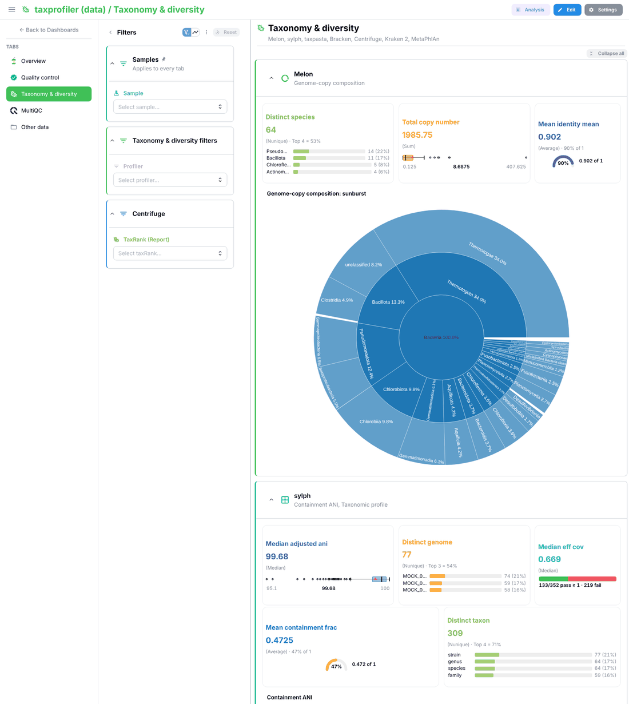
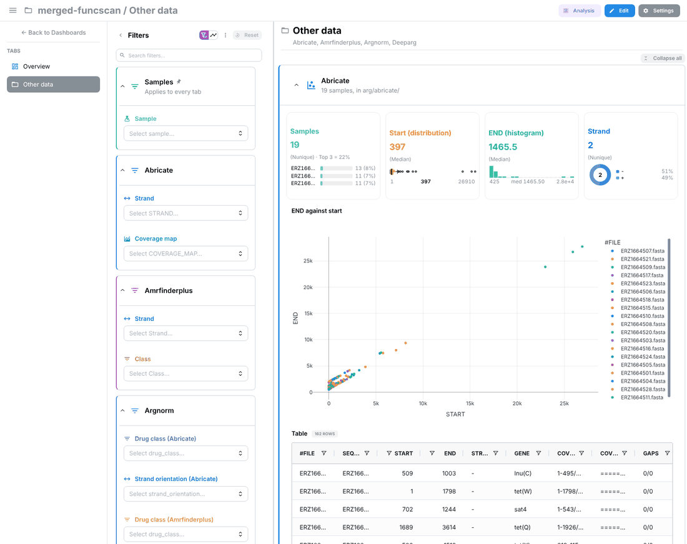

# A results directory in, a dashboard out (MultiQC-like)

Goal: `uv tool install "depictio[local]"`, point Depictio at a results directory, and
get a dashboard built for it: the files recognised, KPIs, plots, tabs and their
order, the way MultiQC builds its report.

Decisions: a dashboard served locally (no standalone HTML in a first version); a
deterministic core, with the AI generation stack (#964 → #1028 → #1032 → #1045) as an
optional layer on top; nf-core runs with a bundled template plus anything the
catalog recognises, with every other file **proposed**, never added silently; an
Overview tab, then one tab per pipeline stage.

## What exists, mapped onto MultiQC

| MultiQC | Depictio | State |
|---|---|---|
| search patterns | catalog `find:` + `match_run_dir()` (`models/components/advanced_viz/catalog.py`) | exists; not wired into ingestion (`catalog/TODO.md`, "Guided mode") |
| a module's parsing | recipes (`depictio/recipes/`) | exists; the matched path is not handed to the recipe |
| a module's sections | `renders_as` | exists; mostly advanced_viz, few figures and cards |
| General Stats across tools | `multiqc/general_stats.yaml`, MultiQC only | missing |
| `module_order`, sample-name cleaning | — | missing: a `Render` has no order or priority |
| report assembly | `compose_run_dir()`: "a preview only" | missing |
| custom content, user config | catalog and templates read from the package only | missing |
| pipeline detection | `select_template_for_run()` from `pipeline_info/` | exists in `depictio ingest` |

## Where composition lives

Every entry point already ends in `depictio ingest <dir>` (formerly `run`): a person
against the local server (`depictio local up`, then `depictio ingest results/`), the
Nextflow completion hook (`cli/configs/nextflow/depictio.config`, the closest thing
to MultiQC as a pipeline's last step), an ingestion against a shared server
(`--server`), and later `POST /projects/from_run` (#1047). A separate `report`
command would serve only the first. So composition is one more level of template
resolution inside `ingest`:

```
--template  >  --pipeline-id  >  bundled template detected from the run  >  template COMPOSED from the catalog
```

The composed result is an ordinary template (`template.yaml` with `{DATA_ROOT}`,
plus `dashboards/*.yaml`), so everything downstream is reused as is:
`resolve_template`, pruning of missing collections, conditionals, recipe seeds,
dashboard import, `--update-config`. The one new command is `depictio template
compose <dir> [-o out/]`: offline, no server. It prints the proposal (collections,
tabs, KPIs, unrecognised files with what they could become) and writes an editable
template, ingested with `ingest <dir> --template ./out/`. Composition must be deterministic
(sorted, stable tags), and the composed template is kept with the project so a
re-run does not reshuffle the dashboard.

## Phases

1. **Plumbing** (done): `ingest --template <path>` and `ingest --result-json`.
   The rest of what this phase first did on `local up` (ingesting from it, a
   second ingestion of the same directory, the local server as the default) is
   main's CLI rework now: `local up` only runs the server, `depictio ingest <dir>`
   detects the template, `--update-config` / `--reset-dashboards` refresh, and the
   local server is the default when no other is configured.
2. **Composer** (done, `depictio/cli/cli/utils/compose.py`):
   - catalog matches → collections: raw → table; recipe → `transform` with
     `source_overrides` re-rooted from the matched file; `multiqc.parquet` →
     multiqc, read off the parquet itself (`multiqc_parquet.py`);
   - a `dc_ref` a recipe needs is tagged as it expects, or synthesised from its raw
     files (mosdepth's recipes read a collection named like their own output);
   - every composed collection is `optional`, so a failed one is skipped and its
     tiles dropped by the import instead of failing the run;
   - a multi-tab dashboard (`{main_dashboard, tabs}`) with explicit layouts
     (`compose_layout.py`), validated with the lite models before it is written;
   - `depictio template compose <dir> [-o out/]`; the fallback in `ingest`, forced
     with `--compose`.
3. **Catalog** (done): `stage` on a tool and as an output override, `headline` on a
   card, `priority` on any render; thresholds reuse the card's `threshold_*`
   fields. Every MultiQC plot present in the report is on the dashboard. A
   cross-tool general-stats table (`general_stats.tsv` next to the composed
   template) joins each tool's headline cards per normalised sample.
4. **Unrecognised files** (done): a deterministic proposal from the Polars schema
   (sample column, numeric columns → cards, categoricals of at most 50 values →
   filters, a scatter or box figure, the table), printed by `template compose` and
   `ingest`, stored on `TemplateOrigin.unrecognised_files` and listed on the project
   page with the command that adds each file; `--include-unknown` /
   `--include <glob>` adds them to an "Other data" tab. Files of one shape
   (same depth, extension and columns) that differ by one value are one
   collection (`abricate/{sample}/{sample}.txt`): a recursive scan whose
   wildcard becomes a column at ingestion. The column is `sample` when the
   values turn up elsewhere in the run under another kind of name, `file`
   otherwise (variants of one output, `salmon.merged.gene_*.tsv`). Files of
   one directory and name pattern whose first rows share no name are
   headerless (`bowtie2out`), and grouped as such.
   - **Where a group goes**: the deepest directory the catalog names (a tool or
     a MultiQC module, by id or name, or exactly one word of it:
     `deseq2_qc`) gives the section its tool's name and its stage's tab;
     otherwise the first directory below what the groups share, a top
     directory holding only tool directories looked through once
     (`arg/abricate`), in Other data. Tiles say what the group holds in the
     words its section does not already say ("Kraken2 report" of Bracken).
     A table written twice (`x.csv`, `x.tsv`) is kept once.
   - **One Samples filter**: `samples.tsv` next to the template holds every
     sample of the run (sample columns, path values, MultiQC's General
     Statistics; a value extending another at a separator is the same
     sample). Its persistent MultiSelect is linked to MultiQC and to every
     collection naming samples (`direct`, or `sample_mapping` with the
     variants), so it narrows every tab; per-collection sample filters are
     dropped, other filters kept when they have 2 to 12 values.
5. **Not done here**: the optional AI layer (it needs the #964 → #1045 stack on
   main: hand it the composed plan through the `plan` hook of #1032), a standalone
   HTML report, a Python API, and catalog enrichment (most outputs still render
   mostly advanced visualisations; about 31 of 183 MultiQC modules have a section,
   which only matters for their stage, since every plot of a report is shown).

Known limits:

- The Samples filter reaches a collection only through a sample-named column
  (`sample`, `sample_id`…) or its path; a table keying rows by another name
  for samples is not linked.
- A recipe whose inputs are other collections (`dc_ref`) is left out of the
  general statistics, which are computed before ingestion.
- A one-click "add this file" on the project page needs the server to see the
  files (local mode); the page shows the command instead.

## Validation

- Unit: `depictio/tests/cli/utils/test_compose.py` (matching against
  `match_run_dir`, determinism, the composed YAML against the lite models, full
  card rows, every MultiQC plot, recipe re-rooting, `dc_ref` providers, proposals,
  the `template compose` command).
- End to end: `depictio ingest <dir>` against `depictio local up` on the catalog
  conformance run,
  nf-core/ampliseq 2.14.0 (with and without `--include-unknown`) and
  nf-core/viralrecon (`--compose`), then
  `depictio/tests/e2e-playwright/tests/local/composed-dashboard.spec.ts`, which
  opens every tab and the project page and fails on any server error.

## Layout of a composed dashboard

- **Overview** (main tab): sample count and headline KPIs (#1145 `headline` cards),
  the general-stats table, one `[Stage](tab:…)` tile per tab.
- **One tab per stage present**, ordered by a fixed vocabulary
  (`qc → preprocessing → alignment → quantification → variants → taxonomy →
  downstream → other`), one section per tool: cards → figures → advanced_viz →
  collapsed table.
- **MultiQC**: one tab, every plot present.
- **Other data**: only when asked for.

Composed from nf-core megatest results: taxprofiler's Taxonomy & diversity tab
(sections per tool, the one Samples filter for every tab), and funcscan's Other
data tab (files the catalog does not know, one collection per shape):

|  |  |
|---|---|

The deterministic layout of #1028 (`ai_endpoints/dashboard_layout.py`: 8-column grid,
full card rows, figures in pairs) moves out of `ai_endpoints` so the CLI can use
it, and learns tabs.

Icons and colours (`compose_style.py`), after the seeded reference dashboards
(iris, penguins, nf-core/ampliseq, nf-core/viralrecon), from words and structure
only:

- a card's colour and icon say what it measures, not where it sits: samples
  teal with a flask on every tab, coverage cyan, a percentage blue, taxa green;
  a card nothing names takes a free colour of the references' palette; no
  section shows one colour twice; filters likewise, on the seaborn palette;
- a tab's first section wears the tab's colour, the next ones change hue
  (starting at a different place on each tab) and take an icon from what they
  hold (a sunburst's donut, a dot plot's grid, a scatter); tables stay gray;
- a section shows one row of cards (two for a recognised tool, none twice);
  files the catalog does not know get the references' varied row: the samples
  (top N), a distribution (box plot), a histogram, quartiles, a category's
  donut; a column named after a sample (a matrix's) gets no card, and
  numbered columns or sample-against-sample get no figure;
- an all-capitals column name is set in lower case (`STRAND` → "Strand"),
  acronyms kept (`GC content`);
- every icon used is one the viewer's production icon subset carries
  (`generate-icon-subset.mjs` scans viewer sources and shipped dashboards
  only); a unit test guards it. The viewer shows a card's icon on hover.
