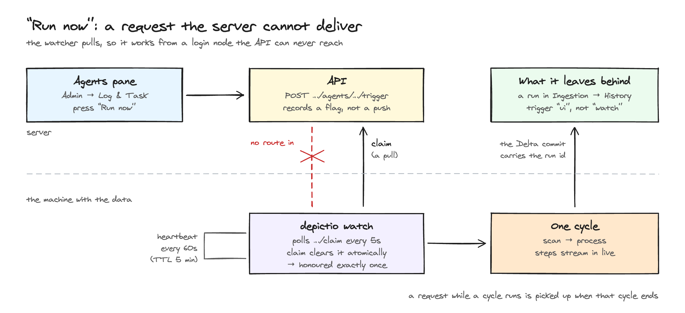
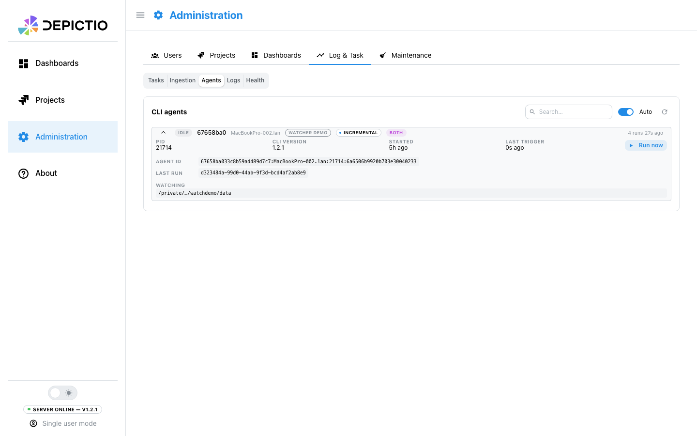
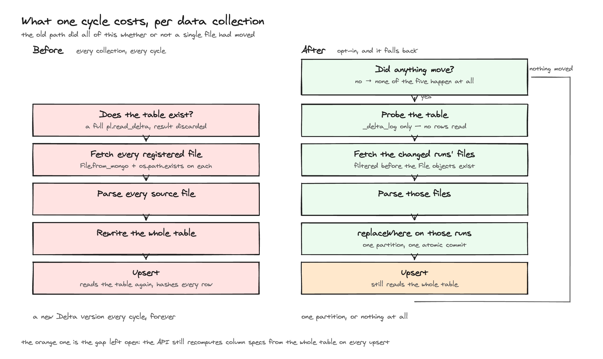
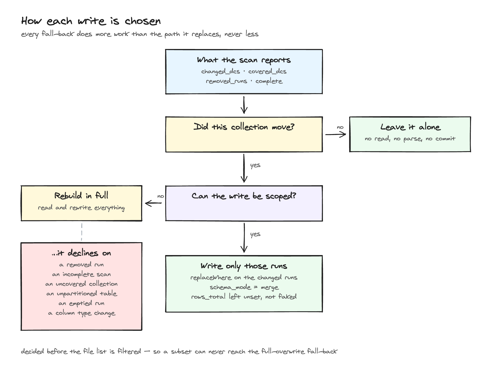
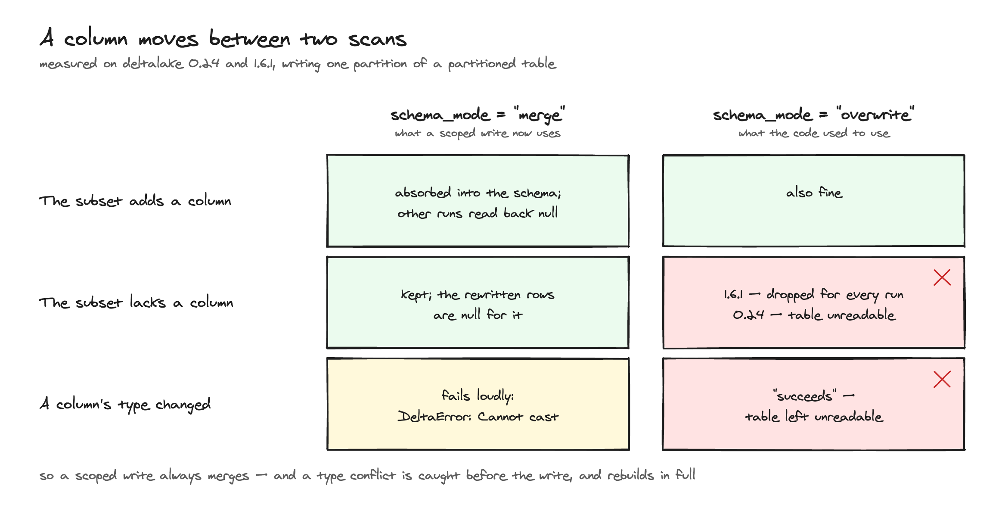

# Automated ingestion

Depictio's CLI can watch a data root and re-ingest by itself when files appear
or change, instead of waiting for someone to run `depictio run`.

This page covers the watcher, Delta dataset versioning, and offloading the
server-side half of an ingestion so a large table no longer risks a timeout.

Everything that changes behaviour is opt-in. An upgraded deployment that sets
no new flags behaves exactly as before.

---

## Quick start

```bash
depictio watch \
  --CLI-config-path ~/.depictio/CLI.yaml \
  --project-config-path ./project.yaml \
  --write-mode replace-runs --incremental-write
```

That polls and/or listens for changes, waits for writes to settle, and
re-ingests only what changed: a collection nothing touched is left at its
current Delta version, and a collection that did change has only its changed
runs rewritten.

Watch it from the UI under **Admin → Log & Task → Agents**, or on a project's
**Ingestion → History** tab.

---

## The watcher

### Why there are two change detectors

`--backend` defaults to `auto`, which usually resolves to `both`: native
filesystem events *and* a periodic poll.

This is a correctness choice, not belt-and-braces.

- **inotify does not see writes made from another host.** On NFS, Lustre or
  GPFS — the normal case for depictio, where a pipeline writes from a compute
  node and the watcher runs on a login node — native events never fire at all.
  Nothing errors; the watcher simply sits there forever.
- **The event queue can overflow.** Even on local disk, a burst can exceed
  `fs.inotify.max_user_watches` or fill the queue (`IN_Q_OVERFLOW`), and the
  lost events are not reported.

The poll is the safety net that turns "usually works" into "works". Auto-detection
reads the filesystem type of the data root and drops to `polling` alone on
network mounts, where native events would be pure overhead.

```bash
--backend auto      # default: detect, use both on local disk
--backend native    # events only — fast, but blind on network mounts
--backend polling   # poll only — universal, higher latency
--backend both      # explicit belt-and-braces
```

### Half-written files

A `created` event fires at `open()`, not at `close()`. Ingesting then would
publish a truncated CSV, and because the file hash includes size and mtime, the
next cycle would notice and fix it — after the wrong data had been served.

So a file must hold the same `(size, mtime)` across two observations
`--settle` seconds apart (default 5) before it is eligible. Files that
have not settled are carried to the next cycle, not skipped.

### Pacing

| Flag | Default | What it does |
|---|---|---|
| `--debounce` | 30s (or the project's `realtime.debounce_ms`) | Quiet period before a cycle starts |
| `--max-delay` | 300s | Ceiling, so a continuously-written stream still gets ingested |
| `--interval` | 300s | Poll period |
| `--settle` | 5s | Stability window described above |

Used with `--backend polling --interval N` and nothing else, the
watcher is simply a built-in scheduler — which covers the cron case without a
daemon manager.

### The two modes

```bash
--mode incremental         # default: only new/changed files
--mode full                # re-scan everything and rewrite the whole table
```

Use `full` when the schema changed or upstream data was rewritten in place. It
rewrites the entire Delta table each cycle, so it is not something to leave
running against a large dataset.

`--full-every N` runs one full cycle every N incremental ones, to catch
any drift.

> **Pair `--mode incremental` with `--write-mode replace-runs`.**
> Without it, every new file triggers a *complete* table rewrite — precisely
> what a watch loop must not do. The watcher warns at startup if you don't.

### Safety properties

- **One run at a time per project**, enforced with a `flock` on
  `~/.depictio/state/{server}/{project_id}.lock`. This also stops a second
  watcher, or a manual `depictio run`, from overlapping with a cycle in flight.
- **Events during a cycle coalesce into one follow-up pass**, not N queued ones.
- **Joins are rebuilt at the end of every cycle**, as `depictio run` does, so a
  project with a `joins:` block cannot end up with fresh source tables and a
  joined one frozen at whatever the last manual run produced.
- **Failures back off** 30s → 15min, reset on the first success, so an API
  restart does not turn into a hammering loop.
- **SIGINT/SIGTERM** stops accepting triggers, finishes the current cycle,
  flushes monitoring, exits 0. A second signal exits immediately.
- The data root must be a local mount. S3/remote roots are rejected explicitly
  rather than silently never firing.

### Bounded runs

```bash
--once            # one cycle, then exit (CI, cron)
--max-runs N      # stop after N cycles
```

### Running a cycle on demand

**Administration → Log & Task → Agents** lists every live watcher, and each card
has a **Run now** button that starts a cycle without waiting for a change.



The registry is one-way — a watcher on a login node heartbeats out, and the
server has no route back in — so the button records a request that the watcher
claims on its next poll, within about five seconds. The card shows *Requested*
until it does. The request is a flag, not a queue — pressing repeatedly still
produces one cycle — and it is only polled between cycles, so a request made
while one is already running is honoured once that one finishes.



Cycles started this way are recorded with trigger `ui` rather than `watch`, in
both the ingestion history and the Delta commit metadata, so a hand-started
ingest stays distinguishable from an automatic one afterwards.

Requests are scoped to the watcher's own user; admins can drive any of them.

---

## Delta dataset versioning

Every write already created a Delta version; nothing surfaced them and nothing
ever reclaimed the old ones.

```bash
# Commit history, newest first
depictio data versions <dc-tag> --project-config-path ./project.yaml
depictio data versions <dc-tag> --project-config-path ./project.yaml --json

# Reclaim superseded files. DRY RUN unless --apply is given.
depictio data vacuum <dc-tag> --project-config-path ./project.yaml
depictio data vacuum <dc-tag> --project-config-path ./project.yaml \
  --apply --retention-hours 168
```

(`--CLI-config-path` defaults to `~/.depictio/CLI.yaml` on both.)

Each write now records who did it, which runs it covered, how it was triggered
(manual / watch / ui), the CLI version and row counts — in the Delta commit
itself, so the provenance travels with the table rather than living only in
Mongo.

> **`vacuum` is never run automatically**, and defaults to a dry run.
> Vacuuming below 168 hours breaks concurrent readers: an API worker part-way
> through a `scan_delta` will have its files deleted underneath it.
>
> It matters more now than before: a watcher commits far more often than a
> person does, so storage grows faster.

### Write modes

```bash
--write-mode overwrite      # default — rewrite the whole table (historical behaviour)
--write-mode replace-runs   # partition by run, rewrite only the runs in this batch
```

`replace-runs` partitions on `depictio_run_id` and uses a `replaceWhere`
predicate, so re-ingesting run A replaces exactly A's rows in one atomic commit
and leaves B and C alone. Duplicates become structurally impossible.

There is deliberately no append mode. A run is always rebuilt by re-parsing
every file registered for it, so what depictio has in hand is *all* of that
run's rows, never just the new ones — appending them would duplicate a run whose
file was edited, and could not remove the rows of a file that has since
disappeared. Replacing the run's partition says "upsert this run" exactly, and
for a genuinely new run the predicate finds nothing to remove, so it costs no
more than an append would have.

It falls back to `overwrite`, with a warning, when partitioning would not help
or would hurt:

- single-file scans, recipes, joins, MultiQC and GeoJSON (one partition, no gain)
- run tags that are not `^[A-Za-z0-9._-]+$` (they become hive path segments)
- more than 5000 runs (too many small files)

Adopting run partitioning on a table that does not already have it rewrites
every row, so it needs an explicit `--repartition`:

```bash
depictio data process --project-config-path ./project.yaml \
  --write-mode replace-runs --repartition
```

Without it, `replace-runs` falls back to `overwrite` and says why. The watcher
never passes `--repartition` — a full rewrite is not something a background
loop should decide to do.

### Rewriting only the runs that changed




`--write-mode replace-runs` on its own partitions the table, but still rebuilds
the frame from *every* registered file, so the predicate ends up covering every
run: a partitioned full rewrite. `--incremental-write` makes it real — the file
list is filtered to the runs the scan reported as changed, and the predicate
covers only those.

```bash
depictio watch --project-config-path ./project.yaml \
  --write-mode replace-runs --incremental-write
```

It is opt-in, and it declines — falling back to a full rebuild, with the reason
in the log — whenever a partial write could not be trusted:

- a run disappeared from the data root (a subset write cannot express "these
  rows should no longer exist")
- the scan could not vouch for the whole picture: a dry run, or without
  `--rescan-folders`, where already-registered runs are skipped unchecked
- the collection is not one the run-based scan walks (single-file, MultiQC,
  GeoJSON, phylogeny, recipes, joins)
- the table does not exist yet, or is not partitioned by run — see
  `--repartition` above
- a changed run's files have all vanished, so the subset would be empty
- a column's type changed relative to the table (see below)

Declining is always the safe direction: it does *more* work, never less.



### Untouched collections are left alone

A cycle where nothing moved no longer writes anything. The scan reports which
collections gained, lost or changed a file, and a collection absent from that
list keeps its current Delta version — no read, no parse, no commit.

The watcher does this by itself on incremental cycles, but only after a cycle
that actually succeeded: a failure, or a fresh start, rebuilds everything. For
`depictio run` it is the explicit `--skip-unchanged`, off by default so that
re-running stays a way to repair a project that drifted.

Nothing is skipped silently: the collections left alone are named in the CLI
output, and the process step reports "N changed, M left unchanged" in the live
step timeline.

### When the schema drifts

Between two scans of the same collection, a source file can gain a column, lose
one, or change a column's type.



| Change | What happens |
|---|---|
| A column appears | Merged into the table schema; earlier runs read back as null for it |
| A column disappears from the changed runs | Kept in the table; the rewritten rows are null for it |
| A column's type changes | Full rebuild, so every row ends up in one type |

The first two are handled inside the partial write. The third cannot be: only
the changed runs would be rewritten in the new type, leaving the untouched runs
in the old one under a schema claiming otherwise. It is detected before anything
is written, and the collection is rebuilt in full instead.

---

## Offloading the server-side work

`POST /deltatables/upsert` used to read the whole Delta table, copy it to
pandas and hash every row *inside the request*. On a large table that outlived
gunicorn's timeout, and the worker was killed — which the CLI saw as a dropped
connection rather than a clean error.

Two independent fixes:

1. **Always on, no configuration.** That work now runs off the event loop, and
   gunicorn's timeout was raised to 300s to match the CLI's. This alone resolves
   the common case.

2. **Opt-in offloading.** The API records the aggregation immediately and hands
   back a `job_id`; a Celery worker finishes the profiling. The request returns
   in milliseconds regardless of table size.

```bash
# Server
DEPICTIO_JOBS_ENABLED=true
DEPICTIO_INGESTION_ASYNC_DELTATABLE_UPSERT=true

# Client
depictio run --async-upsert ...
```

Both are required: the job document is the client's only handle on deferred
work, so offloading without the job store would hand back a `job_id` pointing
at nothing. The API logs a warning and stays synchronous in that case.

Bring up the worker (no rebuild needed — same image, different environment):

```bash
docker compose up -d depictio-ingestion-worker

# dev
docker compose -f docker-compose.dev.yaml --profile ingestion \
  up -d --build depictio-ingestion-worker

# verify
curl -s -H "Authorization: Bearer $TOKEN" \
  http://localhost:8058/depictio/api/v1/celery/health | jq '.workers, .queues'
```

The client contract is one rule: **a response without a `job_id` means the work
is already done.** An older server ignores `async_mode` and answers inline, so
no version negotiation is needed.

---

## Running the watcher as a service

Both templates are parameterised — set the variables, don't edit the unit.

### systemd

`deploy/depictio-watch@.service` — a template unit, one instance per project:

```bash
sudo cp deploy/depictio-watch@.service /etc/systemd/system/
sudo mkdir -p /etc/depictio
sudo tee /etc/depictio/myproject.env >/dev/null <<'EOF'
DEPICTIO_CLI_CONFIG=/home/alice/.depictio/CLI.yaml
DEPICTIO_PROJECT_CONFIG=/srv/projects/myproject/project.yaml
DEPICTIO_WATCH_MODE=incremental
DEPICTIO_WATCH_WRITE_MODE=replace-runs
DEPICTIO_WATCH_INCREMENTAL_WRITE=1
DEPICTIO_WATCH_BACKEND=auto
DEPICTIO_WATCH_INTERVAL=300
DEPICTIO_WATCH_DEBOUNCE=30
EOF

sudo systemctl enable --now depictio-watch@myproject
journalctl -u depictio-watch@myproject -f
```

### Docker Compose

`deploy/docker-compose.watcher.yaml`:

```bash
docker compose -f deploy/docker-compose.watcher.yaml up -d
```

Mount the data root **read-only** — the watcher never writes to it.

---

## Troubleshooting

**Nothing happens when files land.**
Check the backend: `--backend polling --interval 20` will detect
changes on any filesystem. If polling works and native does not, you are on a
network mount and `auto` should have caught it — please report the fstype.

**"No files found" with files clearly present.**
Expand the data collection in **Ingestion → Report**. The scan diagnostics show
how many directories were walked, how many files were seen, how many the regex
rejected, and example rejected paths — usually the pattern, or a `data_root`
pointing one level too high or too low.

**The watcher rewrites the whole table every cycle.**
You are on `--write-mode overwrite`. Use `--write-mode replace-runs
--incremental-write`. If you already are, the log says which condition sent it
back to a full rebuild — most often a table that predates run partitioning, in
which case one `depictio data process --write-mode replace-runs --repartition`
converts it.

**A collection was not rewritten and I expected it to be.**
Its files did not move, so it was left alone. `--mode full`, or `depictio run`
without `--skip-unchanged`, rebuilds it regardless.

**Storage keeps growing.**
Nothing vacuums automatically. Run `depictio data vacuum <dc-tag>` to see what
would be reclaimed, then `--apply`.

**An agent shows a red heartbeat.**
It has not reported for over three minutes. The process is wedged or cannot
reach the API; check its logs. Dead agents disappear on their own via TTL.
