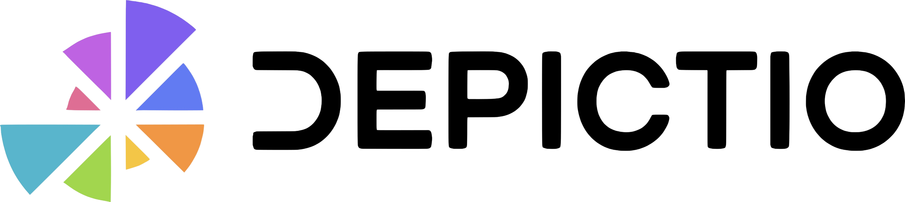

# 🎉 Depictio 1.0: from prototype to production

Depictio went live last year, and it worked. People built real dashboards with
it and shared them. It was also slow: past a few tens of thousands of rows it
went from sluggish to unusable, and there were enough rough edges that using it
meant working around them.

The idea never changed: point Depictio at the outputs of a pipeline, tell it how
those datasets relate, and get a dashboard where filtering one thing filters
everything. What changed is that it now does that at the scale your pipelines
actually produce, and at speed.

That is what 1.0 means here. Not "feature complete", which no tool ever is, but
fast, stable enough to leave running, and settled enough that building on top of
it is a reasonable thing to do. Here is what changed.

  <iframe
    src="https://player.vimeo.com/video/1194664914?h=4155d79379&amp;badge=0&amp;autopause=0&amp;player_id=0&amp;app_id=58479&amp;autoplay=1&amp;loop=1&amp;muted=1"
    frameborder="0"
    allow="autoplay; fullscreen; picture-in-picture; clipboard-write; encrypted-media; web-share"
    referrerpolicy="strict-origin-when-cross-origin"
    style="position: absolute; top: 0; left: 0; width: 100%; height: 100%"
    title="Depictio, from project to dashboard"
  ></iframe>
  

  
🎬 Depictio end to end: a project, its data collections, and the dashboard built on top.

<!-- more -->

## ✅ What stopped moving

The practical meaning of 1.0 is that the data model, the API and the viewer are
now stable. Projects you ingest today keep working. Dashboards you build today
keep opening. Code you write against the API does not need rewriting at the next
release.

That matters more than it sounds. A dashboard is something you set up once and
then come back to months later with new samples, often after the person who
built it has moved on. That only works if the thing underneath holds still, and
until now it did not.

## ⚛️ The front end is now React

The biggest structural change since launch is one you feel more than you see. The
entire front end was rebuilt in React and TypeScript, and the old Dash codebase
is gone. Importantly, the interface looks the same: Dash is itself built on top
of React, and Depictio's UI was made of Dash Mantine Components, so moving to
React with Mantine directly let us keep the exact same visual identity while
gaining full control over it.

The bigger win is under the hood. Depictio used to run two servers side by side,
FastAPI for the API and a Flask server under Dash for the interface. Now there's
a single FastAPI backend with a cleanly decoupled React frontend talking to it.
One server instead of two, a real separation between front and back, and as a
nice bonus the automatic dashboard screenshots came out roughly twice as fast on
the new stack.

| | |
|:--:|:--:|
|  |  |
| **Dashboards.** Saved objects with a live thumbnail, an owner and a visibility setting. | **Projects.** Data collections, the links between them, and the template a project came from. |
|  |  |
| **ampliseq &middot; community.** A taxonomic sunburst, drillable from Kingdom down to Class. | **viralrecon &middot; QC.** MultiQC rendered inside the dashboard, not linked as a separate report. |

*The two landing pages, and tabs from the [nf-core/ampliseq](https://depictio.github.io/depictio-docs/latest/pipeline-templates/nf-core/ampliseq/) and [nf-core/viralrecon](https://depictio.github.io/depictio-docs/latest/pipeline-templates/nf-core/viralrecon/) template dashboards, built from real pipeline output. Click any screenshot to open it full size.*

That rebuild is also what made the next two parts possible: with the rendering
path under our own control, we could make the whole dashboard react as one, and
then make it fast.

## 🔗 Everything filters everything

This is still what Depictio is for. Not a grid of charts that happen to sit on
the same page, but a set of datasets that know about each other, where narrowing
one narrows all of them.

A project holds several data collections, and you declare how they relate: which
column in the sample sheet corresponds to which column in the feature matrix,
which sample names in a MultiQC report map back to which samples. Nothing is
merged on disk: the link is resolved at query time, which is what lets a sample
sheet filter a MultiQC report or an image gallery, not just another table.

Those links resolve in both directions, so it does not matter where a filter
starts. Pick a condition on the 500-row sample sheet and the twelve-million-row
feature table narrows to match. Pick a set of features and the sample sheet
narrows the other way. Names rarely line up exactly across tools, so links can
resolve by direct match, by pattern (`{sample}.bam`), by regex, by wildcard, or
through an explicit mapping for the one-to-many case where `S1` means both
`S1_R1` and `S1_R2` in a MultiQC report.

The left panel is the obvious way to drive that: dropdowns and multi-selects for
categories, sliders and range sliders for numbers, date ranges, switches,
segmented controls, all built from the actual column type.

  <iframe
    src="https://player.vimeo.com/video/1213942946?badge=0&amp;autopause=0&amp;player_id=0&amp;app_id=58479&amp;autoplay=1&amp;loop=1&amp;muted=1"
    frameborder="0"
    allow="autoplay; fullscreen; picture-in-picture; clipboard-write; encrypted-media; web-share"
    referrerpolicy="strict-origin-when-cross-origin"
    style="position: absolute; top: 0; left: 0; width: 100%; height: 100%"
    title="Filtering a Depictio dashboard, with every component following along"
  ></iframe>
  

  
🎬 One filter, every linked component following it.

But the more useful interaction is often the one where the *plot* is the filter:

- **Box-select or lasso points on a scatter plot** and every other component on
  the dashboard reduces to those points.
- **Select rows in a table** and the same thing happens from the table.
- **Select markers or a region on a map** and the dashboard follows the geography.

Those selections behave like any other filter and compose with the panel rather
than fighting it, so you can drop the range slider to a window, lasso a cluster
inside it, and read the cards for exactly that subset. Each selection is tagged
by where it came from, so you can clear the chart selections and keep the panel
filters, or the reverse.

## ⚡ A serious step forward in performance

This is the one that had to be solved. Depictio was usable on demo files and
painful on real ones, and that is the gap between a tool people try and a tool
people keep. It is also the least visible thing in a screenshot, so here it is in
motion instead.

  <iframe
    src="https://player.vimeo.com/video/1213726629?badge=0&amp;autopause=0&amp;player_id=0&amp;app_id=58479&amp;autoplay=1&amp;loop=1&amp;muted=1"
    frameborder="0"
    allow="autoplay; fullscreen; picture-in-picture; clipboard-write; encrypted-media; web-share"
    referrerpolicy="strict-origin-when-cross-origin"
    style="position: absolute; top: 0; left: 0; width: 100%; height: 100%"
    title="Opening a Depictio dashboard with the full range of components"
  ></iframe>
  

  
🎬 A dashboard using the full range of components, over three linked collections, captured in the browser.

Depictio takes several kinds of data collection, and each one gets the treatment
that suits it. Tabular data, whether you hand it over as CSV, TSV, Parquet,
Feather or Excel, is normalised into Delta tables at ingest, and that is what
figures, cards, tables and the advanced visualisations read from: they pull only
the columns they actually need, backed by a schema cache, so a chart doesn't drag
the whole table across just to draw a few series. Charts are now built in Polars
from end to end, with no conversion step in the middle, and a plot only ever
receives as many points as it can actually show. The slowest jobs are handed to
background workers, so the interface stays responsive while they run.

The rest stay in their own formats, because converting them would lose the point.
MultiQC reports are read as MultiQC, and since they can get large they get
filter-aware caching and prewarming so they don't recompute from scratch every
time you touch a filter. Images are served from object storage, GeoJSON feeds map
boundaries, and Newick or Nexus trees go straight to the phylogeny renderer.

Some numbers, so those aren't just adjectives. On a dataset of **12 million rows**
across three linked collections (1 GB raw, 1.4 GB as Delta), running on a laptop
with a **single API worker in dev mode**, a dashboard puts its first component on
screen in **133 to 270 ms** whether it holds 4 components or 30. A sixteen-component
dashboard (thirty fetches, counting the filter panel) has its first chart up at
**190 ms** and everything drawn in **3.3 s** cold, 3.1 s warm.

The number that matters most, given the section above, is what a filter costs.
The dashboard starts responding in **around 100 to 200 ms** and is fully caught
up in **1.7 s** at four components, 2.0 s at eight and 4.1 s at sixteen, with all
three collections re-filtered. And the bidirectional linking holds up under
measurement: a filter starting on the twelve-million-row feature matrix costs
about the same as one starting on the 500-row sample sheet (2.0 s against 2.4 s
median), because both resolve to a few hundred sample ids in **25 ms** before any
data is touched. Per component, the median render is **11 ms** for a filter
widget, **222 ms** for a table and **822 ms** for a volcano plot reading several
million rows off the feature matrix.

  <iframe
    src="https://player.vimeo.com/video/1213726492?badge=0&amp;autopause=0&amp;player_id=0&amp;app_id=58479&amp;autoplay=1&amp;loop=1&amp;muted=1"
    frameborder="0"
    allow="autoplay; fullscreen; picture-in-picture; clipboard-write; encrypted-media; web-share"
    referrerpolicy="strict-origin-when-cross-origin"
    style="position: absolute; top: 0; left: 0; width: 100%; height: 100%"
    title="Filtering a MultiQC report embedded in a Depictio dashboard"
  ></iframe>
  

  
🎬 A MultiQC report inside a dashboard, re-rendering as filters change, with caching and prewarming behind it.

The part I like best: box plots, histograms and bar charts are computed as an
aggregation directly over the stored files, so they materialise **zero rows** —
exact, not sampled. That's half the figure renders in the run (114 of 225).
Across the whole run, the largest data frame ever held in memory was **1.6 MB**,
with a median of 439 KB.

And one thing worth stressing about those numbers: they are a floor, not a
ceiling. That run is a single laptop with **one API worker in dev mode**, with
the auto-reloader attached. A real deployment runs several workers on server
hardware, so it should comfortably beat everything above.

Very dense dashboards, several dozen components all refreshing at once, can still
back up behind the render queue, and that is where the next round of work goes.
The full report, with the methodology and the numbers that didn't flatter us,
comes with the follow-up post.

## 🧬 Visualisations built for biology

Depictio now ships a catalog of advanced visualisations aimed squarely at omics
work: volcano plots, clustered heatmaps, embeddings (PCA, UMAP, t-SNE, PCoA),
Manhattan plots, oncoplots, taxonomy bars, and more. Each one is a self-contained
panel that comes with its own controls, so a volcano arrives with movable
thresholds and a Manhattan knows how to order chromosomes.

| | |
|:--:|:--:|
|  |  |
| **Volcano + DA barplot** &middot; ampliseq | **PCoA + clustered heatmap** &middot; ampliseq |
|  |  |
| **Phylogenetic tree** &middot; ampliseq | **Coverage track + amplicon heatmap** &middot; viralrecon |

*Four tabs from the two template dashboards, click any of them to open it full size. The volcano and DA barplot are driven by the same contrast filter; the PCoA, distance matrix and taxonomy heatmap are three views of one structure; the tree comes straight from Newick; the coverage track carries a SARS-CoV-2 gene axis under it. The catalog has eighteen visualisation types in total. [Browse them in the docs.](https://depictio.github.io/depictio-docs/latest/features/components/#advanced-visualizations)*

Those controls are additional, not a replacement. Everything from the section
above still applies: panel filters and selections made on other components narrow
what these plots draw, like any other component. On top of that, each advanced
visualisation exposes its own parameters for how that data gets drawn:
normalisation and clustering method on the heatmap, significance and effect-size
cutoffs on the volcano, layout and colouring on the tree. You filter down to the
samples you care about, then tune the plot itself without leaving the dashboard.

The heavier steps, dimensionality reduction and clustering, run in the background
with caching, so you can compute an embedding and then explore it without the
page locking up. There's a lot more to say about how these plots connect to
pipelines and to a community-extensible tool catalog, but that deserves its own
post, so I'll come back to it.

## 🚀 Ready to deploy for real

Production-readiness is also about the parts nobody tweets about. Depictio's
services are built to scale independently: an API replica runs with four FastAPI
workers to handle concurrent requests, a separate pool of Celery workers absorbs
the heavy jobs (ingestion, clustering, rendering) so they never block the
interface, and the stateless viewer and API can be scaled out to several replicas
under load. On Kubernetes, MongoDB can now run as a three-node replica set for high
availability via the Percona operator. Splitting the work this way is exactly
what keeps the UI responsive while big data is being crunched behind it.

There's permission-based authentication and dedicated ingress paths for the
backend and object storage, and dashboards now carry an ingestion report and a
health banner, so when something goes wrong during a scan you can actually see it
instead of guessing. These are the boring, essential things that separate a demo
from something a department can run without babysitting.

And it's still self-hosted and open-source, the way it started. Your data stays
on your infrastructure, there's no vendor account and no per-seat bill, and you
can read every line if you want to.

## 📊 Where Depictio is today

1.0 is also a good moment to look up from the code for a second. Depictio has
been in the making for about three years, it's MIT-licensed, and it is running in
production in two places.

At **EMBL**, where it started, it serves dashboards for groups across the
institute. And at **SciLifeLab**, Depictio is available on
[SciLifeLab Serve](https://serve.scilifelab.se/), the Swedish national platform
for hosting research applications: any life-science researcher at a Swedish
university can spin up their own Depictio instance there for free, no
infrastructure and no sysadmin required. That is the deployment story I care most
about, because it takes "self-hosted" and removes the part where you have to host
it yourself. If you want to see it end to end, I presented exactly that workflow,
building a dashboard privately and then publishing it to a public URL on Serve,
in a [SciLifeLab webinar](https://www.scilifelab.se/event/depictio_dashboards/)
as part of their Tools for AI/ML research in life sciences series.

As far as I'm aware, Depictio is also being trialled at **GHGA** (the German
Human Genome Phenome Archive), **MGnify** at EMBL-EBI, and **ISCIII** in Spain.

## 🗺️ What's next

A stable foundation is the point, not the finish line, and the next post is
already taking shape. It's about the two pieces I deliberately kept out of this
one: Depictio's dashboard **templates** and its bioinformatics **tools catalog**.

A **template** is a ready-made dashboard for a known pipeline, curated by the
community and by the pipeline developers themselves, who know better than anyone
what their output deserves to look like. Instead of rebuilding a dashboard from
scratch every time, you pick the template that matches your pipeline, point
Depictio at your results, and it assembles the dashboard for you. Run the same
pipeline next week on new samples, and it's the same template with new data: a
populated, interactive dashboard in minutes. That fits **nf-core** pipelines
especially well, where the outputs are already standardised across every run of
the same workflow.

The **tools catalog** is the library that makes both dashboards and templates
easier to build. For each bioinformatics tool, it records what the tool's output
looks like and which visualisation renders it best, so a differential-expression
table knows it should become a volcano plot, and a taxonomy table knows it should
become a stacked bar. Think of it as extending what MultiQC does for QC into the
downstream analysis, where the results actually get interpreted. A template is
really just an assembly of catalog entries. And the catalog is built to be
community-extensible: adding a new tool is a small config contribution, not a
code change, and it will be possible through a web interface rather than a pull
request. This will be the subject of the next post, and it is already in progress.

Put together, that's how Depictio goes from "a dashboard builder" to "the
dashboard your pipeline should have shipped with." That's the next story, along
with the full performance report behind the numbers above. More soon.

## 🚀 Try it

- **Live demo:** [demo.depictio.embl.org](https://demo.depictio.embl.org/dashboards), explore the pre-loaded datasets, or upload your own.
- **Docs:** start with [Your first dashboard in 15 minutes](https://depictio.github.io/depictio-docs/latest/).
- **GitHub:** [depictio/depictio](https://github.com/depictio/depictio), star the repo, open an issue, tell me what breaks.
- **Webinar:** [watch the recording](https://www.youtube.com/watch?v=KWWHo4esUfg) of the SciLifeLab session, a full walkthrough from project to public URL.

