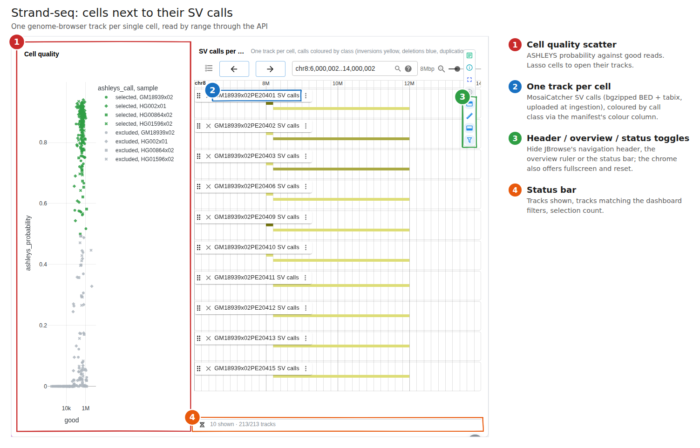
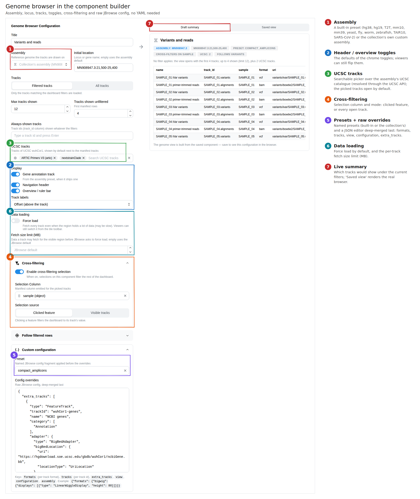
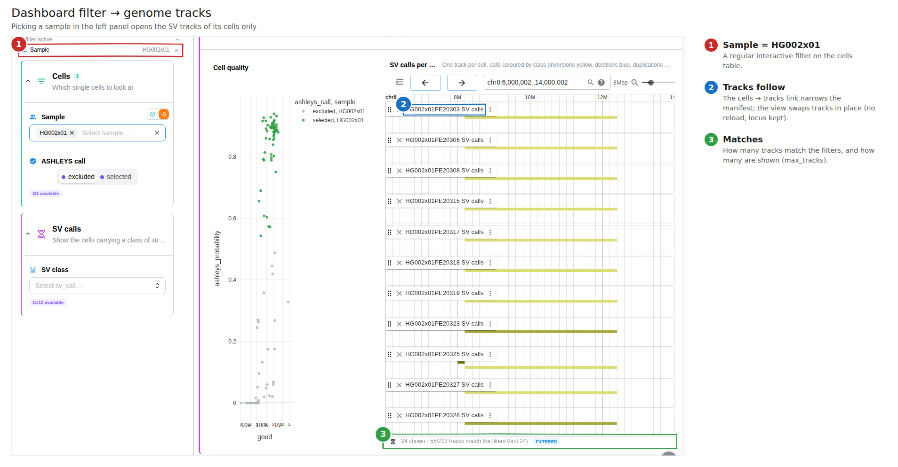
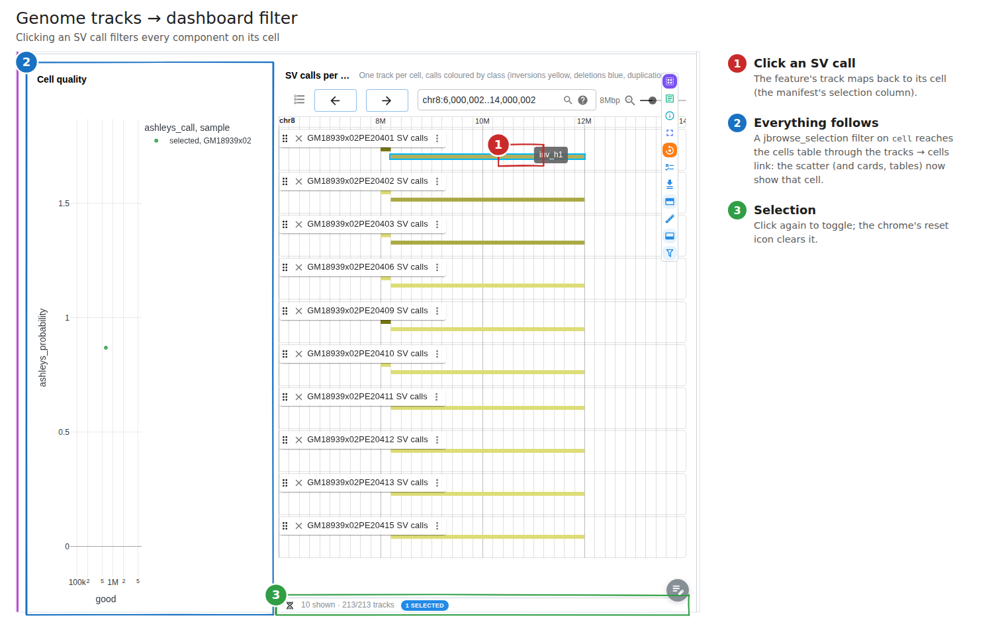
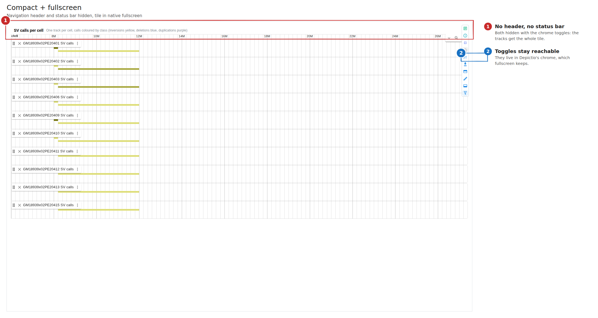
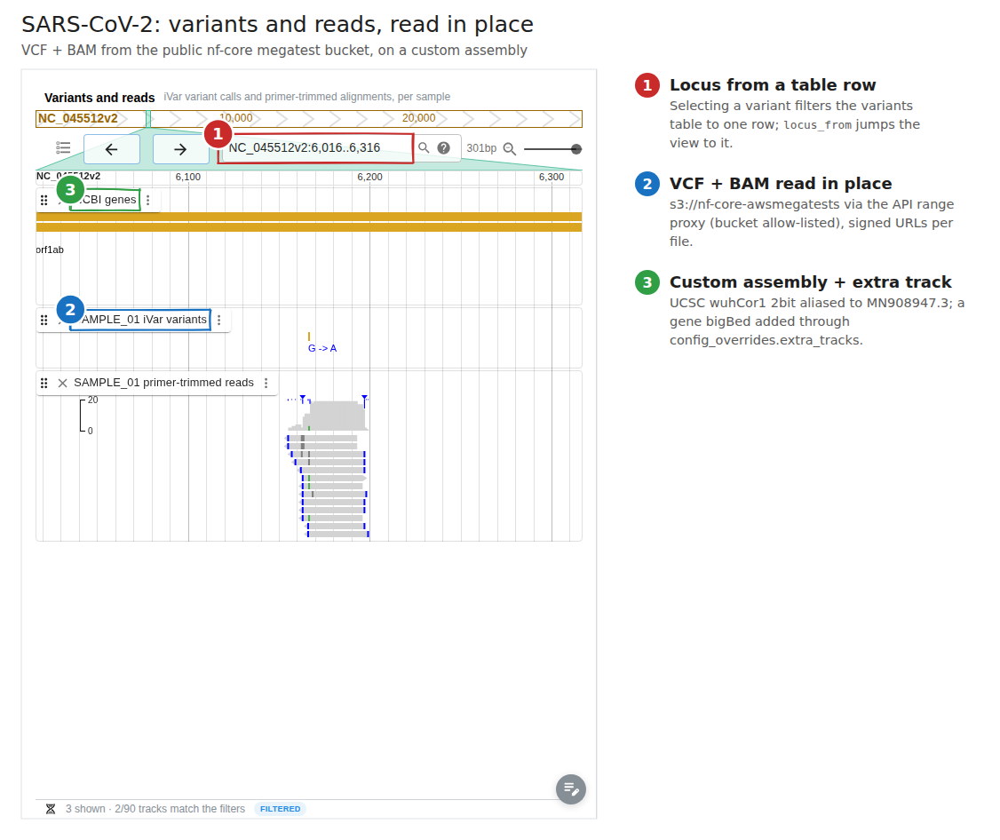
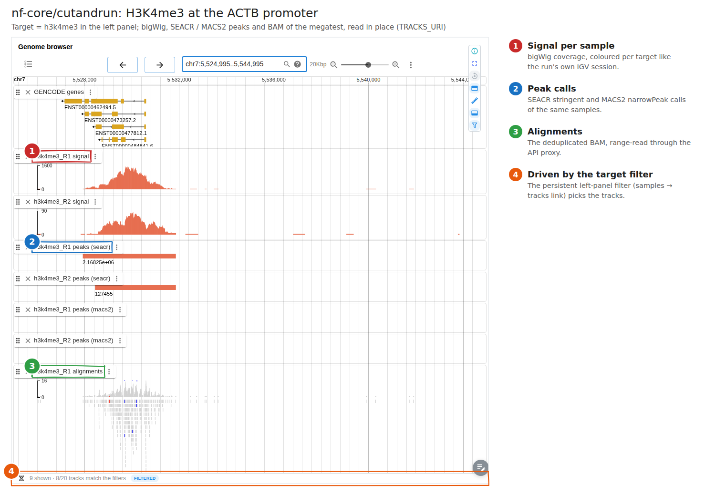
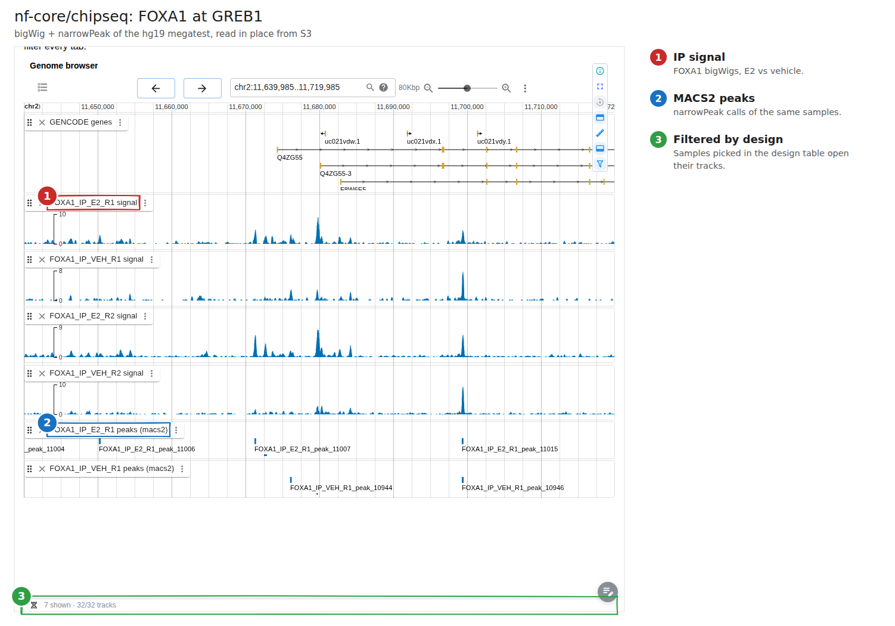
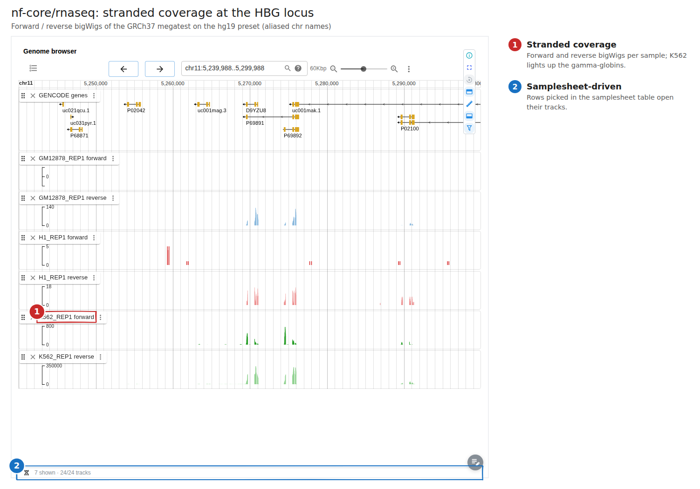

# Genome tracks: the `jbrowse` component and `genomic_tracks` collections

Depictio draws genome tracks with an embedded JBrowse 2 linear genome view,
driven by the dashboard filters like the image gallery is: filter a sample,
select rows or lasso points in a scatter and the browser shows the matching
tracks; click a feature (or change which tracks are open) and the rest of the
dashboard filters on that track's sample.

It replaces the 0.13.x Dash port (an iframe to a separately deployed JBrowse on
`localhost:3000` fed by a session "watcher" on `:9010`), which no deployment
shipped anymore. Nothing else has to run: the browser is a lazy chunk of the
SPA and the track bytes come through the API.



## Architecture

```
 manifest (TSV/CSV/…) ──CLI──► Delta table  ─┐
 track files ──────────CLI──► S3 genomic_tracks/<dc_id>/…   (local files)
 remote s3:// | https:// ──────────────────── (read in place, allow-listed)
                                              │
 viewer ── POST /dashboards/render_jbrowse/{dash}/{component} {filters}
          │   filters extended over DC links → manifest rows → track configs
          │   file locations = signed proxy URLs (HMAC, 6 h)
          ▼
  @jbrowse/react-linear-genome-view2 (lazy chunk, main-thread RPC)
          │  Range GET / HEAD
          ▼
 GET|HEAD /jbrowse/tracks/{dc_id}/{track_key}/{data|index}
 GET|HEAD /jbrowse/assembly/{dc_id}/{role}        custom assembly files
 GET|HEAD /jbrowse/preset/{name}/{role}           built-in assembly files (UCSC)
          │  remote_read: Depictio S3 | allow-listed S3 bucket | allow-listed https host
```

| Piece | Where |
| --- | --- |
| DC model | `depictio/models/models/data_collections_types/genomic_tracks.py` |
| Component model | `JBrowseLiteComponent` in `depictio/models/components/lite.py` |
| Settings | `JBrowseConfig` in `depictio/api/v1/configs/settings_models.py` (`DEPICTIO_JBROWSE_*`) |
| Range reads | `depictio/api/v1/services/remote_read.py` |
| Assemblies, signing, manifest, config builder, render | `depictio/api/v1/services/jbrowse/` |
| Proxy endpoints | `depictio/api/v1/endpoints/jbrowse_endpoints/routes.py` |
| Render endpoint | `render_jbrowse_endpoint` in `dashboards_endpoints/routes.py` |
| CLI upload | `depictio/cli/cli/utils/genomic_tracks_ingest.py` |
| Renderer | `packages/depictio-react-core/src/components/JBrowseRenderer.tsx` (+ `jbrowse/trackSync.ts`) |
| Builder | `depictio/viewer/src/builder/jbrowse/` |

The same code runs in `depictio local up` (no Docker, single origin), Compose
and Kubernetes: there is no extra service, port, volume or CORS origin.

## The `genomic_tracks` data collection

A table of track files: one row per track. It is ingested like a table DC (so
it can be shown in a table, filtered, linked) and the files it names are either
uploaded or read in place.

```yaml
- data_collection_tag: tracks
  config:
    type: genomic_tracks
    metatype: Metadata
    scan: {mode: single, scan_parameters: {filename: tracks.tsv}}
    dc_specific_properties:
      format: TSV
      polars_kwargs: {separator: "\t"}
      uri_column: uri
      track_id_column: track_id
      sample_column: sample
      format_column: format
      name_column: name
      color_column: color
      category_column: category
      order_column: order
      assembly: hg38
      # Read relative rows in place (else: uploaded from the data location)
      remote_base_uri: s3://nf-core-awsmegatests/chipseq/results-…/
      display_defaults:
        bigwig:
          displays: [{type: LinearWiggleDisplay, height: 60}]
      presets:
        tall_signal:
          formats: {bigwig: {displays: [{type: LinearWiggleDisplay, height: 120}]}}
```

| Key | Default | Meaning |
| --- | --- | --- |
| `uri_column` | `uri` | Relative path, `s3://…` or `https://…` |
| `track_id_column` | – | Stable id (else a hash of the uri) |
| `sample_column` | – | Column tracks are filtered and emitted on |
| `format_column` / `default_format` | `format` / – | Track format, else inferred from the extension |
| `index_column` | `index_uri` | Index; `.tbi` / `.csi` / `.bai` / `.crai` / `.fai` / `.gzi` inferred otherwise |
| `name_column`, `color_column`, `category_column` | – | Label, colour, track-selector folder |
| `order_column` | – | Row order the browser opens with (ingestion clusters rows by link columns, so order must be explicit) |
| `assembly` | `hg38` | Preset name/alias or a custom assembly (below) |
| `remote_base_uri` | – | `s3://` or `https://` folder relative rows are read under |
| `direct_access` | `false` | Browser fetches `https://` tracks itself (host must send CORS) |
| `display_defaults` | `{}` | Track config merged into every track of a format |
| `presets` | `{}` | Named fragments a component can pick (`formats`, `view`, `configuration`, `location`) |

**Formats:** `bigwig`, `bedgraph` (tabix), `bed` / `bed.gz`, `bigbed`,
`narrowpeak`, `broadpeak`, `vcf`, `bam`, `cram`, `gff3`, `gtf`, `hic`, `fasta`.
Tabix formats need a `.tbi`/`.csi`; BAM/CRAM need `.bai`/`.crai`; small plain
BED/narrowPeak files are read whole (capped by `max_full_read_mb`).

**Custom assembly:**

```yaml
assembly:
  name: MN908947.3
  display_name: SARS-CoV-2 Wuhan-Hu-1
  aliases: [wuhCor1, NC_045512.2]
  twobit_uri: https://hgdownload.soe.ucsc.edu/goldenPath/wuhCor1/bigZips/wuhCor1.2bit
  # or fasta_uri + fai_uri (+ gzi_uri for bgzipped FASTA)
  chrom_sizes_uri: https://hgdownload.soe.ucsc.edu/goldenPath/wuhCor1/bigZips/wuhCor1.chrom.sizes
  refname_aliases_uri: https://hgdownload.soe.ucsc.edu/goldenPath/wuhCor1/bigZips/wuhCor1.chromAlias.txt
```

**Assembly presets** (UCSC 2bit + chrom.sizes + chromAlias, with a gene track):
`hg38`, `hg19`, `hs1` (T2T-CHM13v2.0), `mm10`, `mm39`, `wuhCor1` (SARS-CoV-2),
`sacCer3`, `dm6`, `ce11`, `danRer11`, `TAIR10` (GenArk). Aliases such as
`GRCh38`, `GRCh37`, `T2T-CHM13v2.0`, `GRCm39` resolve to them.
`GET /depictio/api/v1/jbrowse/assemblies` lists them.

### Ingestion

`depictio run` / `depictio data sync` write the manifest as a Delta table, then:

- relative rows found under the data location are uploaded with their index to
  `s3://<bucket>/genomic_tracks/<dc_id>/…` (removed with the DC / project);
- with `remote_base_uri`, or for rows that are already `s3://` / `https://`,
  nothing is copied: the files are read in place.

Recipes get a second `context` argument (`RecipeContext`: `data_dir`,
`properties`, `reads_in_place`, `exists()`, `glob()`), which lets a template
recipe spell out every expected track when the files are read in place and keep
only the present ones when they are uploaded.

## The `jbrowse` component

```yaml
- component_type: jbrowse
  workflow_tag: rnaseq
  data_collection_tag: tracks
  title: Genome browser
  location: chr11:5,240,000-5,300,000   # else the assembly default
  track_mode: filtered        # or `all`: every track, filters ignored
  max_tracks: 16              # cap on tracks shown under a filter
  initial_tracks: 6           # tracks shown when nothing is filtered
  default_tracks: []          # track ids always shown
  show_annotation: true       # the preset's gene track
  selection_enabled: true     # emit a filter back to the dashboard
  selection_column: sample    # default: the DC's sample_column
  selection_mode: feature_click   # or visible_tracks
  show_header: true           # JBrowse navigation header
  show_overview: true         # overview / ruler bar
  track_labels: offset        # offset | overlapping | hidden
  locus_from:                 # navigate to the filtered rows of another DC
    data_collection_tag: variants
    chrom_column: CHROM
    start_column: POS
    end_column: END
    padding: 150
    max_rows: 3
  preset: signal              # built-in (sv-calls, signal, compact, peaks) or the DC's own
  config_overrides:           # raw JBrowse config, merged last
    formats: {bam: {displays: [{type: LinearAlignmentsDisplay, height: 80}]}}
    tracks: {<trackId>: {name: …}}
    extra_tracks: [{type: FeatureTrack, trackId: …, adapter: …}]
    assembly: {…}
    view: {…}
    configuration: {…}
```

**Merge order** for a track: format base config → preset `formats` → DC
`display_defaults` → component `config_overrides.formats` → `config_overrides.tracks[trackId]`.
Display lists are merged by display `type`, so an override can change a height
without restating the display.

**Cross-filtering** works like the image gallery:

- *dashboard → browser*: the render endpoint extends the filters over DC links
  (`_resolve_link_filters_cached`, same path as `render_image_paths`) and
  applies them to the manifest. Only changed tracks are shown/hidden
  (`showTrack` / `hideTrack`), the view is never rebuilt, so the locus is kept.
- *browser → dashboard*: a feature click (or the open-track set in
  `visible_tracks` mode) emits a `jbrowse_selection` filter on
  `selection_column` with `metadata.dc_id` = the tracks DC. Links from the
  tracks DC propagate it. The component drops its own filter before fetching,
  so selecting does not hide the other tracks.
- `locus_from` jumps to the coordinates of the filtered rows of another DC
  (e.g. a picked variant).

**Chrome:** the header toolbar carries toggles for the JBrowse header, the
overview bar, the status line and click-to-filter (defaults from the YAML,
remembered per viewer), plus reset, metadata and fullscreen. JBrowse menus and
dialogs portal into the fullscreen element, so they keep working there.

**Builder:** the component builder has a *Genome browser* type with the
assembly, locus, tracks, display toggles, cross-filtering, "follow filtered
rows", preset and a JSON override editor, plus a live summary of the tracks the
current filters would show.



## Security model

- The browser never receives a storage URL or credentials. Render returns
  **signed proxy URLs**: HMAC over `scope/dc_id/item/role/user/exp`, keyed from
  the internal API key, valid `url_ttl_s` (6 h). The proxy also accepts a bearer
  token, and always re-checks read access on the DC's project.
- Clients send **ids, never URLs**: the proxy looks the file up in the DC's
  manifest (`track_key` = sha1 of the row), so there is no client-driven SSRF.
- Remote reads go only to **allow-listed** https hosts and s3 buckets
  (`DEPICTIO_JBROWSE_REMOTE_HTTPS_HOSTS` / `_S3_BUCKETS`); `http://` is refused;
  redirects are not followed; one Range is served per request (206, end
  clamped; several ranges or a start past the end → 416); ranges are capped at
  `max_range_mb`, full reads at `max_full_read_mb`.
- Depictio's own bucket is only readable inside the DC's
  `genomic_tracks/<dc_id>/` prefix: a `remote_base_uri` or `s3_base_folder`
  pointing elsewhere in it is refused (403).
- Remote S3 is read anonymously unless `DEPICTIO_JBROWSE_REMOTE_S3_ACCESS_KEY` /
  `_SECRET_KEY` are set (Helm: `secrets.jbrowseRemoteS3SecretKey`).
- The built-in assemblies' UCSC files go through `/jbrowse/preset/…`, which
  only fetches the hardcoded preset URLs (public, cached when ≤ 2 MB).
  `DEPICTIO_JBROWSE_PRESET_ACCESS=direct` lets the browser fetch UCSC itself.
- CSP (API and nginx agree): `connect-src` adds `data:` and
  `https://hgdownload.soe.ucsc.edu`; `worker-src 'self' blob:`.

### Settings

| Variable | Default |
| --- | --- |
| `DEPICTIO_JBROWSE_ENABLED` | `true` |
| `DEPICTIO_JBROWSE_REMOTE_HTTPS_HOSTS` | `nf-core-awsmegatests.s3-eu-west-1.amazonaws.com` |
| `DEPICTIO_JBROWSE_REMOTE_S3_BUCKETS` | `nf-core-awsmegatests` |
| `DEPICTIO_JBROWSE_REMOTE_S3_ENDPOINT_URL` / `_REGION` | AWS / `eu-west-1` |
| `DEPICTIO_JBROWSE_REMOTE_S3_ACCESS_KEY` / `_SECRET_KEY` | unset (anonymous) |
| `DEPICTIO_JBROWSE_PRESET_ACCESS` | `proxy` |
| `DEPICTIO_JBROWSE_REMOTE_TIMEOUT_S` | `30` |
| `DEPICTIO_JBROWSE_MAX_RANGE_MB` / `_MAX_FULL_READ_MB` | `64` / `256` |
| `DEPICTIO_JBROWSE_URL_TTL_S` | `21600` |

Wired in `docker-compose*.yaml`, the Helm configmap (any `DEPICTIO_JBROWSE_*`
key of `backend.env`), `.env.example` and `depictio local up`.

## Examples

1. **Strand-seq single-cell SVs** (`Genome Tracks Showcase` project, hg38,
   files uploaded). 4 HGSVC samples and 384 cells with their ASHLEYS call;
   213 MosaiCatcher SV BEDs coloured by call class. Lasso cells in the scatter →
   their SV tracks; click an SV → the cell is picked everywhere.
   
   
   
2. **SARS-CoV-2 amplicons** (same project, custom `MN908947.3` assembly, read
   in place from the viralrecon megatest). iVar VCFs + primer-trimmed BAMs,
   `locus_from` jumps to the picked variant, a custom `compact_amplicons`
   preset and an extra UCSC gene track from `config_overrides`.
   
3. **nf-core/cutandrun 3.1** — *Genome tracks* tab: bigWig per sample coloured
   per target, SEACR and MACS2 peaks, deduplicated BAM, driven by the target
   filter. 
4. **nf-core/chipseq 1.2.0** — ChIP and input bigWigs, MACS2 narrowPeak calls
   and BAM per antibody (hg19 megatest). 
5. **nf-core/rnaseq 3.26.0** — strand-specific bigWig coverage and BAM per
   sample (hg19 megatest). 

The nf-core templates read the tracks in place when `TRACKS_URI` is set
(`depictio run --var TRACKS_URI=s3://…/results/`; the template turns it into
`remote_base_uri`), and upload the files found in the results folder otherwise.

## Which templates benefit

| Lot | Template | Tracks it publishes | Fit |
| --- | --- | --- | --- |
| 1 | cutandrun | bigWig, SEACR/MACS2 peaks, BAM | **High — shipped** |
| 1 | chipseq | bigWig (ChIP + input), MACS2 peaks, BAM | **High — shipped** |
| 1 | rnaseq | bigWig (±strand), BAM | **High — shipped** |
| 1 | atacseq | bigWig, MACS2 peaks, consensus peaks, BAM | High — same recipe as chipseq, next |
| 1 | rnafusion | fusion BEDPE / Arriba PDFs, BAM | Low — fusions need an arc/breakpoint view |
| 1 | differentialabundance, funcscan, airrflow, taxprofiler, ampliseq | tables, no coordinates | None |
| 1 | viralrecon | VCF, BAM (MN908947.3) | High — shown in the showcase project |
| 1 | variantbenchmarking | truth/query VCFs | Medium — VCF pairs on hg38 |
| 2 (#1102) | sarek | VCF (per caller), CRAM | High — VCF + CRAM on GRCh38 |
| 2 | nanoseq | bigWig, bigBed, BAM | High |
| 2 | methylseq | bedGraph / coverage | Medium — needs bgzip + tabix of the bedGraphs |
| 2 | hic | `.hic`, cool | Low — `.hic` only, a HiC display rather than tracks |
| 2 | eager, scrnaseq, mag | BAM / count matrices | Low / none |

## Reuse from BelSVedere

`weber8thomas/BelSVedere` (a JBrowse 2 SV browser) provided: the adapter
builder per format, the assembly block (2bit + `RefNameAliasAdapter` +
aliases), the UCSC 2bit/chrom.sizes URLs (its own T2T sizes were wrong, UCSC's
are used), the JEXL `itemRgb` colour callback for SV BEDs, the "force load"
display limits, the diff-based sample → track sync with a cap, and the Range
lessons (clamp the end, strip conditional headers, expose `Content-Range`).

## Known limits and follow-ups

- JBrowse web workers are off (`makeWorkerInstance` is broken in 4.3.0): RPC
  runs on the main thread, fine for tens of tracks.
- The JBrowse chunk is ~1.4 MB (lazy; only loaded by a dashboard with a browser).
- One Range per request; BAM/CRAM streaming loads the API process (capped).
- Unindexed large BED/bedGraph files are refused; bgzip + tabix them.
- atacseq, sarek and nanoseq tabs are not written yet; `remote_read` can be
  merged with the manifest-scan reader of #1120 / #965 later.
