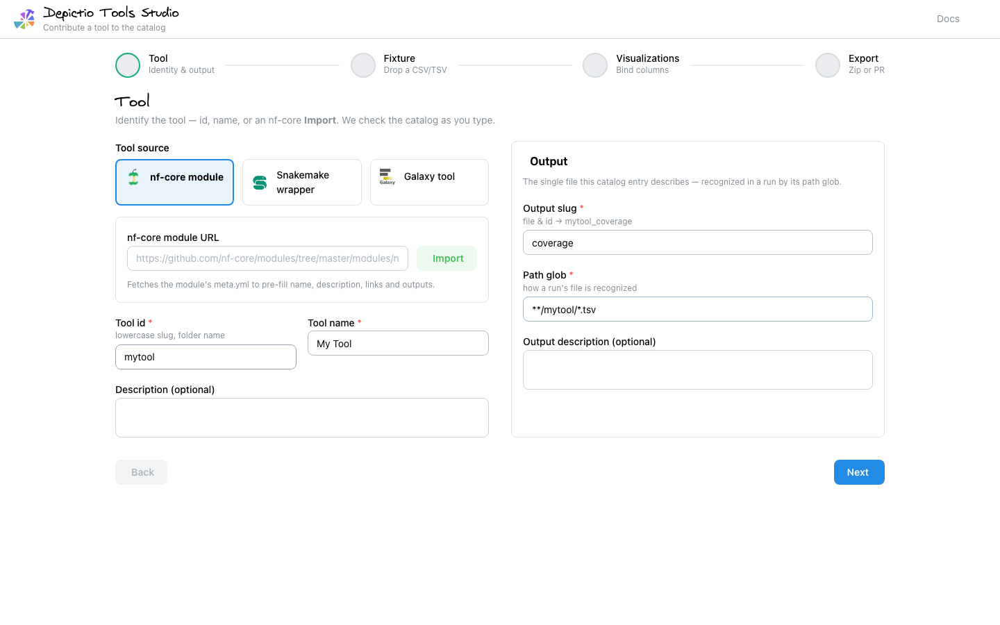
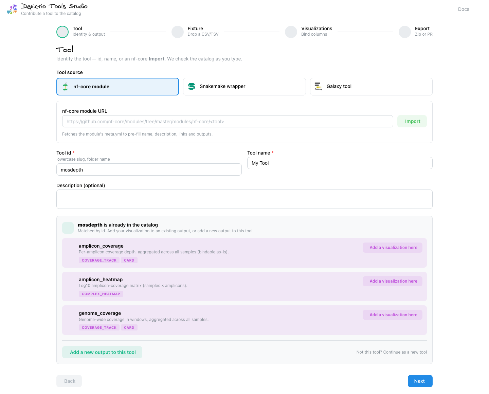
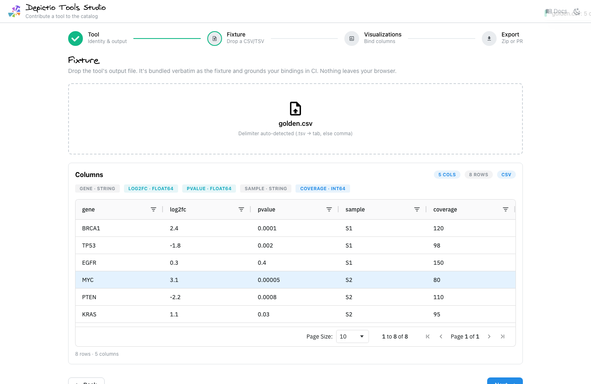
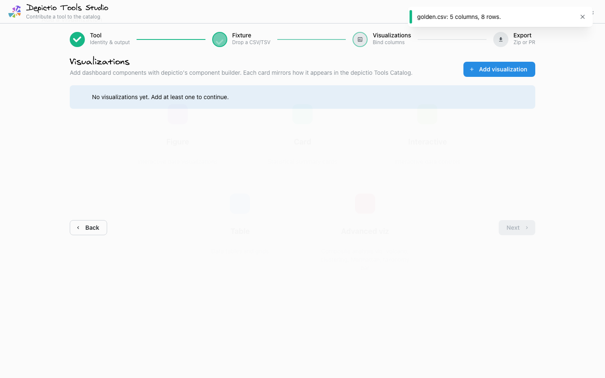
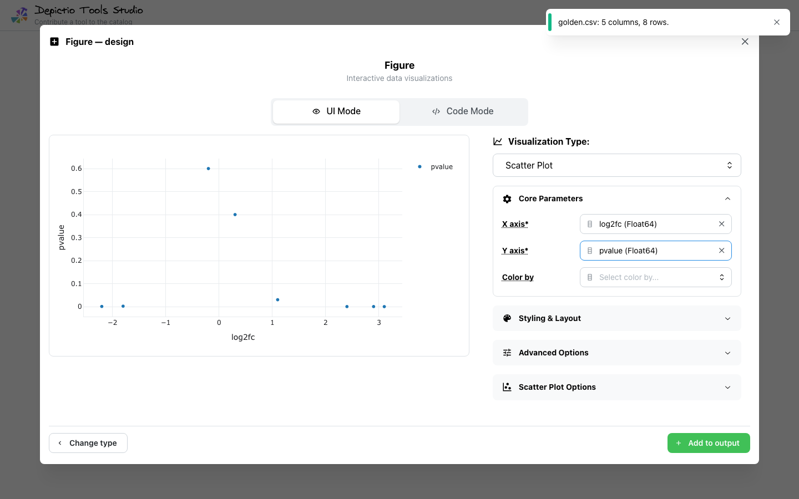
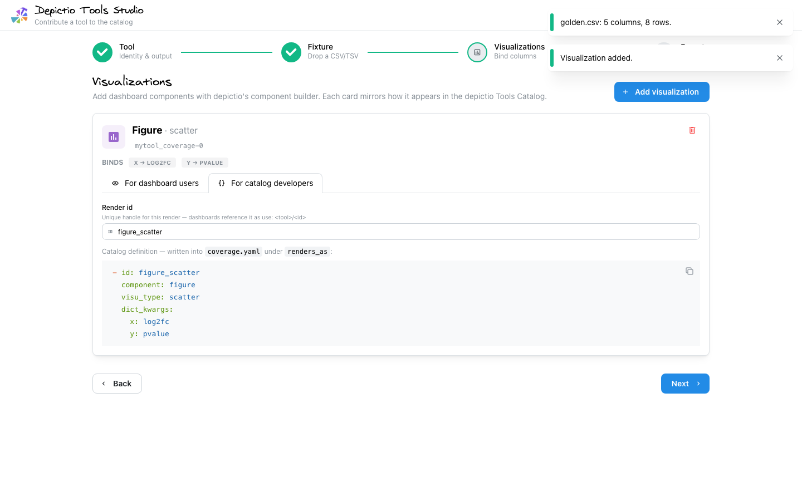
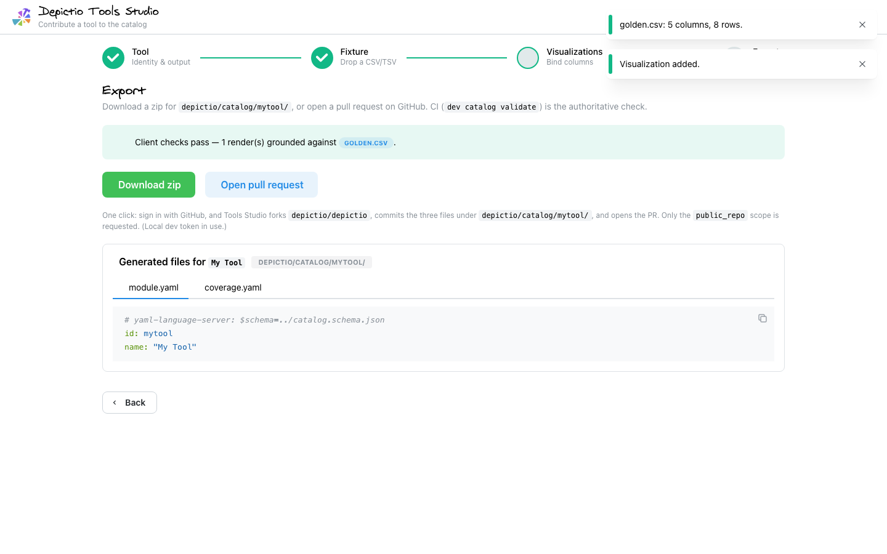

# Depictio Tools Studio

A **100 % client-side** web app (GitHub Pages, no backend) for contributing a
tool to the depictio catalog. Pick a tool source (nf-core / Snakemake / Galaxy),
drop a CSV/TSV, then author dashboard components with **depictio's own component
builder** — and either **download a zip** or open a **one-click pull request**
(*Sign in with GitHub*) against `depictio/depictio`. The tool data lives in
[`depictio/catalog/`](../../depictio/catalog/), not a separate repo.

**Live app:** https://depictio.github.io/depictio/

## The flow

1. **Tool** — identify the tool (id, name, or nf-core **Import**). As you type,
   the app checks the [committed catalog](../../depictio/catalog/): if it's
   already there, the existing entry is shown inline and you can **add a
   visualization to an existing output** or **add a new output to the tool**. If
   it's new, you author its identity + first output (slug + `path_glob`). For
   nf-core, **Import** pulls identity from the module's `meta.yml`.
2. **Fixture** — drop the tool's output file. It's bundled verbatim as the
   fixture and is what grounds your bindings in CI. Columns + dtypes are inferred
   client-side; nothing leaves your browser.
3. **Visualizations** — **Add visualization** opens depictio's real
   component-creation builder (the same figure / card / table / interactive
   controls the dashboard editor uses), seeded from your fixture. advanced_viz is
   authored via a roles panel; heavy kinds (embedding, complex_heatmap,
   upset_plot, sankey, oncoplot) export fine but preview only in depictio.
4. **Export** — download `<tool>/{module.yaml, <output>.yaml, <fixture>}` as a
   zip, or **Sign in with GitHub** to open the PR in one click (the app forks
   `depictio/depictio`, commits the three files, and opens the PR; `public_repo`
   scope, no PAT). When OAuth isn't configured it falls back to a zip +
   GitHub web-upload flow. See [`oauth-worker/README.md`](./oauth-worker/README.md).

## Walkthrough

| | |
| --- | --- |
| **1. Tool** — identity + the single output, 2-panel; nf-core **Import** auto-fills id/name/description **and** the output slug/glob from the module `meta.yml`. |  |
| **1b. Recognition** — when the id/name/nf-core module matches a catalog tool, its outputs + existing renders surface inline, with **Add a visualization here** (append to an output) and **Add a new output to this tool** (a fresh `<output>.yaml`). |  |
| **2. Fixture** — drop the output file; it's parsed client-side and shown in an ag-grid table (this file grounds the bindings in CI). |  |
| **3a. Add a visualization** — depictio's component-type grid (figure / card / table / interactive / advanced_viz). |  |
| **3b. Figure builder** — depictio's real UI (preview-left / properties-right) with a UI/Code toggle; Code Mode runs Plotly-Express in-browser via Pyodide. |  |
| **3c. Render card** — mirrors the Tools Catalog result, with tabs *For dashboard users* (preview + `use:` reuse snippet) and *For catalog developers* (render id + `renders_as`). |  |
| **4. Export** — the generated files for this tool + one-click PR (or zip). |  |

## What it generates

Matches the catalog format the loader + Pydantic models expect:

```yaml
# module.yaml
# yaml-language-server: $schema=../catalog.schema.json
id: mytool
name: My Tool

# results.yaml
id: mytool_results
find: {path_glob: "**/mytool/*.csv"}
fixture: results.csv
renders_as:
  - { component: figure, visu_type: histogram, dict_kwargs: {x: log2fc, color: sample} }
  - { component: card, column: coverage, aggregation: average }
  - { component: advanced_viz, kind: volcano, roles: {feature_id: gene, effect_size: log2fc, significance: pvalue} }
```

`columns:` is intentionally omitted — the exported fixture grounds the bindings.

## Authoritative validation

Client-side checks (grounding + role/dtype validity) are **UX feedback only**.
The source of truth is CI:

```bash
depictio dev catalog validate --path depictio/catalog/<tool>
```

The `catalog-studio-ci` workflow proves the round-trip: an entry generated by
this app's own `yamlGen` must pass `dev catalog validate` (see `scripts/genGolden.ts`).

## Development

```bash
pnpm --filter catalog-studio dev        # http://localhost:5173/depictio/
pnpm --filter catalog-studio test       # vitest
pnpm --filter catalog-studio build      # production build → dist/
pnpm --filter catalog-studio e2e        # Playwright flow test
```

### Reuse from the monorepo

- **Component builder** — the `depictio-builder` alias
  (`vite.config.ts` / `tsconfig.json` → `depictio/viewer/src/builder`) imports
  depictio's *real* builder store + control panels (`StepType` grid via
  `componentTypes`, `FigureUIMode`, `CardBuilder`, `DesignShell`, `ColumnSelect`,
  `aggFunctions`, …). They're store-driven, so `src/builder/seedStore.ts` seeds
  the store from the in-memory fixture (columns + precomputed `specs`) instead of
  the API; only the server-coupled data-source/previews/save are swapped for
  client equivalents (`src/builder/DesignArea.tsx`). `src/catalog/fromBuilderStore.ts`
  maps the builder store → a catalog `RenderSpec`.
- **Rendering** reuses `depictio-react-core`'s shared `TAB10_PALETTE` and
  `depictio-components`' `DepictioCard`. depictio's per-type renderers are
  backend-coupled (they fetch computed data from FastAPI), so previews build
  Plotly figures client-side in `src/viz/figureBuilder.ts` — approximations;
  depictio's Python renderer stays authoritative.
- **Theme** mirrors `depictio/viewer/src/theme.ts` (`src/theme.ts`) + the Virgil
  brand font, so the app looks native to depictio.

### Build-time inputs (kept drift-free)

`scripts/genKinds.ts` (prebuild) regenerates snapshots from the in-repo Python
source when a depictio-capable Python is reachable, else keeps the committed
copies:

- `public/kinds.json` ← `depictio dev catalog kinds --json`
  (advanced_viz roles/dtypes from `models/components/advanced_viz/schemas.py`)
- `public/figureParams.json` ← `depictio dev catalog figure-params --json`
  (figure builder's viz list + per-viz parameter specs; lets depictio's
  `FigureUIMode` render its parameter accordion offline)
- `public/catalog.schema.json` ← copy of `depictio/catalog/catalog.schema.json`

CI's drift check regenerates and `git diff --exit-code`s these, so a stale
snapshot fails the build.
