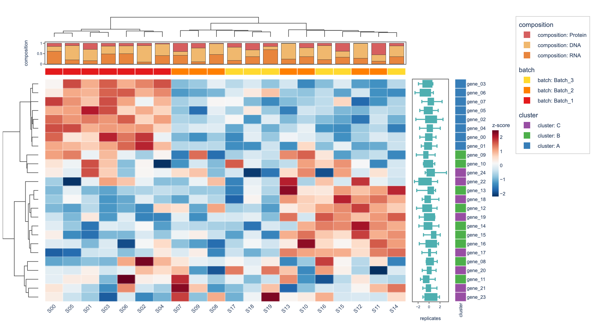
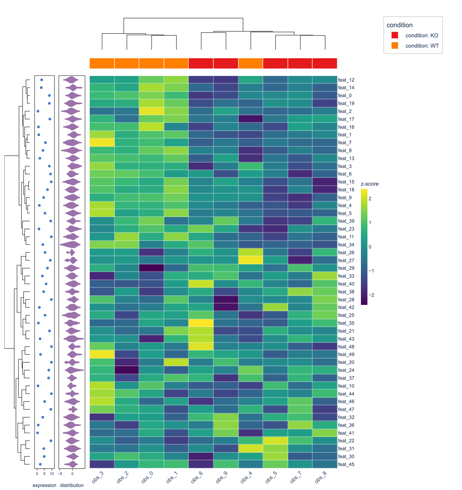
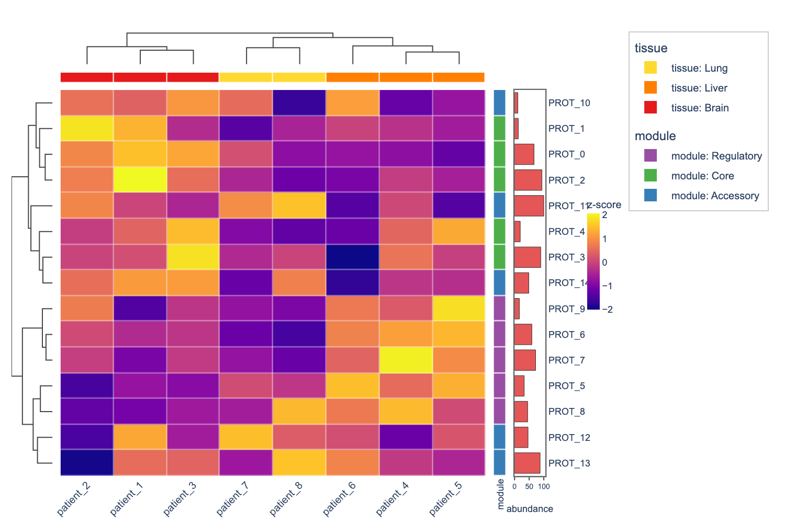

# plotly-complexheatmap

**ComplexHeatmap-style visualizations built on Plotly** — clustered heatmaps with dendrograms, annotation tracks, and split heatmaps using native, interactive Plotly figures.

Inspired by the R [ComplexHeatmap](https://bioconductor.org/packages/ComplexHeatmap/) package by Zuguang Gu, this library brings the same expressive annotation and clustering features to the Python/Plotly ecosystem with **WebGL-first rendering** for large matrices.

## Gallery

### Multi-side annotations with dendrograms

Categorical colour bars, numeric bar charts, and hierarchical clustering on three sides:



### Split heatmap with per-group dendrograms

Rows split by annotation group, each clustered independently:



### Single-DataFrame workflow (`from_dataframe`)

Pass one pandas or polars DataFrame — annotations are auto-extracted from columns:



> See [`examples/showcase.ipynb`](examples/showcase.ipynb) for all 8 examples including stacked bars, box plots, violin plots, and polars integration.

## Installation

```bash
pip install plotly-complexheatmap

# Optional extras
pip install plotly-complexheatmap[fast]    # fastcluster for large matrices
pip install plotly-complexheatmap[polars]  # polars DataFrame support
```

## Quick Start

```python
import numpy as np
import pandas as pd
from plotly_complexheatmap import ComplexHeatmap, HeatmapAnnotation

rng = np.random.default_rng(42)
df = pd.DataFrame(
    rng.standard_normal((30, 12)),
    index=[f"gene_{i}" for i in range(30)],
    columns=[f"sample_{j}" for j in range(12)],
)

# Column annotations (top)
top_ha = HeatmapAnnotation(
    group=["Control"] * 6 + ["Treatment"] * 6,
    quality={"values": rng.uniform(0.7, 1.0, 12), "type": "bar", "color": "#E8853D"},
)

# Row annotations (right)
right_ha = HeatmapAnnotation(
    pathway=["Metabolism"] * 10 + ["Signaling"] * 10 + ["Other"] * 10,
    which="row",
)

hm = ComplexHeatmap(
    df,
    top_annotation=top_ha,
    right_annotation=right_ha,
    colorscale="RdBu_r",
    normalize="row",
    name="z-score",
)
fig = hm.to_plotly()
fig.show()
```

### Single-DataFrame shortcut

```python
# One flat table with data + metadata columns
hm = ComplexHeatmap.from_dataframe(
    df,
    index_column="gene",
    row_annotations=["pathway", "score"],
    col_annotations={"group": ["Ctrl"] * 4 + ["Drug"] * 4},
    colorscale="RdBu_r",
    normalize="row",
)
```

Works with both **pandas** and **polars** DataFrames.

## Features

### Hierarchical Clustering

- Row and/or column clustering via `scipy.cluster.hierarchy`
- Configurable method (`ward`, `complete`, `average`, ...) and metric (`euclidean`, `correlation`, ...)
- Optional `fastcluster` backend for large matrices
- Dendrograms rendered as native Plotly line traces

### Annotation Tracks

Pass data as keyword arguments to `HeatmapAnnotation` — track type is auto-detected:

| Data Type | Rendered As | Example |
|-----------|------------|---------|
| String / categorical | Discrete colour bar | `group=["A", "B", "A"]` |
| Numeric array | Bar chart | `score=[0.5, 1.2, 0.8]` |
| `type="scatter"` | Scatter points | `{"values": [...], "type": "scatter"}` |
| `type="box"` | Box plot | `{"values": 2D_array, "type": "box"}` |
| `type="violin"` | Violin plot | `{"values": 2D_array, "type": "violin"}` |
| `type="stacked_bar"` | Stacked bar chart | `{"values": 2D_array, "type": "stacked_bar"}` |

Supported positions: `top_annotation`, `bottom_annotation`, `left_annotation`, `right_annotation`.

### Split Heatmaps

Divide rows into groups that are clustered independently:

```python
hm = ComplexHeatmap(
    df,
    split_rows_by=["GroupA"] * 15 + ["GroupB"] * 15,
    # Or reference an annotation track by name:
    # split_rows_by="pathway",
)
```

### WebGL Rendering

For matrices larger than 100,000 cells, `go.Heatmapgl` (WebGL) is used automatically. Override with `use_webgl=True/False`.

### Z-Score Normalisation

```python
hm = ComplexHeatmap(df, normalize="row")    # per-row
hm = ComplexHeatmap(df, normalize="column") # per-column
hm = ComplexHeatmap(df, normalize="global") # whole matrix
```

## API Reference

### `ComplexHeatmap`

| Parameter | Type | Default | Description |
|-----------|------|---------|-------------|
| `data` | DataFrame / array | required | 2-D numeric data |
| `cluster_rows` | bool | `True` | Cluster rows |
| `cluster_cols` | bool | `True` | Cluster columns |
| `top_annotation` | `HeatmapAnnotation` | `None` | Column annotations (top) |
| `bottom_annotation` | `HeatmapAnnotation` | `None` | Column annotations (bottom) |
| `left_annotation` | `HeatmapAnnotation` | `None` | Row annotations (left) |
| `right_annotation` | `HeatmapAnnotation` | `None` | Row annotations (right) |
| `colorscale` | str / list | blue-white-red | Plotly colorscale |
| `normalize` | str | `"none"` | `"none"`, `"row"`, `"column"`, `"global"` |
| `use_webgl` | bool / None | `None` | Force WebGL on/off (auto by default) |
| `split_rows_by` | list / str | `None` | Row-split groups |
| `cluster_method` | str | `"ward"` | Linkage method |
| `cluster_metric` | str | `"euclidean"` | Distance metric |
| `name` | str | `""` | Colourbar title |
| `width` / `height` | int | 900 / 700 | Figure size in pixels |

### `ComplexHeatmap.from_dataframe`

| Parameter | Type | Default | Description |
|-----------|------|---------|-------------|
| `df` | DataFrame | required | pandas or polars DataFrame |
| `index_column` | str | `None` | Column to use as row labels |
| `value_columns` | list[str] | `None` | Numeric columns for heatmap (auto-detected) |
| `row_annotations` | list / dict | `None` | Columns to extract as row annotations |
| `col_annotations` | dict | `None` | Per-column metadata (not from DataFrame) |
| `row_annotation_side` | str | `"right"` | `"left"` or `"right"` |
| `col_annotation_side` | str | `"top"` | `"top"` or `"bottom"` |

### `HeatmapAnnotation`

| Parameter | Type | Default | Description |
|-----------|------|---------|-------------|
| `which` | str | `"column"` | `"column"` or `"row"` |
| `gap` | float | `0.005` | Gap between tracks (fraction) |
| `**kwargs` | various | -- | Named annotation tracks |

## Dependencies

- `plotly >= 5.5.0`
- `scipy >= 1.9.0`
- `numpy >= 1.22.0`
- `pandas >= 1.4.0`
- Optional: `fastcluster >= 1.2.0`, `polars >= 0.20.0`

## License

MIT
