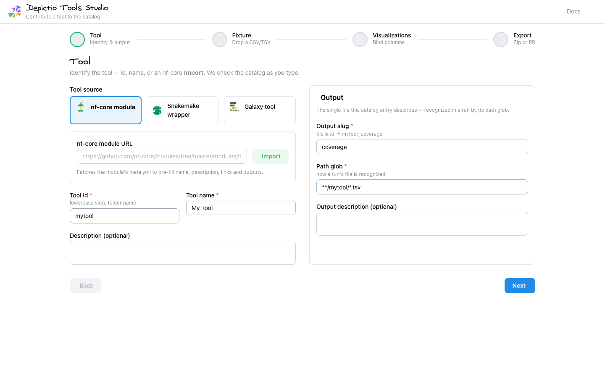
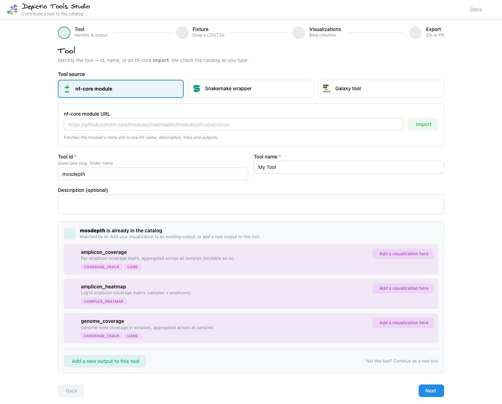
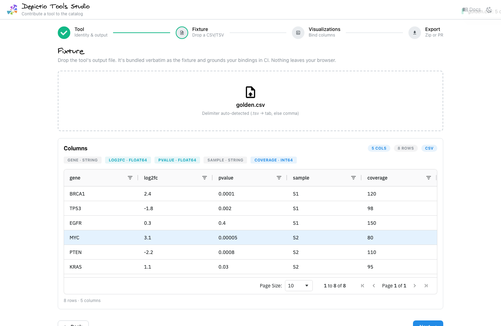
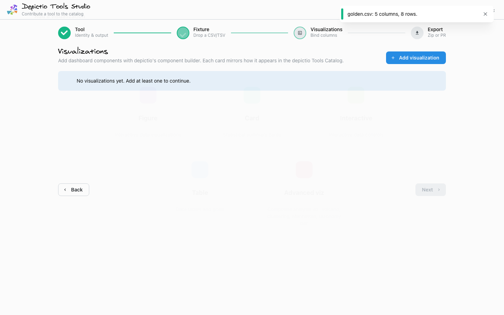
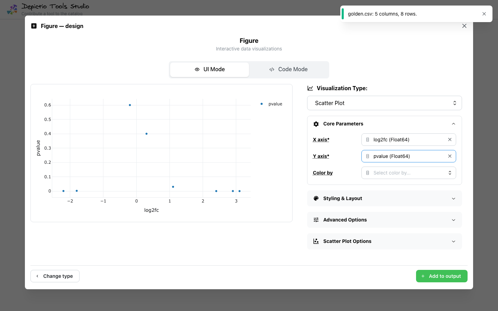
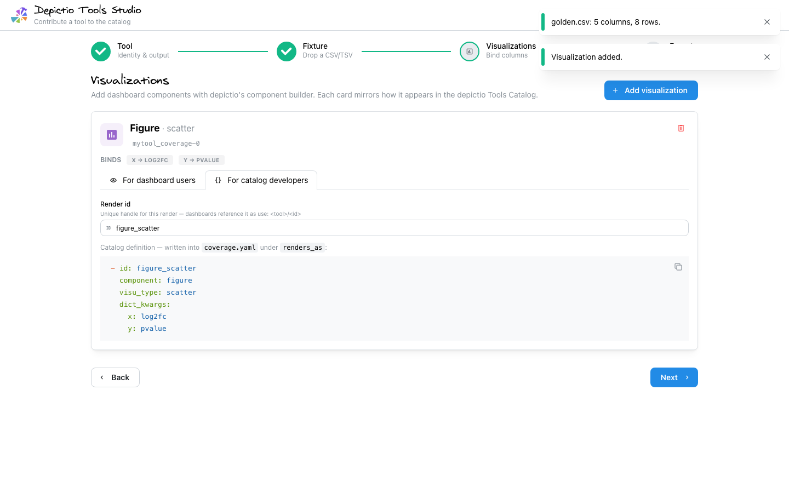
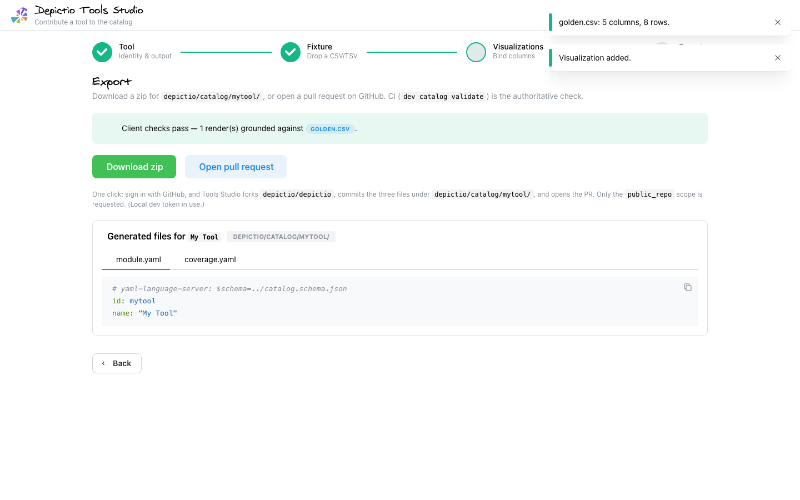

# Depictio Tool Studio

A **100 % client-side** web app (GitHub Pages, no backend) for contributing a
tool to the depictio catalog. Pick a tool source (nf-core / Snakemake / Galaxy),
drop a CSV/TSV, then author dashboard components with **depictio's own component
builder** — and either **download a zip** or open a **one-click pull request**
(*Sign in with GitHub*) against `depictio/depictio`. The tool data lives in
[`depictio/catalog/`](../../depictio/catalog/), not a separate repo.

**Live app:** https://depictio.github.io/depictio-tool-studio/

## The flow

The app opens on a start screen: what a catalog entry does for people who run
the tool, the four steps ahead, and the outputs it cannot describe yet (anything
needing a parsing `recipe`). **Start** enters the wizard, and the screen returns
whenever the draft is reset.

1. **Tool** — identify the tool (id, name, or nf-core **Import**). As you type,
   the app checks the [committed catalog](../../depictio/catalog/): if it's
   already there, the existing entry is shown inline and you can **add a
   visualization to an existing output** or **add a new output to the tool**. If
   it's new, you author its identity + first output (slug + `path_glob`). For
   nf-core, **Import** pulls identity from the module's `meta.yml`.
2. **Fixture** — drop the tool's output file. It's bundled verbatim as the
   fixture and is what grounds your bindings in CI. Columns + dtypes are inferred
   client-side; nothing leaves your browser.
3. **Visualizations** — **Add visualization** opens depictio's real
   component-creation builder — figure, card, table, interactive and
   advanced_viz, the same controls and the same live previews the dashboard
   editor uses, seeded from your fixture. When the tool is already in the
   catalog, its committed renders are previewed the same way, over the fixture
   sample bundled with the entry.
4. **Export** — download `<tool>/{module.yaml, <output>.yaml, <fixture>}` as a
   zip, or **Sign in with GitHub** to open the PR in one click (the app forks
   `depictio/depictio`, commits the three files, and opens the PR; `public_repo`
   scope, no PAT). When OAuth isn't configured it falls back to a zip +
   GitHub web-upload flow. See [`oauth-worker/README.md`](./oauth-worker/README.md).

## Walkthrough

| | |
| --- | --- |
| **1. Tool** — identity + the single output, 2-panel; nf-core **Import** auto-fills id/name/description **and** the output slug/glob from the module `meta.yml`. |  |
| **1b. Recognition** — when the id/name/nf-core module matches a catalog tool, its outputs + existing renders surface inline, with **Add a visualization here** (append to an output) and **Add a new output to this tool** (a fresh `<output>.yaml`). |  |
| **2. Fixture** — drop the output file; it's parsed client-side and shown in an ag-grid table (this file grounds the bindings in CI). |  |
| **3a. Add a visualization** — depictio's component-type grid (figure / card / table / interactive / advanced_viz). |  |
| **3b. Figure builder** — depictio's real UI (preview-left / properties-right) with a UI/Code toggle; Code Mode runs Plotly-Express in-browser via Pyodide. |  |
| **3c. Render card** — mirrors the depictio Catalog result, with tabs *For dashboard users* (preview + `use:` reuse snippet) and *For catalog developers* (render id + `renders_as`). |  |
| **4. Export** — the generated files for this tool + one-click PR (or zip). |  |

## What it generates

Matches the catalog format the loader + Pydantic models expect:

```yaml
# module.yaml
# yaml-language-server: $schema=../catalog.schema.json
id: mytool
name: My Tool

# results.yaml
id: mytool_results
find: {path_glob: "**/mytool/*.csv"}
fixture: results.csv
renders_as:
  - { component: figure, visu_type: histogram, dict_kwargs: {x: log2fc, color: sample} }
  - { component: card, column: coverage, aggregation: average }
  - { component: advanced_viz, kind: volcano, roles: {feature_id: gene, effect_size: log2fc, significance: pvalue} }
```

`columns:` is intentionally omitted — the exported fixture grounds the bindings.

## Authoritative validation

Client-side checks (grounding + role/dtype validity) are **UX feedback only**.
The source of truth is CI:

```bash
depictio dev catalog validate --path depictio/catalog/<tool>
```

The `tool-studio-ci` workflow proves the round-trip: an entry generated by
this app's own `yamlGen` must pass `dev catalog validate` (see `scripts/genGolden.ts`).

## Development

```bash
pnpm --filter tool-studio dev            # http://localhost:5173/depictio-tool-studio/
pnpm --filter tool-studio test           # vitest
pnpm --filter tool-studio test:coverage  # + a v8 coverage summary
pnpm --filter tool-studio build          # production build → dist/
pnpm --filter tool-studio e2e            # Playwright: build → vite preview
```

`e2e` builds and serves the production bundle, so it takes ~1 min; set
`PW_DEV_SERVER=1` to run against the dev server while iterating. The PR journeys
route `api.github.com` and the OAuth worker, so no token is involved.

### Reuse from the monorepo

- **Component builder** — the `depictio-builder` alias
  (`vite.config.ts` / `tsconfig.json` → `depictio/viewer/src/builder`) imports
  depictio's *real* builder store + control panels (`StepType` grid via
  `componentTypes`, `FigureBuilder`, `CardBuilder`, `TableBuilder`,
  `InteractiveBuilder`, `AdvancedVizBuilder`, …). They're store-driven, so
  `src/builder/seedStore.ts` seeds the store from the in-memory fixture (columns
  + precomputed `specs`) instead of the API, and `src/builder/DesignArea.tsx` is
  a per-type lookup into those builders. `src/catalog/fromBuilderStore.ts` maps
  the builder store → a catalog `RenderSpec`; `src/catalog/fromManifestRender.ts`
  does the same for a render already committed to the catalog.
- **Rendering** — depictio's per-type renderers read computed data from FastAPI,
  so `vite.config.ts` installs an `api-shim` plugin (shared with the
  catalog-preview bundle via `packages/depictio-react-core/viteApiShim.ts`) that
  redirects every `depictio-react-core` import of `api.ts` to
  `src/api/studioApi.ts`. That module re-exports the real api and overrides only
  the fetchers, computing them from the fixture in the browser
  (`src/api/frame.ts`, `aggregations.ts`, `cardMetrics.ts` — a port of
  `api/v1/services/card_metrics.py`, pinned to Python by a golden test).
  depictio's `ComponentRenderer` then runs unmodified in `src/viz/RenderPreview.tsx`,
  which is the single preview used by the design surface and the render list.

  Three things the shim genuinely cannot serve say so on screen instead of
  spinning: the five Celery-computed advanced-viz kinds (embedding in live mode,
  complex_heatmap, upset_plot, coverage_track, sankey), a phylogenetic tree's
  newick (a second file the Studio was never given), and exact figures — those
  are approximated client-side in `src/viz/figureBuilder.ts` because the
  authoritative figure is built by Python plotly-express.
- **Theme** mirrors `depictio/viewer/src/theme.ts` (`src/theme.ts`) + the Virgil
  brand font, so the app looks native to depictio.

### Build-time inputs (kept drift-free)

`scripts/genKinds.ts` (prebuild) regenerates snapshots from the in-repo Python
source when a depictio-capable Python is reachable, else keeps the committed
copies:

- `public/kinds.json` ← `depictio dev catalog kinds --json`
  (the same kind descriptors the `/advanced_viz/kinds` endpoint serves — label,
  icon, category, roles/dtypes — so `AdvancedVizBuilder`'s kind picker and its
  fit scoring work offline)
- `public/figureParams.json` ← `depictio dev catalog figure-params --json`
  (figure builder's viz list + per-viz parameter specs; lets depictio's
  `FigureUIMode` render its parameter accordion offline)
- `public/catalog.json` ← `depictio dev catalog manifest --json`
  (the existing catalog: duplicate detection, the recognition panel, and the
  base the "add a visualization" preview appends to)
- `public/catalog.schema.json` ← copy of `depictio/catalog/catalog.schema.json`
- `src/catalog/generated/cardSpec.ts` ← the card enums *derived* from that
  schema, so a `secondary_layout` added in depictio can't silently go missing
  from the exporter (`src/catalog/cardRules.ts` turns it into a compile error)

CI's drift check regenerates and `git diff --exit-code`s all of these, with
`TOOL_STUDIO_STRICT_GEN=1` so a regeneration that silently no-ops fails
instead of leaving the check to pass against unchanged snapshots.

### Deployment (GitHub Pages)

The app is built here and published to a **showcase repository**,
[`depictio/depictio-tool-studio`](https://github.com/depictio/depictio-tool-studio), which
holds only the built site. A Pages site's URL path is its repository name, so
this is what buys the dedicated `/depictio-tool-studio/` path instead of `/depictio/`
— which would read like the project's own site while the docs actually live at
`/depictio-docs/`. The source stays in this monorepo, so the `depictio-builder`
alias and the committed catalog snapshots keep working unchanged.

`deploy-tool-studio.yaml` builds on every push to `main` that touches the app
(or the in-repo schema/catalog it snapshots) and force-pushes `dist/` to that
repo's `main` branch as a single commit. There is no `gh-pages` branch: the
repository holds nothing but the build, so a second branch would serve no
purpose — and GitHub's *Deploy from a branch* setting only lists branches that
already exist, so a repo whose only branch is the one being created by the
workflow cannot have Pages enabled in the first place.

One-time setup, all in this repo's *Settings → Secrets and variables → Actions*
except where noted:

| Name | Kind | Value |
|---|---|---|
| `CATALOG_STUDIO_DEPLOY_TOKEN` | secret | fine-grained PAT scoped to `depictio/depictio-tool-studio` only, **Contents: Read and write**. The name predates the rename to Tool Studio and is kept: a secret cannot be read back, so renaming it would mean minting a new PAT for nothing. |
| `VITE_GH_CLIENT_ID` | variable | the GitHub OAuth App's client id (public) |
| `VITE_GH_OAUTH_WORKER_URL` | variable | the deployed worker's `/exchange` endpoint |

Plus, in `depictio/depictio-tool-studio`: *Settings → Pages → Source: **Deploy from a
branch**, branch `main`, folder `/`*.

Each is independently optional and degrades loudly rather than silently:
without the token the workflow builds and warns instead of publishing; without
the two variables the deployed app falls back to zip + web upload and the Export
step says so. Vite inlines the variables at build time — there is no runtime
config, so changing either means a redeploy. The OAuth client *secret* lives
only in the Cloudflare Worker; see
[`oauth-worker/README.md`](./oauth-worker/README.md).
